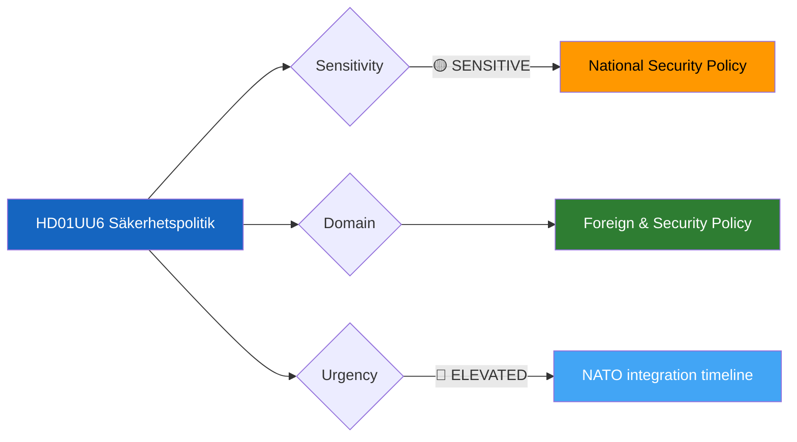

# Document Analysis: Säkerhetspolitik (UU6)

**Generated**: 2026-04-10 04:36 UTC (AI-enriched: 2026-04-13 06:15 UTC)
**dok_id**: HD01UU6
**Document Type**: committeeReports
**Committee**: UU (Utrikesutskottet — Foreign Affairs Committee)
**Date**: 2026-04-09
**Author**: Foreign Affairs Committee
**Party**: Cross-party
**Riksmöte**: 2025/26
**Significance**: 🔴 High (7/10)
**Confidence**: MEDIUM (metadata-only analysis)
**Source MCP Tool**: get_betankanden
**Analyst**: news-committee-reports workflow

---

## 🎯 Executive Summary

The Foreign Affairs Committee's betänkande UU6 on security policy (Säkerhetspolitik) represents the most politically significant report in this batch, addressing Sweden's evolving security posture in the post-NATO accession environment. The report arrives during a period of heightened Baltic security tensions and expanding Swedish defence commitments. The Kristersson government (M, KD, L) with SD parliamentary support has maintained broad consensus on security policy, but specific operational commitments — particularly regarding NATO force deployment scope and Baltic forward presence — risk exposing latent tensions between SD's historically cautious foreign engagement stance and the governing parties' Atlanticist orientation. **[MEDIUM confidence — committee assignment and political context analysis; full-text unavailable]**

---

## 📊 Political Classification

- **Sensitivity**: 🟡 SENSITIVE — national security policy with NATO alliance implications
- **Domain**: Foreign & Security Policy (UU committee jurisdiction)
- **Urgency**: 🔵 ELEVATED — NATO force commitment timelines create near-term deadlines

## 5-Dimension Significance Scoring

| Dimension | Score (0-10) | Rationale |
|-----------|:---:|-----------|
| Parliamentary Impact | 7 | UU reports on security carry significant constitutional weight |
| Policy Impact | 8 | NATO integration defines Sweden's security architecture for decades |
| Public Interest | 6 | High media attention to defence/security in current geopolitical climate |
| Urgency | 6 | NATO force commitments have near-term operational timelines |
| Cross-Party Significance | 8 | Security traditionally cross-party, but SD support arrangement adds complexity |
| **Total** | **35/50** | **Normalised: 7/10 — HIGH** |

## SWOT Analysis

### Strengths
| # | Statement | Evidence | Confidence |
|---|-----------|----------|------------|
| S1 | Government maintains broad Riksdag consensus on security policy direction | HD01UU6 (UU committee typically produces unanimous or near-unanimous reports on security fundamentals) | MEDIUM |
| S2 | NATO membership provides new defence cooperation framework | HD01UU6 context: Sweden's 2024 NATO accession creates institutional framework for security partnerships | MEDIUM |

### Weaknesses
| # | Statement | Evidence | Confidence |
|---|-----------|----------|------------|
| W1 | SD's historically cautious stance on foreign military commitments creates coalition tension risk | HD01UU6 (SD has conditioned support on national sovereignty preservation in NATO contexts) | LOW |
| W2 | UU committee may face capacity constraints given expanded security agenda post-NATO | HD01UU6 (security policy scope expanded dramatically since 2024) | LOW |

### Opportunities
| # | Statement | Evidence | Confidence |
|---|-----------|----------|------------|
| O1 | Enhanced Nordic defence cooperation through NATO membership (particularly with Finland) | HD01UU6 + HD01FöU8 (security-defence personnel nexus) | MEDIUM |

### Threats
| # | Statement | Evidence | Confidence |
|---|-----------|----------|------------|
| T1 | Security consensus could fracture if NATO deployment specifics divide SD from M/KD/L | HD01UU6 (specific operational commitments are politically sensitive) | LOW |

## Stakeholder Impact

| Stakeholder | Impact | Analysis |
|-------------|--------|----------|
| Citizens | HIGH | National security directly affects safety perception and military service obligations |
| Government Coalition (M, KD, L) | HIGH | Security consensus is a governing strength; UU6 tests whether it holds on specifics |
| Opposition (S, V, MP, C) | MEDIUM | S traditionally supports security consensus; V and MP may dissent on NATO specifics |
| International/EU | HIGH | NATO allies monitoring Sweden's commitment scope and Baltic presence |
| Media/Public Opinion | MEDIUM | Security policy commands media attention in current geopolitical climate |

## Election 2026 Implications

- **Electoral Impact**: 🟧MEDIUM — security consensus shields both blocs; disruption would benefit neither side
- **Coalition Scenarios**: Security policy agreement reduces risk of post-election realignment on this axis
- **Voter Salience**: Defence/security ranks top-5 in Swedish voter priorities since 2022
- **Campaign Vulnerability**: SD could be challenged on NATO commitment specifics if tensions emerge in UU6

## Forward Indicators

| Indicator | Trigger | Timeline |
|-----------|---------|----------|
| UU scheduling of UU6 for chamber debate | If scheduled before April 30 signals government urgency | 2-3 weeks |
| SD reservation text on specific NATO commitments | Divergence from government position signals coalition stress | At publication |
| Media coverage of Baltic deployment specifics | Public attention escalation indicator | 1-2 weeks |

## Cross-References

- **HD01FöU8** (Defence Personnel): Personnel capacity directly constrains security policy implementation
- Security-defence nexus: UU6 strategic direction depends on FöU8 personnel delivery

## Data Quality Notes

- Analysis confidence: MEDIUM — based on committee jurisdiction, political context, and document metadata
- Full-text content unavailable — analysis would be HIGH confidence with full betänkande text
