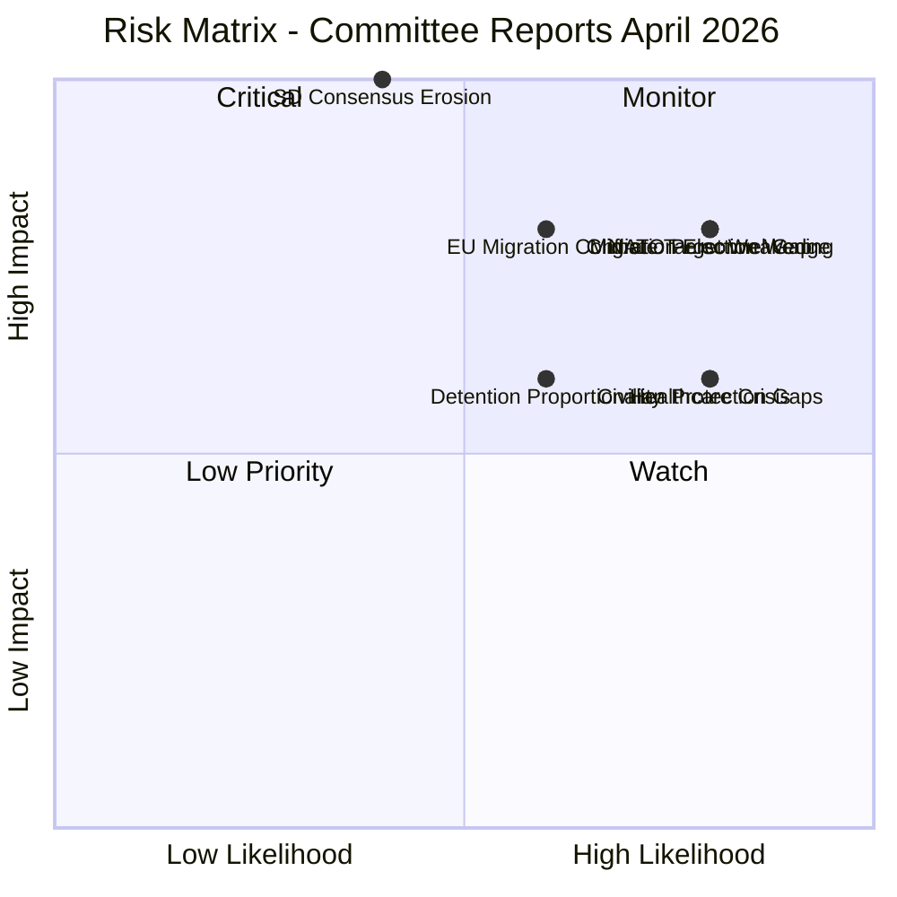

# ⚠️ Risk Assessment — Committee Reports 2026-04-13

| Field | Value |
|-------|-------|
| **Date** | 2026-04-13 |
| **Riksmöte** | 2025/26 |
| **Documents Analyzed** | 20 |
| **Overall Risk Level** | **ELEVATED** |

## 📈 Risk Matrix

| # | Risk Description | Likelihood (1-5) | Impact (1-5) | Score (LxI) | Level | Source dok_id |
|---|-----------------|-------------------|--------------|-------------|-------|---------------|
| 1 | Migration policy becomes Election 2026 wedge issue — opposition coordinates counter-narrative from 157 rejected motions | 4 | 4 | 16 | 🔴 VERY HIGH | HD01SfU16 |
| 2 | NATO Force Structure targets missed — 98 personnel proposals rejected without alternatives | 4 | 4 | 16 | 🔴 VERY HIGH | HD01FöU8 |
| 3 | Climate targets weakened through EU alignment — breaks 2017 cross-party consensus | 4 | 4 | 16 | 🔴 VERY HIGH | HD01MJU30 |
| 4 | EU-Sweden migration policy conflict — national measures may exceed EU asylum pact framework | 3 | 4 | 12 | 🟠 HIGH | HD01SfU16, HD01SfU31 |
| 5 | Healthcare access crisis worsens — 348 motions rejected without alternative strategy | 4 | 3 | 12 | 🟠 HIGH | HD01SoU16, HD01SoU17 |
| 6 | Municipal capacity gaps in civilian protection implementation | 4 | 3 | 12 | 🟠 HIGH | HD01FöU12 |
| 7 | SD security consensus erodes before election — DCA debate intensifies | 2 | 5 | 10 | 🟠 HIGH | HD01UU6 |
| 8 | Detention framework proportionality challenged in courts | 3 | 3 | 9 | 🟡 MEDIUM | HD01SfU31 |

## 🔮 Forward Indicators

| # | Indicator | Trigger | Timeline | Confidence |
|---|-----------|---------|----------|------------|
| 1 | SfU16/31/32/36 chamber vote scheduling | If scheduled same week, confirms coordinated migration push | April-May 2026 | **[HIGH]** |
| 2 | Försvarsmakten quarterly personnel report | Below-target recruitment validates opposition criticism | Q2 2026 | **[HIGH]** |
| 3 | S climate policy platform announcement | Shift from current position signals electoral calculation | Before June 2026 | **[MEDIUM]** |
| 4 | EU Asylum Pact transposition progress | Delays or conflicts with SfU31/32 create legal uncertainty | H2 2026 | **[MEDIUM]** |
| 5 | NATO Capability Review findings on Sweden | Personnel shortfall flagged internationally creates political pressure | 2026 | **[MEDIUM]** |
