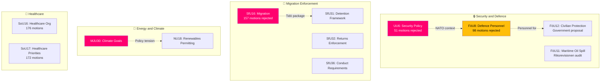

# 🧩 Synthesis Summary — Committee Reports

| Field | Value |
|-------|-------|
| **Date** | 2026-04-13 |
| **Riksmöte** | 2025/26 |
| **Article Type** | committeeReports |
| **Documents Analyzed** | 20 |
| **Analysis Timestamp** | 2026-04-13 07:05 UTC |
| **Overall Confidence** | **HIGH** |
| **Risk Level** | **ELEVATED** |

## 🔑 Key Findings

1. **Security-Migration Legislative Cluster** — The government has orchestrated a coordinated release of 9 committee reports across security (UU6, FöU8, FöU12) and migration (SfU16, SfU31, SfU32, SfU36) policy areas within 48 hours, rejecting a combined 404 opposition motions. This represents the most intensive legislative consolidation of the Tidö Agreement security and migration agenda this session. **[HIGH]**

2. **Climate Policy Realignment** — MJU30 (climate milestones) signals a fundamental break from Sweden's 2017 cross-party climate framework, reframing national targets as EU-aligned while potentially lowering ambition. Combined with NU18 (renewables permitting), the government balances climate action with industry-friendly implementation. **[HIGH]**

3. **Defence Personnel Bottleneck Unresolved** — FöU8 rejects all 98 defence personnel motions despite Sweden's documented inability to meet NATO Force Structure requirements. FöU12 (civilian protection) advances but without addressing the workforce needed to implement it. **[HIGH]**

4. **Healthcare System Under Pressure** — SoU16 and SoU17 together reject 348 motions on healthcare organization and priorities, signaling the government has no new solutions for Sweden's healthcare access crisis. **[MEDIUM]**

5. **Labour Market Status Quo** — AU11 and AU12 reject 146 motions on work environment and gender equality, maintaining current regulatory framework. **[MEDIUM]**

## 🗳️ AI-Recommended Article Metadata

- **Recommended Title (EN)**: Parliament Consolidates Security and Migration Agenda as 404 Opposition Motions Rejected
- **Recommended Title (SV)**: Riksdagen konsoliderar säkerhets- och migrationsagendan — 404 oppositionsförslag avvisas
- **Meta Description (EN)**: Swedish Parliament committees reject 404 opposition motions across security policy, NATO integration, migration enforcement, and climate goals in coordinated Tidö Agreement legislative push.
- **Meta Description (SV)**: Riksdagens utskott avvisar 404 oppositionsförslag inom säkerhetspolitik, NATO-integration, migrationsåtstramning och klimatmål i koordinerad Tidöavtalets lagstiftningsoffensiv.
- **Key Highlights**: Security-migration cluster (UU6+SfU16+SfU31/32/36+FöU8), Climate realignment (MJU30+NU18), Healthcare impasse (SoU16+SoU17)
- **Article Decision**: PUBLISH
- **Article Priority**: HIGH

## 📊 Thematic Clusters

## 📈 Significance Ranking

| Rank | dok_id | Committee | Title | Score |
|------|--------|-----------|-------|-------|
| 1 | HD01SfU16 | SfU | Migration Issues | 40/50 |
| 2 | HD01MJU30 | MJU | Climate Goals | 40/50 |
| 3 | HD01UU6 | UU | Security Policy | 39/50 |
| 4 | HD01FöU12 | FöU | Civilian Protection | 38/50 |
| 5 | HD01FöU8 | FöU | Defence Personnel | 36/50 |
| 6 | HD01SfU31 | SfU | Detention Framework | 34/50 |
| 7 | HD01NU18 | NU | Renewables Permitting | 31/50 |
| 8 | HD01SoU16 | SoU | Healthcare Organization | 30/50 |
| 9 | HD01SoU17 | SoU | Healthcare Priorities | 30/50 |
| 10 | HD01JuU15 | JuU | Criminal Justice | 28/50 |
