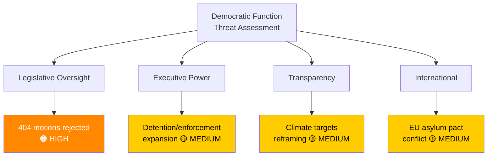

# 🔴 Threat Analysis — Committee Reports 2026-04-13

| Field | Value |
|-------|-------|
| **Date** | 2026-04-13 |
| **Riksmöte** | 2025/26 |
| **Documents Analyzed** | 20 |

## Democratic Function Threat Categories

### 1. Legislative Oversight Erosion
- **Severity**: 🟠 HIGH
- **Evidence**: 404 opposition motions rejected across 20 committee reports using identical boilerplate referral to ongoing work (UU6, SfU16, FöU8, SoU16, SoU17, AU12). This systematic pattern bypasses substantive parliamentary debate on critical policy areas including NATO, migration, healthcare, and defence.
- **Democratic Impact**: Reduces opposition to a rubber-stamp function; citizens' elected representatives cannot influence policy direction **[HIGH]**

### 2. Executive Power Concentration
- **Severity**: 🟡 MEDIUM
- **Evidence**: Migration enforcement package (SfU31: detention, SfU32: returns, SfU36: conduct requirements) expands executive enforcement powers without corresponding judicial oversight mechanisms. New detention framework (SfU31) requires scrutiny for ECHR proportionality.
- **Democratic Impact**: Shifts power balance toward executive enforcement agencies **[MEDIUM]**

### 3. Policy Transparency Deficit
- **Severity**: 🟡 MEDIUM
- **Evidence**: MJU30 climate goals reframed as EU-aligned without transparent comparison to previous national targets. The framing obscures whether ambition is maintained or reduced. FöU8 personnel strategy remains opaque despite documented NATO gaps.
- **Democratic Impact**: Citizens cannot assess whether government is meeting its own commitments **[MEDIUM]**

### 4. International Obligation Conflicts
- **Severity**: 🟡 MEDIUM
- **Evidence**: SfU16 migration restrictive measures may conflict with EU Asylum Pact transposition. DCA agreement (UU6) rejected from debate despite constitutional implications of foreign basing agreements.
- **Democratic Impact**: International commitments made without adequate parliamentary scrutiny **[MEDIUM]**

## Threat Taxonomy Diagram

