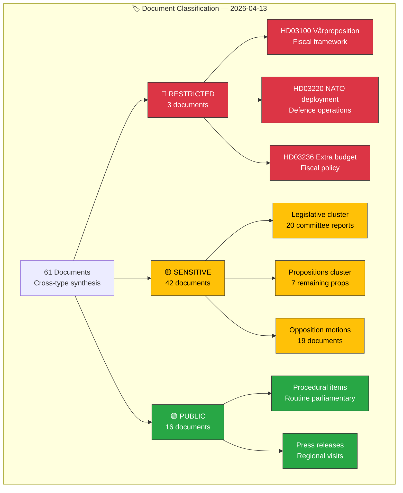

# 🏷️ Classification Results — Evening Analysis (Second Pass)

| Field | Value |
|-------|-------|
| **ID** | CLS-EVE-2026-04-13-002 |
| **Date** | 2026-04-13 18:30 UTC |
| **Riksmöte** | 2025/26 |
| **Documents Classified** | 61 (aggregated from 6 analysis types) |
| **Confidence** | HIGH |
| **Methodology** | political-classification-guide.md |

---

## 📊 Sensitivity Decision Tree

## 📋 Classification Summary

| Sensitivity | Count | % | Key Documents |
|------------|:-----:|:-:|---------------|
| 🔴 RESTRICTED | 3 | 5% | HD03100 (Vårproposition), HD03220 (NATO), HD03236 (Extra budget) |
| 🟡 SENSITIVE | 42 | 69% | 20 committee reports, 7 propositions, 15 motions |
| 🟢 PUBLIC | 16 | 26% | 4 motions (routine), press releases, procedural |

## 📋 Domain Distribution

| Domain | Documents | Examples |
|--------|:---------:|---------|
| Fiscal/Economic | 10 | HD03100, HD03236, HD0399, HD0398 |
| Security/Defence | 5 | UU6, FöU8, FöU12, HD03220 |
| Migration | 4 | SfU16, SfU31, SfU32, SfU36 |
| Climate/Environment | 3 | MJU30, NU18, NU17 |
| Healthcare/Social | 4 | SoU16, SoU17, SoU18 |
| Justice/Law | 3 | HD03218, HD03217, JuU38 |
| Labour | 2 | AU11, AU12 |
| Opposition Activity | 19 | 19 motions from S, MP, C, V |
| Constitutional | 2 | HD10429, HD10430 (interpellations) |
| Regional/Government | 2 | Press releases (Värmland, Skåne) |
