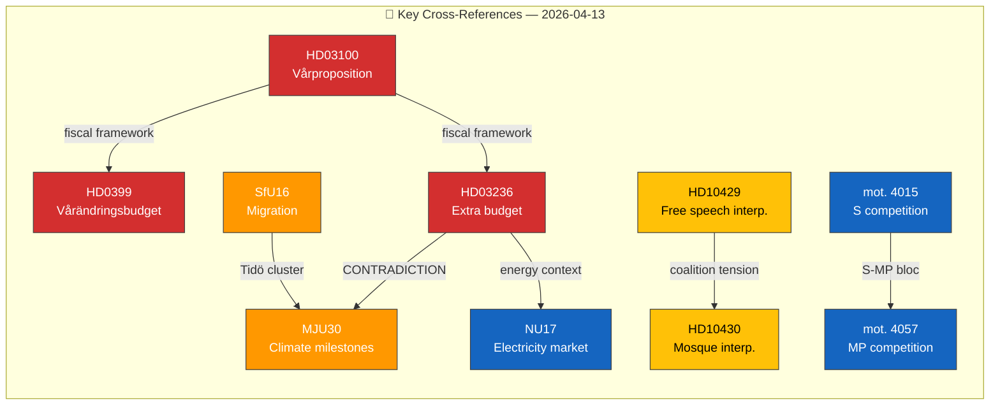

# 🔗 Cross-Reference Map — Evening Analysis (Second Pass)

| Field | Value |
|-------|-------|
| **ID** | XREF-EVE-2026-04-13-002 |
| **Date** | 2026-04-13 18:30 UTC |

---

## 📊 Document Interconnection Network

## 📋 Key Cross-Reference Pairs

| Link | Type | Significance |
|------|------|:------------:|
| HD03236 ↔ MJU30 | **CONTRADICTION** — Fuel tax cut vs climate milestones | 🔴 CRITICAL |
| HD03100 ↔ HD0399 ↔ HD03236 | **PACKAGE** — Coordinated fiscal offensive | 🔴 HIGH |
| HD10429 ↔ HD10430 | **PATTERN** — SD coalition accountability push | 🟠 HIGH |
| mot. 4015 ↔ mot. 4057 | **BLOC** — S-MP cross-party competition policy | 🟠 HIGH |
| mot. 4070-4072 | **BLOC** — C-V-MP Sida audit coordination | 🟡 MEDIUM |
| HD03236 ↔ NU17 | **CONTEXT** — Fuel cuts + electricity market debate | 🟡 MEDIUM |
| SfU16 ↔ MJU30 | **CLUSTER** — Tidö Agreement legislative consolidation | 🟡 MEDIUM |
