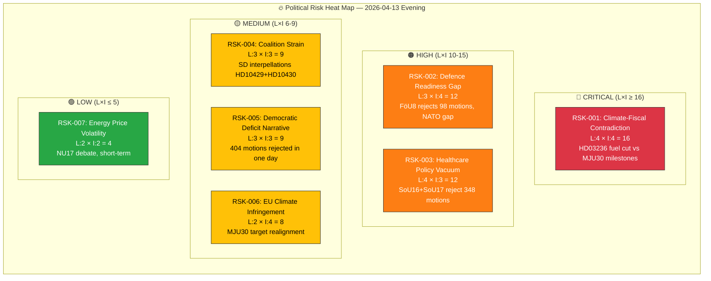

# ⚠️ Risk Assessment — Evening Analysis (Second Pass)

| Field | Value |
|-------|-------|
| **ID** | RSK-EVE-2026-04-13-002 |
| **Date** | 2026-04-13 18:30 UTC |
| **Riksmöte** | 2025/26 |
| **Overall Risk Level** | ELEVATED |
| **Confidence** | HIGH |
| **Methodology** | political-risk-methodology.md (5×5 L×I matrix) |

---

## 📊 Risk Heat Map

## 📋 Detailed Risk Register

| Risk ID | Risk | Likelihood (1-5) | Impact (1-5) | L×I Score | Category | Evidence |
|---------|------|:-----------------:|:------------:|:---------:|----------|----------|
| RSK-001 | Climate-fiscal contradiction: fuel tax cut (HD03236) vs climate milestones (MJU30) | 4 | 4 | **16** | Policy | HD03236 explicit tax reduction vs MJU30 target framework |
| RSK-002 | Defence readiness gap: NATO force structure unfilled after FöU8 rejects 98 motions | 3 | 4 | **12** | Security | FöU8 committee report, documented personnel shortfall |
| RSK-003 | Healthcare policy vacuum: 348 motions rejected without replacement policy | 4 | 3 | **12** | Electoral | SoU16 (187 motions) + SoU17 (161 motions) rejected |
| RSK-004 | Coalition strain: SD interpellations targeting M and KD ministers | 3 | 3 | **9** | Coalition | HD10429 (Strömmer/M), HD10430 (Forssmed/KD), due Apr 24-27 |
| RSK-005 | Democratic deficit narrative: opposition frames mass rejection as rubber stamp | 3 | 3 | **9** | Democratic | 404 motions across 20 committee reports in one day |
| RSK-006 | EU climate infringement: MJU30 reframes targets below EU expectations | 2 | 4 | **8** | International | MJU30 "EU-aligned" language vs previous national ambition |
| RSK-007 | Energy price volatility: NU17 debate shows unresolved electricity market tensions | 2 | 2 | **4** | Economic | NU17 debate, Lakso (MP) vs Skalberg Karlsson (M) |

## 🎯 Risk Mitigation Observations

| Risk | Government Mitigation | Opposition Exploitation |
|------|----------------------|------------------------|
| RSK-001 | Frame fuel cuts as "household relief" not "climate retreat" | "Choosing voters over planet" campaign narrative |
| RSK-002 | Point to NATO membership itself as achievement | "Paper membership without real capability" attack |
| RSK-003 | Refer to ongoing healthcare commission work | "Four years, no healthcare improvement" attack |
| RSK-004 | Emphasize Tidö cooperation successes | Monitor SD positioning for post-election demands |
| RSK-005 | Normal parliamentary process argument | Democratic accountability framing |

## 📅 Risk Monitoring Triggers

| Risk | Trigger Event | Timeline | Escalation Criteria |
|------|---------------|----------|:-------------------:|
| RSK-001 | EU Commission climate review | Q3 2026 | Formal infringement warning |
| RSK-002 | NATO capability review | Oct 2026 | Public readiness gap disclosure |
| RSK-003 | Healthcare wait time statistics release | May 2026 | Wait times increase >10% |
| RSK-004 | Ministerial interpellation responses | Apr 24-27 | Evasive or confrontational responses |
| RSK-005 | Media coverage of rejected motions | Apr 14-18 | >5 major outlet editorials |
