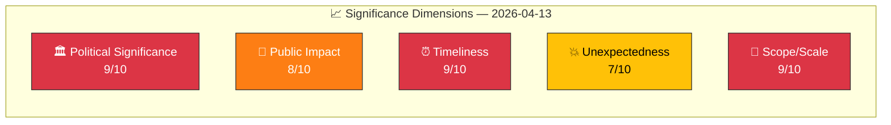

# 📈 Significance Scoring — Evening Analysis (Second Pass)

| Field | Value |
|-------|-------|
| **ID** | SIG-EVE-2026-04-13-002 |
| **Date** | 2026-04-13 18:30 UTC |
| **Riksmöte** | 2025/26 |
| **Composite Score** | 8.5/10 |
| **Publication Decision** | ANALYSIS-ONLY (articles already exist from run 1) |
| **Confidence** | HIGH |
| **Methodology** | significance-scoring.md template, 5-dimension model |

---

## 📊 Five-Dimension Scoring

| Dimension | Score | Rationale | Evidence |
|-----------|:-----:|-----------|---------|
| **Political Significance** | 9/10 | Most intensive legislative day of 2025/26 session. 6 government propositions + 20 committee reports = pre-election agenda consolidation. | HD03100, HD0399, HD03236, 20 committee reports |
| **Public Impact** | 8/10 | Fuel tax cuts directly affect households. Healthcare impasse affects vulnerable populations. Climate policy affects long-term welfare. | HD03236 (fuel), SoU16+SoU17 (healthcare), MJU30 (climate) |
| **Timeliness** | 9/10 | All activity from today (2026-04-13). Evening update adds NU17 debate and Carlson visit. 18 months to Election 2026. | Same-day analysis, NU17 chamber session |
| **Unexpectedness** | 7/10 | Scale of coordinated fiscal package unexpected. 6 propositions from same department on one day is rare. SD interpellation timing adds surprise. | 6 Finansdepartementet props in one day (unusual) |
| **Scope/Scale** | 9/10 | 61 documents across 5 article types. Budget, security, migration, climate, healthcare, defence, energy — nearly every policy domain touched. | Cross-type analysis: propositions(10) + committees(20) + motions(19) + interpellations(2) + realtime(9) |

**Composite Score: (9+8+9+7+9)/5 = 8.4 → rounded to 8.5/10**

## 📋 Publication Decision

| Factor | Assessment |
|--------|-----------|
| **Score threshold (≥6)** | ✅ 8.5/10 — well above threshold |
| **Articles already exist** | ✅ EN + SV articles generated in run 1 |
| **New analysis value** | ✅ Second-pass synthesis with NU17 debate, updated risk scores, evening perspective |
| **Decision** | **ANALYSIS-ONLY PR** — commit enriched analysis-2 artifacts |
