# 👥 Stakeholder Perspectives — Evening Analysis (Second Pass)

| Field | Value |
|-------|-------|
| **ID** | STA-EVE-2026-04-13-002 |
| **Date** | 2026-04-13 18:30 UTC |
| **Riksmöte** | 2025/26 |
| **Groups Assessed** | 8/8 (all mandatory) |
| **Confidence** | HIGH |
| **Methodology** | stakeholder-impact.md template |

---

## 📊 Impact Radar

```mermaid
graph TD
    subgraph "👥 8-Group Stakeholder Impact — 2026-04-13 Evening"
        direction TB
        subgraph CIT["🏠 Citizens"]
            CIT1["🟢 POSITIVE: Fuel tax relief<br/>HD03236 — direct cost savings"]
            CIT2["🔴 NEGATIVE: Healthcare impasse<br/>SoU16+SoU17 — 348 motions, no progress"]
            CIT3["🟡 MIXED: Climate risk<br/>MJU30 target dilution vs energy costs"]
        end
        subgraph GOV["🏛️ Government Coalition"]
            GOV1["🟢 STRONG: Fiscal offensive<br/>6 propositions = campaign platform"]
            GOV2["🟡 WATCH: SD interpellations<br/>HD10429+HD10430 — internal testing"]
        end
        subgraph OPP["⚔️ Opposition Bloc"]
            OPP1["🟢 GAINING: Bloc formation<br/>S-MP + C-V-MP cross-party alliances"]
            OPP2["🟢 GAINING: Climate narrative<br/>HD03236 vs MJU30 contradiction"]
        end
        subgraph BIZ["💼 Business/Industry"]
            BIZ1["🟢 POSITIVE: Energy cost relief<br/>HD03236 fuel cuts, NU17 debate"]
            BIZ2["🟡 WATCH: Competition policy<br/>Prop 203, S-MP opposition bloc"]
        end
        subgraph CIV["🤝 Civil Society"]
            CIV1["🟡 CONCERNED: 404 motions rejected<br/>Democratic participation narrowed"]
            CIV2["🟢 POSITIVE: Sida audit bloc<br/>C-V-MP accountability push"]
        end
        subgraph INT["🌍 International/EU"]
            INT1["🟢 POSITIVE: NATO deployment<br/>HD03220 — Finland cooperation"]
            INT2["🟠 CONCERNING: Climate divergence<br/>MJU30 below EU ambition level"]
        end
        subgraph JUD["⚖️ Judiciary/Constitutional"]
            JUD1["🟡 ACTIVE: Free speech tension<br/>HD10429, Prop 133 debate"]
            JUD2["🟢 ACCEPTABLE: Gang crime penalties<br/>HD03218 within constitutional bounds"]
        end
        subgraph MED["📰 Media/Public Opinion"]
            MED1["🟢 HIGH INTEREST: Budget package<br/>Multiple narrative threads"]
            MED2["🟡 DEVELOPING: SD internal tension<br/>Interpellation story building"]
        end
    end
    style CIT1 fill:#4CAF50,stroke:#424242,color:#FFFFFF
    style CIT2 fill:#D32F2F,stroke:#424242,color:#FFFFFF
    style CIT3 fill:#FFC107,stroke:#424242,color:#000000
    style GOV1 fill:#4CAF50,stroke:#424242,color:#FFFFFF
    style GOV2 fill:#FFC107,stroke:#424242,color:#000000
    style OPP1 fill:#4CAF50,stroke:#424242,color:#FFFFFF
    style OPP2 fill:#4CAF50,stroke:#424242,color:#FFFFFF
    style BIZ1 fill:#4CAF50,stroke:#424242,color:#FFFFFF
    style BIZ2 fill:#FFC107,stroke:#424242,color:#000000
    style CIV1 fill:#FFC107,stroke:#424242,color:#000000
    style CIV2 fill:#4CAF50,stroke:#424242,color:#FFFFFF
    style INT1 fill:#4CAF50,stroke:#424242,color:#FFFFFF
    style INT2 fill:#FF9800,stroke:#424242,color:#FFFFFF
    style JUD1 fill:#FFC107,stroke:#424242,color:#000000
    style JUD2 fill:#4CAF50,stroke:#424242,color:#FFFFFF
    style MED1 fill:#4CAF50,stroke:#424242,color:#FFFFFF
    style MED2 fill:#FFC107,stroke:#424242,color:#000000
```

## 📋 Impact Summary Matrix

| Stakeholder Group | Net Impact | Key Evidence (dok_id) | Confidence |
|-------------------|:----------:|----------------------|:----------:|
| **Citizens** | 🟡 Mixed | Fuel relief (HD03236) helps cost-of-living but healthcare (SoU16+SoU17) stagnates. Climate dilution (MJU30) long-term negative. | 🟩HIGH |
| **Government Coalition** | 🟢 Positive | Coordinated fiscal offensive (HD03100, HD0399, HD03236) establishes 2026 campaign platform. Legislative agenda nearly complete. | 🟩HIGH |
| **Opposition Bloc** | 🟢 Strengthening | Cross-party blocs forming: S-MP (mot. 4015+4057) on competition, C-V-MP (mot. 4070-4072) on Sida. Climate contradiction ammunition. | 🟩HIGH |
| **Business/Industry** | 🟢 Positive | Fuel tax cuts reduce transport costs (HD03236). NU17 debate shows energy policy attention. Competition policy (prop. 203) risk from S-MP opposition. | 🟧MEDIUM |
| **Civil Society** | 🟡 Concerned | 404 motions rejected narrows democratic participation. However, Sida audit bloc (C-V-MP) shows NGO concerns heard. | 🟧MEDIUM |
| **International/EU** | 🟡 Mixed | NATO Finland deployment (HD03220) positive for alliance credibility. Climate MJU30 realignment concerning for EU compliance. | 🟧MEDIUM |
| **Judiciary/Constitutional** | 🟡 Active | HD10429 free speech vs Prop 133 creates constitutional tension. HD03218 gang penalties within bounds. No judicial crisis. | 🟧MEDIUM |
| **Media/Public Opinion** | 🟢 Active | Multiple high-interest narrative threads: budget package, climate contradiction, SD coalition tensions, opposition bloc formation. Rich coverage day. | 🟩HIGH |
