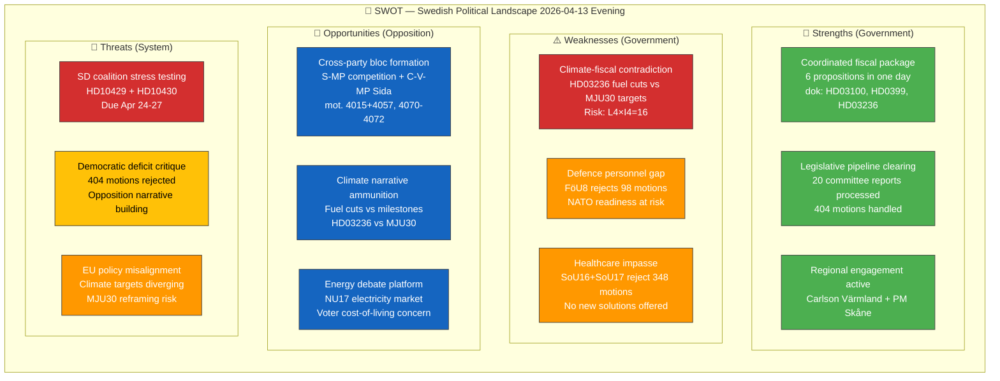

# 🔄 SWOT Analysis — Evening Analysis (Second Pass)

| Field | Value |
|-------|-------|
| **ID** | SWT-EVE-2026-04-13-002 |
| **Date** | 2026-04-13 18:30 UTC |
| **Riksmöte** | 2025/26 |
| **Confidence** | HIGH |
| **Methodology** | political-swot-framework.md |

---

## 📊 Quadrant Mapping

## 💪 Strengths — Government Coalition (M, KD, L + SD support)

| # | Strength | Evidence (dok_id) | Impact | Confidence |
|---|----------|-------------------|--------|:----------:|
| S1 | **Coordinated fiscal offensive** — 6 Finansdepartementet propositions on single day demonstrates unified government agenda control | HD03100 (Vårproposition), HD0399 (Vårändringsbudget), HD03236 (Extra budget), HD0398, HD03217, HD03218 | Campaign platform established before summer recess | 🟩HIGH |
| S2 | **Legislative pipeline clearing** — 20 committee reports processed, 404 opposition motions rejected. Tidö Agreement agenda locked in. | SfU16 (157 motions), FöU8 (98 motions), SoU16 (187 motions), MJU30 | Government controls legislative calendar | 🟩HIGH |
| S3 | **Direct voter appeal** — Fuel tax cuts (HD03236) + energy price support targets cost-of-living voters directly | HD03236, NU17 debate context | Pre-election voter mobilization | 🟩HIGH |
| S4 | **Regional campaign activation** — Carlson (Värmland) + PM Kristersson (Skåne) projecting competence outside Stockholm | regeringen.se press releases Apr 11, 13 | National reach for campaign | 🟧MEDIUM |

## ⚠️ Weaknesses — Government Coalition

| # | Weakness | Evidence (dok_id) | Impact | Confidence |
|---|----------|-------------------|--------|:----------:|
| W1 | **Climate-fiscal contradiction** — Fuel tax cut (HD03236) directly undercuts MJU30 climate milestones commitment. Opposition has clear attack vector. | HD03236 vs MJU30 | Highest risk of the day (L:4 × I:4 = 16) | 🟩HIGH |
| W2 | **Defence personnel bottleneck** — FöU8 rejects all 98 defence motions despite NATO readiness gaps. No new solutions for force structure requirements. | FöU8 | NATO credibility risk | 🟩HIGH |
| W3 | **Healthcare impasse** — SoU16+SoU17 reject 348 motions with no replacement policy. Voters see no progress. | SoU16, SoU17 | Electoral vulnerability in healthcare-sensitive regions | 🟧MEDIUM |

## 🎯 Opportunities — Opposition Bloc

| # | Opportunity | Evidence (dok_id) | Impact | Confidence |
|---|-----------|-------------------|--------|:----------:|
| O1 | **Cross-party bloc architecture** — S-MP competition policy bloc (mot. 4015+4057) + C-V-MP Sida audit bloc (mot. 4070-4072). Pre-election alliance signals. | mot. 4015, 4057, 4070, 4071, 4072 | Coalition alternative credibility | 🟩HIGH |
| O2 | **Climate narrative weapon** — HD03236 vs MJU30 contradiction gives opposition "voters vs planet" framing | HD03236, MJU30 | High-impact election issue | 🟩HIGH |
| O3 | **Energy debate platform** — NU17 debate (Lakso MP vs Skalberg Karlsson M) shows electricity costs remain politically charged | NU17 committee report debate | Cost-of-living voter mobilization | 🟧MEDIUM |

## 🔴 Threats — Democratic System

| # | Threat | Evidence (dok_id) | Impact | Confidence |
|---|--------|-------------------|--------|:----------:|
| T1 | **Coalition stress from within** — SD interpellations targeting M (HD10429) and KD (HD10430) ministers. Responses due Apr 24-27. If evasive, SD gains post-election leverage. | HD10429, HD10430 | Coalition stability risk | 🟧MEDIUM |
| T2 | **Democratic deficit narrative** — 404 motions rejected in single day + 20 committee reports = opposition claims of "rubber stamp parliament" | 20 committee reports, 404+ motions | Public trust in parliamentary process | 🟧MEDIUM |
| T3 | **EU policy misalignment** — MJU30 reframes national climate targets as EU-aligned while potentially lowering ambition. Risk of infringement action. | MJU30 | International credibility | 🟧MEDIUM |

## 🏛️ All 8 Stakeholder Groups Assessed

| Stakeholder Group | Net Impact | Key Evidence |
|-------------------|:----------:|-------------|
| **Citizens** | Mixed | Fuel tax relief helps (+), but healthcare impasse (-), climate risk (-) |
| **Government Coalition** | Positive | Fiscal offensive + legislative agenda locked in |
| **Opposition Bloc** | Strengthening | Cross-party blocs forming, climate narrative ammunition |
| **Business/Industry** | Positive | Energy cost relief (HD03236), competition policy debate (prop. 203) |
| **Civil Society** | Concerned | 404 motions rejected, democratic participation questioned |
| **International/EU** | Cautious | NATO deployment (HD03220) positive, climate divergence (MJU30) negative |
| **Judiciary/Constitutional** | Neutral | Gang crime penalties (HD03218) within constitutional bounds |
| **Media/Public Opinion** | Active | Multiple narrative threads for coverage — budget, climate, SD tensions |
