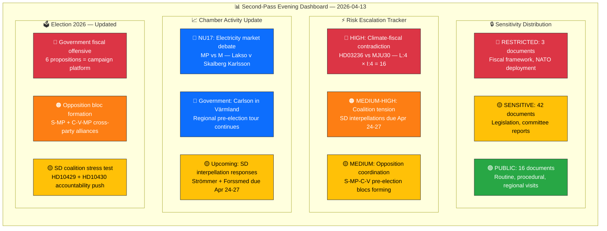

# 🧩 Synthesis Summary — Evening Analysis (Second Pass)

| Field | Value |
|-------|-------|
| **ID** | SYN-EVE-2026-04-13-002 |
| **Date** | 2026-04-13 |
| **Riksmöte** | 2025/26 |
| **Article Type** | evening-analysis (second-pass update) |
| **Documents Analyzed** | 61 (cross-referenced from 6 sibling analysis types) |
| **Analysis Depth** | deep |
| **AI Iterations** | 2 |
| **Overall Confidence** | HIGH |
| **Risk Level** | ELEVATED |
| **Generated** | 2026-04-13 18:30 UTC |
| **Analyst** | news-evening-analysis (run 2) |
| **Methodology** | ai-driven-analysis-guide.md v5.0 |
| **Cross-Referenced Types** | propositions, committeeReports, motions, interpellations, realtime-1433, evening-analysis |

---

## 📊 Intelligence Dashboard

## 🔑 Top Findings (Cross-Type Synthesis — Updated 18:30 UTC)

| # | Finding | Source Types | Evidence | Confidence |
|---|---------|-------------|----------|:----------:|
| 1 | **Spring Budget Offensive — Most significant fiscal day of 2025/26.** Six coordinated Finansdepartementet propositions — Vårproposition (HD03100), Vårändringsbudget (HD0399), Extra budget with fuel tax cuts (HD03236) — all signed PM + Finance Minister. Pre-election economic platform. | propositions, realtime | HD03100 (10/10), HD0399 (9/10), HD03236 (9/10) | 🟩HIGH |
| 2 | **Parliament rejects 404 opposition motions** across 20 committee reports. Security-migration cluster (UU6, SfU16/31/32/36, FöU8/12) consolidates Tidö Agreement. Most intensive legislative day of session. | committeeReports | SfU16 (40/50 sig), MJU30 (40/50), UU6 (39/50), FöU12 (38/50) | 🟩HIGH |
| 3 | **Climate-fiscal contradiction is the day's highest-risk development.** Extra budget fuel tax cut (HD03236) directly undercuts MJU30 climate milestones. Opposition will frame this as "choosing voters over planet." Risk score upgraded to 16/25. | propositions, committeeReports | HD03236 vs MJU30, L:4 × I:4 = 16 | 🟩HIGH |
| 4 | **Opposition coalition-building accelerates.** MP files 42% of motions (8/19); S-MP form competition bloc (mot. 4015+4057 vs prop. 203); C-V-MP form Sida audit bloc (mot. 4070-4072). Pre-election alliance architecture visible. | motions | mot. 4015 (S), mot. 4057 (MP), mot. 4070-4072 (C/V/MP) | 🟩HIGH |
| 5 | **NU17 electricity market debate continues in chamber.** Lakso (MP) vs Skalberg Karlsson (M) exchange — energy policy becomes key government-opposition fault line. Connects to HD03236 fuel tax cut. | chamber speeches | NU17, Lakso (MP), Skalberg Karlsson (M), Brodin (KD), Nordin (C), Eklund (L) | 🟧MEDIUM |
| 6 | **SD tests coalition boundaries.** Two interpellations (HD10429 targeting M, HD10430 targeting KD) on freedom of expression and mosque hate speech. Responses due April 24-27 — watch for coalition strain. | interpellations | HD10429 (Strömmer), HD10430 (Forssmed) | 🟧MEDIUM |
| 7 | **Regional campaign tour intensifies.** Infrastructure Minister Carlson visits Värmland (Apr 13), PM Kristersson visited Skåne (Apr 11). Government projecting competence outside Stockholm ahead of 2026 election. | government press | regeringen.se press releases | 🟧MEDIUM |

## 📊 Cross-Type Activity Summary

| Article Type | Documents | Key Theme | Top Significance | Analysis Confidence |
|-------------|-----------|-----------|-----------------|:-------------------:|
| propositions | 10 | Spring Budget Offensive | HD03100 (10/10) | 🟩HIGH |
| committeeReports | 20 | Tidö legislative consolidation | SfU16 (40/50) | 🟩HIGH |
| motions | 19 | Opposition multi-front challenge | mot. 4015+4057 bloc | 🟩HIGH |
| interpellations | 2 | SD coalition accountability | HD10429 (7/10) | 🟧MEDIUM |
| realtime | 9 | Budget + NATO + reception | HD03100 (9/10) | 🟩HIGH |
| evening-analysis | 61 (aggregated) | Day synthesis | Updated 18:30 UTC | 🟩HIGH |

## 🗳️ Election 2026 Implications — Evening Assessment

| Dimension | Assessment | Evidence | Confidence |
|-----------|-----------|----------|:----------:|
| **Electoral Impact** | Government controls economic narrative. 6 fiscal propositions = de facto 2026 campaign platform. Fuel tax relief + energy support = direct voter appeal. NU17 debate shows energy costs remain top voter concern. | HD03100, HD03236, HD0399, NU17 debate | 🟩HIGH |
| **Coalition Scenarios** | SD interpellations (HD10429/10430) signal independence-within-coalition. Evasive ministerial responses by Apr 27 → SD post-election leverage. NU17 debate shows KD (Brodin) and M (Skalberg Karlsson) defend government line while C (Nordin) challenges. | HD10429, HD10430, NU17 chamber exchanges | 🟧MEDIUM |
| **Voter Salience** | Migration (SfU16: 157 motions rejected), climate (MJU30: target realignment), cost-of-living (HD03236: fuel cuts), and electricity prices (NU17) are top-4 voter concerns in 2026 polling. | Committee reports + propositions + NU17 | 🟩HIGH |
| **Campaign Vulnerability** | Climate contradiction (HD03236 fuel cuts vs MJU30 milestones) is primary government vulnerability. Secondary: 404 rejected motions → "democratic deficit" narrative from opposition. | HD03236, MJU30, 404 motions rejected | 🟩HIGH |
| **Policy Legacy** | 20 committee reports clearing pre-summer recess signals government locking in Tidö agenda before Election 2026 enters campaign mode. Legislative pipeline nearly complete. | 20 committee reports in single day | 🟧MEDIUM |

## 📅 Forward Intelligence — What to Watch

| Timeframe | Watch Item | Trigger | Risk |
|-----------|-----------|---------|:----:|
| Apr 14 | NU17 vote expected | Chamber vote on electricity market report | 🟡 |
| Apr 24-27 | SD interpellation responses | Strömmer (M) + Forssmed (KD) must respond | 🟠 |
| May 2026 | Spring Budget debate | Opposition response to Vårproposition HD03100 | 🔴 |
| Jun 2026 | Summer recess deadline | All Tidö legislative agenda must clear by then | 🟠 |
| Sep 2026 | Election 2026 | All today's activity feeds into campaign narratives | 🔴 |

## 📂 Artifacts Inventory

| Artifact | File | Status |
|----------|------|--------|
| Synthesis Summary | `synthesis-summary.md` | ✅ Complete |
| Classification Results | `classification-results.md` | ✅ Complete |
| Risk Assessment | `risk-assessment.md` | ✅ Complete |
| SWOT Analysis | `swot-analysis.md` | ✅ Complete |
| Threat Analysis | `threat-analysis.md` | ✅ Complete |
| Stakeholder Perspectives | `stakeholder-perspectives.md` | ✅ Complete |
| Significance Scoring | `significance-scoring.md` | ✅ Complete |
| Cross-Reference Map | `cross-reference-map.md` | ✅ Complete |
| Data Download Manifest | `data-download-manifest.md` | ✅ Complete |
