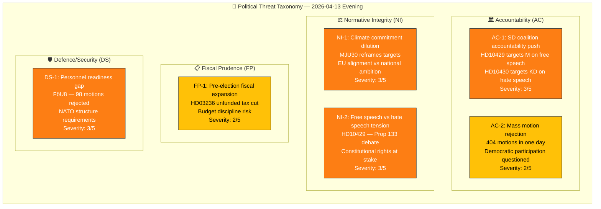

# 🔴 Threat Analysis — Evening Analysis (Second Pass)

| Field | Value |
|-------|-------|
| **ID** | THR-EVE-2026-04-13-002 |
| **Date** | 2026-04-13 18:30 UTC |
| **Riksmöte** | 2025/26 |
| **Threat Level** | MODERATE |
| **Confidence** | HIGH |
| **Methodology** | political-threat-framework.md (6 democratic function categories) |

---

## 📊 Threat Taxonomy Network

## 📋 Threat Register

| Threat ID | Category | Description | Severity (1-5) | Evidence | Actor |
|-----------|----------|-------------|:--------------:|----------|-------|
| THR-AC-001 | Accountability | SD uses interpellations to hold coalition partners publicly accountable on ideological fault lines | 3 | HD10429 (Strömmer/M), HD10430 (Forssmed/KD) | SD (Björkman) |
| THR-AC-002 | Accountability | Mass rejection of 404 motions creates "rubber stamp" narrative undermining parliamentary legitimacy | 2 | 20 committee reports, 404+ motions rejected | Opposition parties |
| THR-NI-001 | Normative Integrity | Climate target realignment from national ambition to EU-minimum standard | 3 | MJU30 committee report, shift from 2017 framework | Government coalition |
| THR-NI-002 | Normative Integrity | Free speech vs hate speech — Prop 133 creates constitutional tension between competing rights | 3 | HD10429, Prop 2025/26:133 | Structural (law vs rights) |
| THR-FP-001 | Fiscal Prudence | Pre-election fuel tax cut without offset creates deficit risk | 2 | HD03236 Extra ändringsbudget | Government (Finansdepartementet) |
| THR-DS-001 | Defence/Security | NATO force structure requirements unmet, no new personnel measures despite 98 defence motions | 3 | FöU8 committee report | Structural (military/political gap) |

## 🎯 Escalation Decision

| Threat | Current Level | Escalation Trigger | Timeline |
|--------|:------------:|--------------------|---------:|
| THR-AC-001 | 🟡 MODERATE | Ministerial response is evasive or confrontational | Apr 24-27 |
| THR-NI-001 | 🟡 MODERATE | EU Commission formal inquiry on climate targets | Q3 2026 |
| THR-NI-002 | 🟡 MODERATE | Constitutional committee (KU) review of Prop 133 | May 2026 |
| THR-DS-001 | 🟡 MODERATE | NATO capability assessment reveals shortfall | Oct 2026 |
