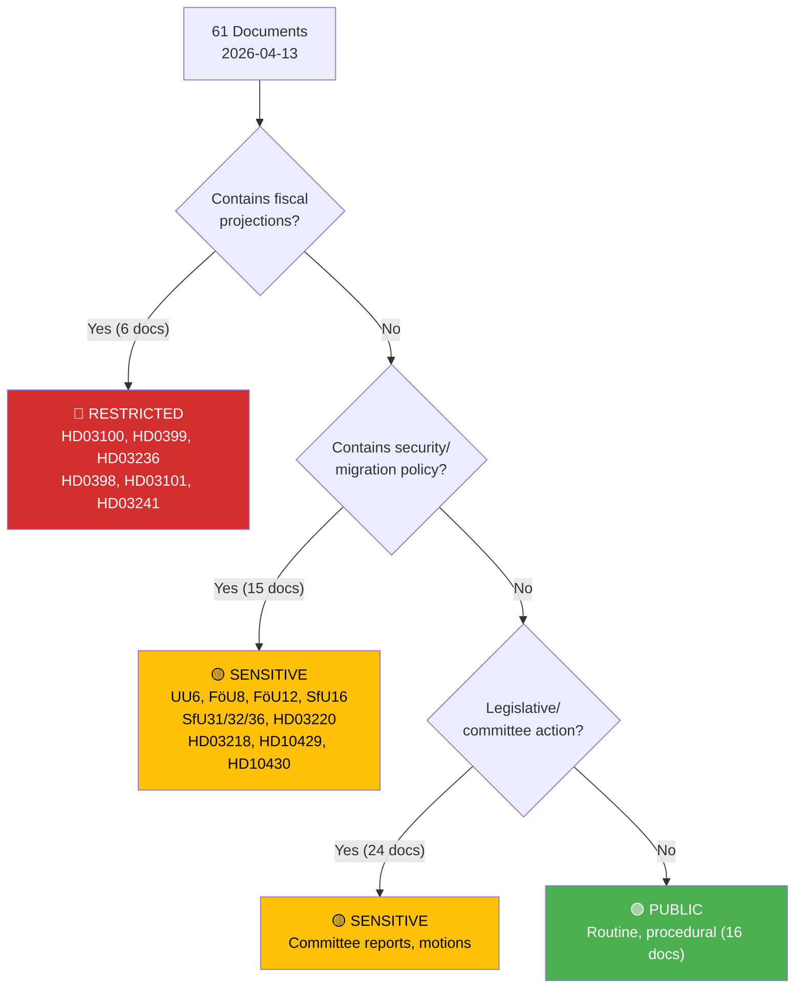

# 🔒 Classification Results — Evening Analysis 2026-04-13

| Field | Value |
|-------|-------|
| **ID** | CLS-EVE-2026-04-13-001 |
| **Date** | 2026-04-13 |
| **Riksmöte** | 2025/26 |
| **Documents Classified** | 61 |
| **Confidence** | HIGH |
| **Generated** | 2026-04-13 17:56 UTC |

---

## Sensitivity Decision Tree

## Per-Document Classification

| dok_id | Type | Title | Sensitivity | Domain | Urgency | Significance |
|--------|------|-------|------------|--------|---------|-------------|
| HD03100 | prop | 2026 års ekonomiska vårproposition | 🔴 RESTRICTED | Fiscal Policy | CRITICAL | 10/10 |
| HD0399 | prop | Vårändringsbudget för 2026 | 🔴 RESTRICTED | Budget | IMMEDIATE | 9/10 |
| HD03236 | prop | Extra ändringsbudget — Sänkt skatt på drivmedel | 🔴 RESTRICTED | Energy/Tax | IMMEDIATE | 9/10 |
| HD03218 | prop | Dubbla straff för brott i kriminella nätverk | 🟡 SENSITIVE | Criminal Justice | HIGH | 8/10 |
| HD03220 | prop | Svenskt bidrag till Natos framskjutna närvaro | 🟡 SENSITIVE | Defence/NATO | HIGH | 8/10 |
| HD03217 | prop | Utökat straffrättsligt tjänstemannaansvar | 🟡 SENSITIVE | Public Admin | MODERATE | 7/10 |
| HD01SfU16 | bet | Migrationsfrågor | 🟡 SENSITIVE | Migration | HIGH | 40/50 |
| HD01MJU30 | bet | Klimatmål och klimatpolitik | 🟡 SENSITIVE | Climate | HIGH | 40/50 |
| HD01UU6 | bet | Säkerhetspolitik | 🟡 SENSITIVE | Security | HIGH | 39/50 |
| HD01FöU12 | bet | Totalförsvaret — civilt försvar | 🟡 SENSITIVE | Defence | HIGH | 38/50 |
| HD01FöU8 | bet | Försvarsmaktens personalförsörjning | 🟡 SENSITIVE | Defence | HIGH | 36/50 |
| HD10429 | ip | Skyddet för yttrandefriheten | 🟡 SENSITIVE | Constitutional | MODERATE | 7/10 |
| HD10430 | ip | Moskéer som sprider hat och hot | 🟡 SENSITIVE | Religious Extremism | MODERATE | 6/10 |
| HD0398 | skr | Redovisning av skatteutgifter 2026 | 🔴 RESTRICTED | Taxation | ROUTINE | 6/10 |
| HD03101 | skr | Årsredovisning för staten 2025 | �� RESTRICTED | Public Finance | ROUTINE | 6/10 |
| HD03241 | skr | Riksrevisionens rapport om finanspolitiska ramverket | 🔴 RESTRICTED | Fiscal Audit | ROUTINE | 6/10 |
| HD03219 | prop | Riksrevisionens rapport om tandvårdsstödet | 🟢 PUBLIC | Healthcare | LOW | 5/10 |

## Distribution Summary

| Sensitivity | Count | Percentage |
|------------|-------|-----------|
| 🔴 RESTRICTED | 6 | 10% |
| 🟡 SENSITIVE | 39 | 64% |
| 🟢 PUBLIC | 16 | 26% |
