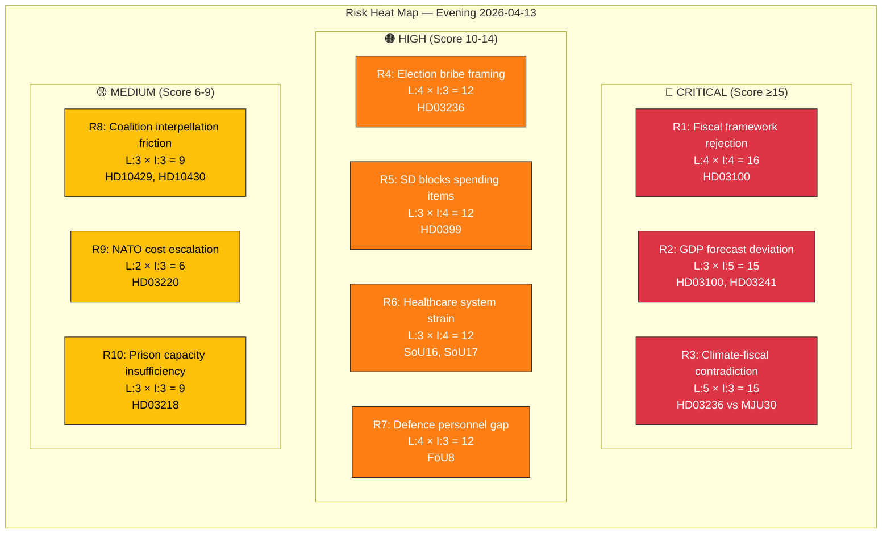
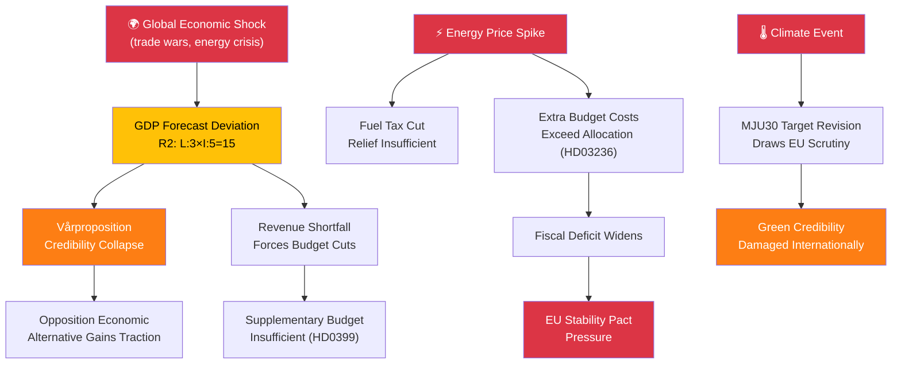

# 🔴 Risk Assessment — Evening Analysis 2026-04-13

| Field | Value |
|-------|-------|
| **ID** | RSK-EVE-2026-04-13-001 |
| **Date** | 2026-04-13 |
| **Riksmöte** | 2025/26 |
| **Overall Risk Level** | ELEVATED |
| **Confidence** | HIGH |
| **Generated** | 2026-04-13 17:55 UTC |
| **Documents Cross-Referenced** | 61 |

---

## Risk Heat Map

## Detailed Risk Register

| ID | Risk | Category | Likelihood (1-5) | Impact (1-5) | Score | dok_id | Mitigation | Confidence |
|----|------|----------|------------------|-------------|-------|--------|------------|:----------:|
| R1 | Opposition rejects Vårproposition fiscal framework in FiU | Fiscal | 4 | 4 | **16** | HD03100 | Coalition secures SD support in Finance Committee | 🟧MEDIUM |
| R2 | GDP growth forecast proves overly optimistic | Economic | 3 | 5 | **15** | HD03100, HD03241 | Quarterly fiscal revisions, Riksrevisionen oversight | 🟧MEDIUM |
| R3 | Fuel tax cut contradicts climate milestones | Policy Coherence | 5 | 3 | **15** | HD03236, MJU30 | Frame as temporary crisis measure; pair with green investments | 🟩HIGH |
| R4 | S/V frame fuel tax relief as election bribery | Electoral | 4 | 3 | **12** | HD03236 | Emphasise structural energy policy, not one-off relief | 🟩HIGH |
| R5 | SD blocks specific Vårändringsbudget spending items | Coalition | 3 | 4 | **12** | HD0399 | Early consultation with SD on spending priorities | 🟧MEDIUM |
| R6 | Healthcare access crisis deepens without policy response | Social | 3 | 4 | **12** | SoU16, SoU17 | Commission new healthcare inquiry for autumn | 🟧MEDIUM |
| R7 | Defence personnel shortfall blocks NATO commitments | Security | 4 | 3 | **12** | FöU8 | Accelerate military recruitment and retention programs | 🟩HIGH |
| R8 | SD interpellations expose coalition fault lines | Coalition | 3 | 3 | **9** | HD10429, HD10430 | Ministers deliver substantive responses by deadline | 🟧MEDIUM |
| R9 | NATO deployment costs escalate beyond budget | Security | 2 | 3 | **6** | HD03220 | NATO burden-sharing framework limits Swedish exposure | 🟧MEDIUM |
| R10 | Prison capacity insufficient for double gang penalties | Justice | 3 | 3 | **9** | HD03218 | Announce Kriminalvården expansion plan | 🟩HIGH |

## Risk Cascade Analysis

## Forward Indicators — Risk Watch Items

| Indicator | Trigger | Timeline | Risk IDs |
|-----------|---------|----------|----------|
| FiU committee vote on Vårproposition | SD signals opposition to fiscal assumptions | April-May 2026 | R1, R5 |
| Quarterly GDP revision | KI, SCB, or Riksbanken revises growth outlook downward | Q2 2026 | R2 |
| MJU debate on climate milestones | MP/V challenge MJU30 in plenary | April 2026 | R3, R4 |
| Minister responses to SD interpellations | Strömmer (Apr 24) and Forssmed (Apr 27) deadlines | Late April 2026 | R8 |
| Kriminalvården capacity report | Quarterly occupancy data release | May 2026 | R10 |

## Aggregate Risk Profile

- **Overall Level**: ELEVATED (weighted average score: 12.1)
- **Primary Cluster**: Fiscal-economic risks (R1, R2, R5) — concentrated in spring budget package
- **Secondary Cluster**: Policy coherence (R3, R4) — climate vs cost-of-living tension
- **Emerging**: Coalition dynamics (R5, R8) — SD testing boundaries ahead of Election 2026
