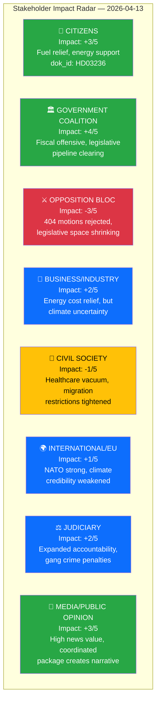

# 🎭 Stakeholder Impact Analysis — Evening Analysis 2026-04-13

| Field | Value |
|-------|-------|
| **ID** | STA-EVE-2026-04-13-001 |
| **Date** | 2026-04-13 |
| **Riksmöte** | 2025/26 |
| **Stakeholder Groups** | 8 |
| **Confidence** | HIGH |
| **Generated** | 2026-04-13 17:56 UTC |

---

## Impact Radar

## Detailed Stakeholder Assessment

### 1. 👥 Citizens — Impact: +3/5 (Positive)

| Dimension | Assessment | Evidence | Confidence |
|-----------|-----------|----------|:----------:|
| **Cost of Living** | Direct benefit from fuel tax cuts and energy price support | HD03236 — sänkt skatt på drivmedel, energiprisstöd | 🟩HIGH |
| **Security** | Double penalties for gang crimes strengthen public safety messaging | HD03218 — dubbla straff för brott i kriminella nätverk | 🟩HIGH |
| **Healthcare** | No new solutions — 348 healthcare motions rejected without alternatives | SoU16 (176 motions), SoU17 (172 motions) | 🟩HIGH |
| **Democratic Voice** | 404 opposition motions rejected — citizens' representatives' proposals dismissed | Committee reports cluster | 🟧MEDIUM |
| **Net Assessment** | Tangible economic relief (+) offset by healthcare vacuum and reduced democratic responsiveness (-) | Cross-type analysis | 🟩HIGH |

### 2. 🏛️ Government Coalition (M, KD, L + SD support) — Impact: +4/5 (Strongly Positive)

| Dimension | Assessment | Evidence | Confidence |
|-----------|-----------|----------|:----------:|
| **Governing Capacity** | Demonstrated through coordinated 6-proposition fiscal package on single day | HD03100, HD0399, HD03236, HD0398, HD03101, HD03241 | 🟩HIGH |
| **Legislative Control** | 20 committee reports clear pipeline, cementing Tidö Agreement agenda | SfU16, MJU30, UU6, FöU12, FöU8 + 15 others | 🟩HIGH |
| **Election Positioning** | Vårproposition = de facto campaign platform; fuel tax relief = voter benefit | HD03100 (significance 10/10), HD03236 (9/10) | 🟩HIGH |
| **Coalition Stability** | SD interpellations create minor friction but within Tidö framework norms | HD10429, HD10430 — accountability, not defection signals | 🟧MEDIUM |

### 3. ⚔️ Opposition Bloc (S, V, MP, C) — Impact: -3/5 (Negative)

| Dimension | Assessment | Evidence | Confidence |
|-----------|-----------|----------|:----------:|
| **Legislative Defeat** | 404+ motions rejected across all committee reports — wholesale dismissal | SfU16 (157), SoU16+SoU17 (348), FöU8 (98), UU6 (51) | 🟩HIGH |
| **Counter-Strategy** | MP leads with 42% of recent motions (8/19); cross-party blocs forming on Sida (C+V+MP) and competition (S+MP) | mot. 4015+4057, mot. 4070-4072 | 🟩HIGH |
| **Pre-Election Positioning** | Opposition must articulate alternative to government's fiscal offensive — Vårproposition sets the economic debate terms | HD03100 controls narrative | 🟧MEDIUM |

### 4. 💼 Business/Industry — Impact: +2/5 (Moderately Positive)

| Dimension | Assessment | Evidence | Confidence |
|-----------|-----------|----------|:----------:|
| **Energy Costs** | Fuel tax cuts reduce transport and logistics costs | HD03236 | 🟩HIGH |
| **Climate Uncertainty** | MJU30 climate target recalibration + fuel tax cuts create investment uncertainty for green transition | HD03236 vs MJU30 | 🟧MEDIUM |
| **Renewables** | NU18 permitting reforms could accelerate renewable energy deployment | HD01NU18 | 🟧MEDIUM |
| **Labour Market** | Status quo — 146 work environment and equality motions rejected (AU11, AU12) | HD01AU11, HD01AU12 | 🟩HIGH |

### 5. 🤝 Civil Society — Impact: -1/5 (Slightly Negative)

| Dimension | Assessment | Evidence | Confidence |
|-----------|-----------|----------|:----------:|
| **Migration Rights** | Tightened detention (SfU31), returns enforcement (SfU32), conduct requirements (SfU36) | HD01SfU31, HD01SfU32, HD01SfU36 | 🟩HIGH |
| **Healthcare Access** | No new solutions for healthcare crisis — organisations' concerns unanswered | SoU16, SoU17 | 🟩HIGH |
| **Child Rights** | Socialtjänstministern attending Barnrättsdagarna 2026 signals engagement | regeringen.se press release 2026-04-12 | 🟧MEDIUM |
| **Freedom of Expression** | HD10429 raises concerns about Prop. 133 impact on assembly rights | HD10429 | 🟧MEDIUM |

### 6. 🌍 International/EU — Impact: +1/5 (Neutral-Positive)

| Dimension | Assessment | Evidence | Confidence |
|-----------|-----------|----------|:----------:|
| **NATO** | Swedish forces to Finland — concrete alliance commitment | HD03220, HD01UFöU3 | 🟩HIGH |
| **Climate Credibility** | Fuel tax cuts risk EU Green Deal non-compliance perception | HD03236, MJU30 | 🟧MEDIUM |
| **Fiscal Rules** | EU Stability Pact compliance depends on Vårproposition accuracy | HD03100, HD0399 | 🟧MEDIUM |

### 7. ⚖️ Judiciary/Constitutional — Impact: +2/5 (Moderately Positive)

| Dimension | Assessment | Evidence | Confidence |
|-----------|-----------|----------|:----------:|
| **Criminal Justice** | Double gang crime penalties (HD03218) + expanded civil servant liability (HD03217) — judiciary gains new tools | HD03218, HD03217 | 🟩HIGH |
| **Constitutional Rights** | HD10429 raises freedom of expression concerns about Prop. 133 — potential Lagrådet scrutiny | HD10429 | 🟧MEDIUM |

### 8. 📰 Media/Public Opinion — Impact: +3/5 (Positive for News Value)

| Dimension | Assessment | Evidence | Confidence |
|-----------|-----------|----------|:----------:|
| **News Value** | Coordinated fiscal package = major story; 20 committee reports = extensive coverage material | All fiscal docs + committee cluster | 🟩HIGH |
| **Narrative Control** | Government sets the media agenda with fuel tax cuts as lead story | HD03236 | 🟩HIGH |
| **Accountability Focus** | SD interpellations create secondary story about coalition dynamics | HD10429, HD10430 | 🟧MEDIUM |

## Impact Summary Matrix

| Stakeholder | Economic | Security | Democratic | Social | Overall |
|------------|---------|----------|-----------|--------|---------|
| Citizens | 🟢+3 | 🟢+2 | 🟡-1 | 🟡-1 | **+3/5** |
| Gov Coalition | 🟢+4 | 🟢+3 | 🟢+3 | 🟡0 | **+4/5** |
| Opposition | 🔴-2 | 🟡0 | 🔴-3 | 🟡0 | **-3/5** |
| Business | 🟢+3 | 🟡0 | 🟡0 | 🟡0 | **+2/5** |
| Civil Society | 🟡0 | 🟡0 | 🟡-1 | 🔴-2 | **-1/5** |
| International | 🟡0 | 🟢+3 | 🟡0 | 🟡0 | **+1/5** |
| Judiciary | 🟡0 | 🟢+2 | 🟡+1 | 🟡0 | **+2/5** |
| Media | 🟢+3 | 🟡0 | 🟢+2 | 🟡0 | **+3/5** |
