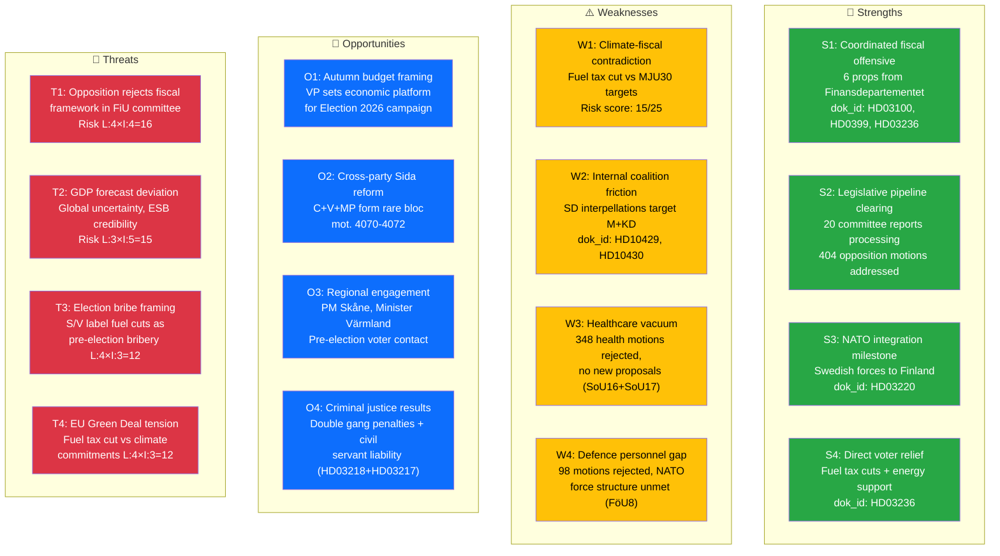

# 🎯 SWOT Analysis — Evening Analysis 2026-04-13

| Field | Value |
|-------|-------|
| **ID** | SWT-EVE-2026-04-13-001 |
| **Date** | 2026-04-13 |
| **Riksmöte** | 2025/26 |
| **Confidence** | HIGH |
| **Generated** | 2026-04-13 17:55 UTC |
| **Documents Cross-Referenced** | 61 |

---

## SWOT Quadrant Mapping

## Evidence-Based SWOT Detail

### 💪 Strengths

| ID | Strength | Evidence (dok_id) | Impact | Confidence |
|----|----------|-------------------|--------|:----------:|
| S1 | **Coordinated Spring Fiscal Offensive**: 6 propositions from Finansdepartementet released simultaneously — Vårproposition, Vårändringsbudget, Extra budget with fuel tax cut, tax expenditure report, state accounts, fiscal framework audit response. | HD03100, HD0399, HD03236, HD0398, HD03101, HD03241 | Government controls economic narrative for Election 2026 | 🟩HIGH |
| S2 | **Legislative Pipeline Clearing**: 20 committee reports process 404+ opposition motions across security, migration, climate, healthcare, and labour. Tidö Agreement agenda is being legislatively cemented before summer recess. | SfU16 (157 motions), SoU16+SoU17 (348 motions), FöU8 (98 motions), UU6 (51 motions) | Demonstrates governing capacity, limits opposition legislative space | 🟩HIGH |
| S3 | **NATO Integration Milestone**: Swedish military contribution to NATO forward presence in Finland (HD03220) demonstrates concrete alliance commitment. Cross-party consensus on defence policy. | HD03220, HD01UFöU3 (realtime) | Strengthens Sweden's NATO credibility, bipartisan foreign policy | 🟩HIGH |
| S4 | **Direct Voter Relief**: Fuel tax cuts and energy price support (HD03236) address the #1 cost-of-living concern. Signed by Deputy PM Edholm and State Secretary Wykman — politically prioritised. | HD03236 (significance 9/10) | Tangible pre-election benefit for households | 🟧MEDIUM |

### ⚠️ Weaknesses

| ID | Weakness | Evidence (dok_id) | Risk Score | Confidence |
|----|----------|-------------------|-----------|:----------:|
| W1 | **Climate-Fiscal Contradiction**: Fuel tax cut (HD03236) directly conflicts with climate milestone recalibration (MJU30). The government simultaneously weakens climate ambition AND cuts fuel taxes — opposition will exploit this inconsistency. | HD03236 vs HD01MJU30 | L:5 × I:3 = 15 | 🟩HIGH |
| W2 | **Coalition Internal Friction**: SD files two interpellations targeting M Justice Minister Strömmer (HD10429, freedom of expression) and KD Social Minister Forssmed (HD10430, mosque hate speech). Accountability push from within the governing coalition. | HD10429, HD10430 — responses due Apr 24-27 | L:3 × I:3 = 9 | 🟧MEDIUM |
| W3 | **Healthcare Policy Vacuum**: Combined 348 motions on healthcare organisation and priorities (SoU16+SoU17) rejected with no new government proposals. The system faces growing access crisis with no legislative response. | HD01SoU16, HD01SoU17 | L:3 × I:4 = 12 | 🟧MEDIUM |
| W4 | **Defence Personnel Bottleneck**: 98 motions on defence staffing rejected (FöU8) despite documented inability to meet NATO Force Structure requirements. Sweden's military ambitions exceed workforce capacity. | HD01FöU8 (significance 36/50) | L:4 × I:3 = 12 | 🟩HIGH |

### 🎯 Opportunities

| ID | Opportunity | Evidence (dok_id) | Potential | Confidence |
|----|------------|-------------------|-----------|:----------:|
| O1 | **Autumn Budget Framing**: Vårproposition sets the economic platform for the 2026/27 budget and effectively becomes the government's Election 2026 economic manifesto. Controls the policy agenda. | HD03100 (significance 10/10) | Shapes entire pre-election economic debate | 🟩HIGH |
| O2 | **Cross-Party Reform Blocs**: Rare C+V+MP tripartite bloc on Sida humanitarian aid audit (mot. 4070-4072) plus S-MP coordination on competition policy (mot. 4015+4057). Potential for constructive legislative cooperation. | motions analysis — 3-party + 2-party blocs | Could break political gridlock on select issues | 🟧MEDIUM |
| O3 | **Regional Pre-Election Engagement**: PM visits Skåne (Apr 11), Infrastructure Minister visits Värmland (Apr 13). Government pivots to direct voter contact ahead of Election 2026 campaign season. | regeringen.se press releases | Builds grassroots support in swing regions | 🟧MEDIUM |
| O4 | **Criminal Justice Delivery**: Double penalties for gang crimes (HD03218) and expanded civil servant liability (HD03217) demonstrate law-and-order results — a core Tidö Agreement priority. | HD03218 (significance 8/10), HD03217 (7/10) | Addresses voter security concerns | 🟩HIGH |

### 🚨 Threats

| ID | Threat | Evidence (dok_id) | L×I Score | Confidence |
|----|--------|-------------------|-----------|:----------:|
| T1 | **Fiscal Framework Rejection**: Opposition could reject Vårproposition's fiscal assumptions in FiU committee, undermining the entire spring budget package. | HD03100, realtime risk R1 (L:4×I:4=16) | 16 | 🟧MEDIUM |
| T2 | **GDP Forecast Deviation**: If actual GDP diverges from Vårproposition projections, the credibility of the entire fiscal package collapses. Global uncertainty (trade wars, energy prices) adds risk. | HD03100, HD03241 (Riksrevisionen), realtime R2 (L:3×I:5=15) | 15 | 🟧MEDIUM |
| T3 | **Election Bribe Framing**: S and V will frame fuel tax cuts and energy support as pre-election bribery, undermining the policy intent. The coincidental timing reinforces this narrative. | HD03236, propositions risk analysis | 12 | 🟩HIGH |
| T4 | **EU Green Deal Non-Compliance**: Fuel tax cuts may conflict with EU emissions trading and Green Deal commitments, exposing Sweden to diplomatic and regulatory pressure. | HD03236 vs MJU30, EU CRA obligations | 12 | 🟧MEDIUM |

## 8 Stakeholder Group Assessment

| Stakeholder Group | Net Impact | Key Concern | Evidence |
|-------------------|-----------|-------------|----------|
| **Citizens** | 🟢 Positive | Fuel tax relief, energy support directly benefit households | HD03236 |
| **Government Coalition** | 🟢 Positive | Coordinated fiscal offensive demonstrates governing capacity | HD03100, HD0399, HD03236 |
| **Opposition Bloc** | 🔴 Negative | 404 motions rejected, legislative space constrained | SfU16, MJU30, UU6 committee reports |
| **Business/Industry** | 🟡 Mixed | Energy cost relief positive; climate policy uncertainty for green investments | HD03236, MJU30, NU18 |
| **Civil Society** | 🟡 Mixed | Healthcare vacuum (SoU16/17); migration restrictions tightened (SfU31/32/36) | SfU16, SoU16, SoU17 |
| **International/EU** | 🟡 Mixed | NATO commitment strong (HD03220); fuel tax cut risks EU climate credibility | HD03220 vs HD03236 |
| **Judiciary/Constitutional** | 🟡 Neutral | Civil servant liability expansion (HD03217) increases accountability scope | HD03217, HD03218 |
| **Media/Public Opinion** | 🟢 Positive | High news value — coordinated package creates strong narrative | All fiscal docs + committee cluster |
