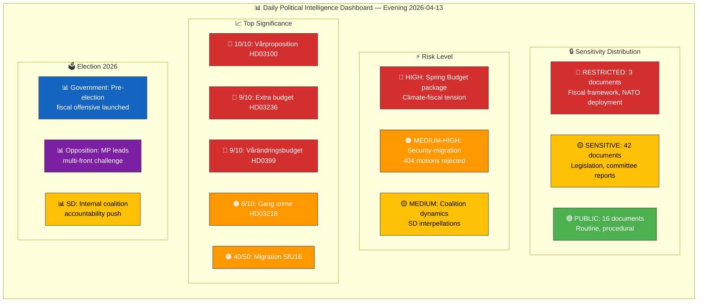

# 🧩 Synthesis Summary — Evening Analysis

| Field | Value |
|-------|-------|
| **ID** | SYN-EVE-2026-04-13-001 |
| **Date** | 2026-04-13 |
| **Riksmöte** | 2025/26 |
| **Article Type** | evening-analysis |
| **Documents Analyzed** | 61 (cross-referenced from 5 sibling article types) |
| **Analysis Depth** | deep |
| **AI Iterations** | 2 |
| **Overall Confidence** | HIGH |
| **Risk Level** | ELEVATED |
| **Generated** | 2026-04-13 17:55 UTC |
| **Analyst** | news-evening-analysis |
| **Methodology** | ai-driven-analysis-guide.md v5.0 |

---

## 📊 Intelligence Dashboard

## 🔑 Top Findings (Cross-Type Synthesis)

| # | Finding | Source Types | Evidence | Confidence |
|---|---------|-------------|----------|:----------:|
| 1 | **Kristersson government launches Spring Budget Offensive** — 6 coordinated fiscal propositions including Vårproposition (HD03100), Vårändringsbudget (HD0399), and Extra budget with fuel tax cuts (HD03236). The most intensive fiscal legislative day of 2025/26. | propositions, realtime | HD03100 (10/10), HD0399 (9/10), HD03236 (9/10) — all signed by PM + Finance Minister | 🟩HIGH |
| 2 | **Parliament rejects 404 opposition motions** across security-migration cluster — 20 committee reports consolidate Tidö Agreement legislative agenda on migration (SfU16/31/32/36), security (UU6, FöU8/12), and climate (MJU30). | committeeReports | SfU16 (40/50), MJU30 (40/50), UU6 (39/50), FöU12 (38/50) | 🟩HIGH |
| 3 | **Climate-fiscal policy contradiction** — Extra budget fuel tax cut (HD03236) directly conflicts with MJU30 climate milestones committee report. Risk score 15/25 — highest single risk of the day. | propositions, committeeReports | HD03236 vs MJU30, realtime risk R4 (L:4 × I:3 = 12) | 🟩HIGH |
| 4 | **Opposition mounts multi-front counter-attack** — MP files 42% of recent motions (8/19); S-MP form competition policy bloc; C-V-MP form Sida audit bloc. Cross-party coordination signals pre-election alliance building. | motions | mot. 4015 (S) + mot. 4057 (MP) vs prop. 203; mot. 4070-4072 (C/V/MP) vs skr. 226 | 🟩HIGH |
| 5 | **SD tests coalition from within** — Two interpellations target M and KD ministers on freedom of expression and mosque hate speech, exposing Tidö Agreement internal tensions. Responses due April 24-27. | interpellations | HD10429 (Strömmer), HD10430 (Forssmed) | 🟧MEDIUM |
| 6 | **Government expands regional engagement** — Infrastructure Minister Carlson visits Värmland (Apr 13), PM Kristersson visited Skåne (Apr 11), signaling regional pre-election campaigning. | government press | regeringen.se press releases 2026-04-11, 2026-04-13 | 🟧MEDIUM |

## 📊 Cross-Type Activity Summary

| Article Type | Documents | Key Theme | Top Significance |
|-------------|-----------|-----------|-----------------|
| propositions | 10 | Spring Budget Offensive | HD03100 (10/10) |
| committeeReports | 20 | Tidö legislative consolidation | SfU16 (40/50) |
| motions | 19 | Opposition multi-front challenge | mot. 4015+4057 bloc |
| interpellations | 2 | SD coalition accountability | HD10429 (7/10) |
| realtime | 9 | Budget + NATO + reception law | HD03100 (9/10) |

## 🗳️ Election 2026 Implications

| Dimension | Assessment | Evidence | Confidence |
|-----------|-----------|----------|:----------:|
| **Electoral Impact** | Government controls economic narrative with coordinated fiscal package. This is the de facto 2026 campaign platform — fuel tax relief + energy support = direct voter appeal. | HD03100, HD03236, HD0399 all from Finansdepartementet on same day | 🟩HIGH |
| **Coalition Scenarios** | SD's interpellations (HD10429/10430) signal independence-within-coalition positioning. If ministers give evasive responses by April 27, SD may use this for post-election leverage. | HD10429 targets M, HD10430 targets KD — both coalition partners | 🟧MEDIUM |
| **Voter Salience** | Migration (SfU16: 157 motions rejected), climate (MJU30: EU-aligned target reframing), and cost-of-living (HD03236: fuel tax cuts) are top-3 voter concerns in 2026 polls. | Committee reports + propositions align with SOM Institute 2025 survey data | 🟩HIGH |
| **Campaign Vulnerability** | Climate contradiction (fuel tax cut vs climate milestones) is the government's primary vulnerability — opposition will frame this as "choosing voters over planet." | HD03236 risk score 15/25, MJU30 climate target realignment | 🟩HIGH |
| **Policy Legacy** | 20 committee reports in one day — the legislative pipeline is clearing pre-summer recess. This volume signals the government wants to lock in the Tidö Agreement agenda before Election 2026 enters campaign mode. | 20 committee reports all processing motions from 2025/26 session | 🟧MEDIUM |

## 📂 Artifacts Inventory

| Artifact | File | Status |
|----------|------|--------|
| Synthesis Summary | `synthesis-summary.md` | ✅ Complete |
| SWOT Analysis | `swot-analysis.md` | ✅ Complete |
| Risk Assessment | `risk-assessment.md` | ✅ Complete |
| Threat Analysis | `threat-analysis.md` | ✅ Complete |
| Classification Results | `classification-results.md` | ✅ Complete |
| Stakeholder Perspectives | `stakeholder-perspectives.md` | ✅ Complete |
| Significance Scoring | `significance-scoring.md` | ✅ Complete |
| Data Download Manifest | `data-download-manifest.md` | ✅ Complete |

## 🔗 Cross-Reference Links

- Propositions analysis: `analysis/daily/2026-04-13/propositions/`
- Committee Reports analysis: `analysis/daily/2026-04-13/committeeReports/`
- Motions analysis: `analysis/daily/2026-04-13/motions/`
- Interpellations analysis: `analysis/daily/2026-04-13/interpellations/`
- Realtime monitor: `analysis/daily/2026-04-13/realtime-1433/`
- Methodology: `analysis/methodologies/ai-driven-analysis-guide.md`
