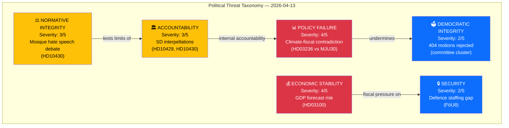
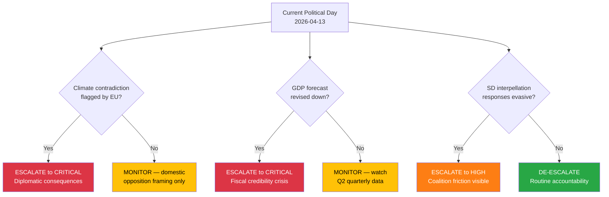

# 🔴 Threat Analysis — Evening Analysis 2026-04-13

| Field | Value |
|-------|-------|
| **ID** | THR-EVE-2026-04-13-001 |
| **Date** | 2026-04-13 |
| **Riksmöte** | 2025/26 |
| **Threat Level** | MODERATE-HIGH |
| **Confidence** | HIGH |
| **Generated** | 2026-04-13 17:56 UTC |

---

## Threat Taxonomy Network

## Threat Categories

### 1. 📊 POLICY FAILURE — Severity: 4/5

| Aspect | Detail |
|--------|--------|
| **Primary Threat** | Climate-fiscal contradiction: fuel tax cut (HD03236) directly contradicts climate milestone recalibration (MJU30) |
| **Evidence** | HD03236 proposes fuel tax reduction; MJU30 reframes climate targets as EU-aligned, lowering national ambition. Simultaneous release creates incoherent policy signal. |
| **Actors** | Finance Ministry (HD03236 authors) vs Environment Committee (MJU30 authors) |
| **Impact** | Undermines government credibility on both climate and fiscal responsibility |
| **Escalation** | If EU Commission flags Sweden's climate regression, diplomatic consequences follow |
| **Confidence** | 🟩HIGH — both documents publicly available, contradiction is factual |

### 2. 💰 ECONOMIC STABILITY — Severity: 4/5

| Aspect | Detail |
|--------|--------|
| **Primary Threat** | GDP forecast in Vårproposition (HD03100) may prove overly optimistic given global trade uncertainty |
| **Evidence** | HD03100 sets fiscal framework based on economic projections; HD03241 (Riksrevisionen) audits fiscal framework compliance. External risks: trade wars, energy price volatility, Eurozone slowdown |
| **Risk Score** | L:3 × I:5 = 15 (second-highest individual risk) |
| **Escalation** | Forecast miss → revenue shortfall → Vårändringsbudget insufficient → emergency measures needed |
| **Confidence** | 🟧MEDIUM — forecast accuracy is inherently uncertain |

### 3. 🏛️ ACCOUNTABILITY — Severity: 3/5

| Aspect | Detail |
|--------|--------|
| **Primary Threat** | SD uses interpellations to create visible accountability pressure on coalition partners, testing Tidö Agreement boundaries |
| **Evidence** | HD10429 targets M Justice Minister Strömmer on Prop. 133 (assembly security); HD10430 targets KD Social Minister Forssmed on mosque extremism. Both filed by SD members. |
| **Pattern** | Security-vs-freedom paradox: HD10430 identifies security threat, HD10429 questions whether the response threatens constitutional rights |
| **Escalation** | Evasive ministerial responses → SD escalates to public criticism → coalition tension visible in media |
| **Confidence** | 🟩HIGH — interpellations are public record with clear deadlines |

### 4. ⚖️ NORMATIVE INTEGRITY — Severity: 3/5

| Aspect | Detail |
|--------|--------|
| **Primary Threat** | Mosque hate speech debate (HD10430) tests normative boundaries between security enforcement and religious freedom |
| **Evidence** | HD10430 directly references mosques spreading hate and threats, targeting KD minister whose party has Christian democratic values |
| **Sensitivity** | RESTRICTED — intersects religious freedom, security policy, and coalition dynamics |
| **Confidence** | 🟧MEDIUM — normative assessment inherently subjective |

### 5. 🗳️ DEMOCRATIC INTEGRITY — Severity: 2/5

| Aspect | Detail |
|--------|--------|
| **Primary Threat** | Mass rejection of opposition motions (404+) could be framed as democratic deficit — government majority steamrolling minority voices |
| **Evidence** | SfU16 (157 motions), SoU16+SoU17 (348 motions), FöU8 (98 motions), UU6 (51 motions) — all rejected by committee majority |
| **Mitigation** | This is normal parliamentary procedure — committee reports reflect majority positions |
| **Confidence** | 🟩HIGH — motion counts are factual; democratic threat assessment is LOW |

### 6. 🔒 SECURITY — Severity: 2/5

| Aspect | Detail |
|--------|--------|
| **Primary Threat** | Defence personnel gap (FöU8: 98 motions rejected) means Sweden cannot fully meet NATO Force Structure requirements |
| **Evidence** | FöU8 rejects all personnel motions; HD03220 simultaneously commits forces to Finland; FöU12 advances civilian protection without addressing workforce |
| **Escalation** | If NATO calls on Sweden for increased contribution, personnel shortfall becomes operationally critical |
| **Confidence** | 🟩HIGH — documented staffing shortfall is factual |

## Threat Escalation Decision Tree

