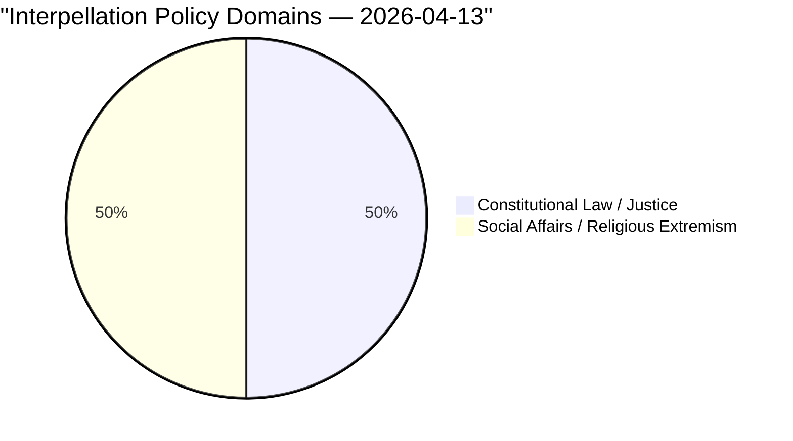

# Political Classification Results — 2026-04-13

| Field | Value |
|-------|-------|
| **ID** | CLASS-IP-2026-04-13-001 |
| **Date** | 2026-04-13 |
| **Riksmöte** | 2025/26 |
| **Documents Classified** | 2 |
| **Overall Confidence** | MEDIUM |
| **Generated** | 2026-04-13 07:20 UTC |

## Classification Summary

## Document Classifications

| dok_id | Sensitivity | Domain | Urgency | Significance | Confidence |
|--------|:-----------:|--------|:-------:|:------------:|:----------:|
| HD10429 | 🟡 SENSITIVE | Constitutional Law / Justice (JUS) | ELEVATED | 7/10 | HIGH |
| HD10430 | 🟡 SENSITIVE | Social Affairs / Religious Extremism (SOC) | ELEVATED | 6/10 | MEDIUM |

## Classification Rationale

### HD10429 — Skyddet för yttrandefriheten
- **Sensitivity**: SENSITIVE — involves constitutional rights (freedom of expression) and references to geopolitical pressure from authoritarian states
- **Domain**: JUS — targets Justice Minister on fundamental rights legislation
- **Urgency**: ELEVATED — chamber announcement today (April 13), minister response due April 27
- **Significance**: 7/10 — directly challenges core government legislation (Prop 2025/26:133) from within the support party base

### HD10430 — Moskéer som sprider hat och hot
- **Sensitivity**: SENSITIVE — involves religious extremism, hate speech, and inter-community tensions
- **Domain**: SOC — targets Social Minister on religious institution regulation
- **Urgency**: ELEVATED — chamber announcement today (April 13), minister response due April 24
- **Significance**: 6/10 — exposes coalition tension on SD's core ideological issue
