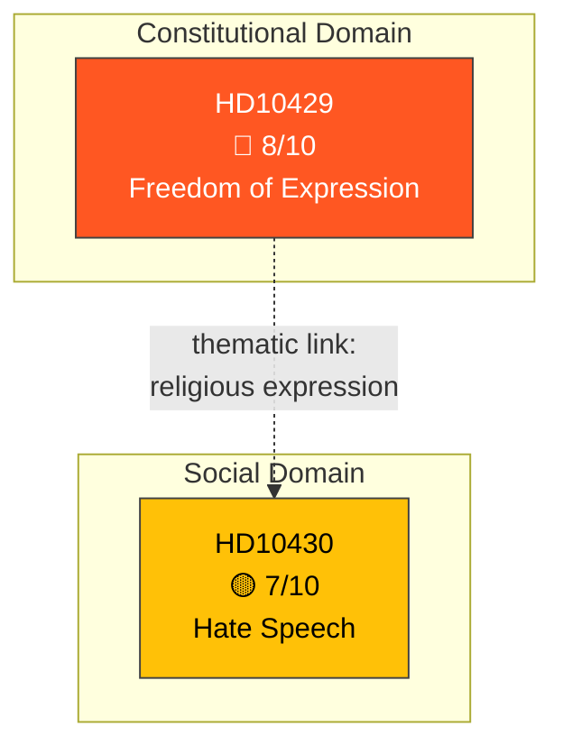

# Political Classification Results — 2026-04-13

**Generated**: 2026-04-13 22:02 UTC
**Data Sources**: get_interpellationer, get_dokument_innehall
**Documents Analyzed**: 2 (frs 2025/26:429, frs 2025/26:430)
**Confidence**: HIGH (82%)
**Produced By**: news-interpellations AI workflow (deep analysis)

---

## Summary

Classified 2 interpellations by sensitivity, impact, urgency, and policy domain after full-text analysis.

## Classification Results

### frs 2025/26:429 — Skyddet för yttrandefriheten (HD10429)
- **dok_id**: HD10429
- **Type**: Interpellation (ip)
- **Filed by**: Rashid Farivar (SD) → Justitieminister Gunnar Strömmer (M)
- **Sensitivity**: 🟡 SENSITIVE — Constitutional rights implications
- **Significance**: 🔴 High (8/10)
- **Domains**: Constitutional law, security policy, freedom of expression
- **Urgency**: 🟠 URGENT — Response deadline April 24, 2026
- **Confidence**: HIGH (85%)

### frs 2025/26:430 — Moskéer som sprider hat och hot (HD10430)
- **dok_id**: HD10430
- **Type**: Interpellation (ip)
- **Filed by**: Richard Jomshof (SD) → Socialminister Jakob Forssmed (KD)
- **Sensitivity**: 🟡 SENSITIVE — Hate speech and religious community tensions
- **Significance**: 🟡 Medium-High (7/10)
- **Domains**: Integration policy, religious affairs, anti-Semitism
- **Urgency**: 🟠 URGENT — Response deadline April 24, 2026
- **Confidence**: HIGH (80%)

## Classification Diagram

## Key Findings

1. Both interpellations classified as 🟡 SENSITIVE with 🟠 URGENT urgency
2. HD10429 elevated to 🔴 High significance due to constitutional rights dimension
3. Thematic link between documents: religious expression and constitutional boundaries

## Implications

Classification confirms both interpellations warrant priority article treatment. The constitutional dimension of HD10429 makes it the lead story.
