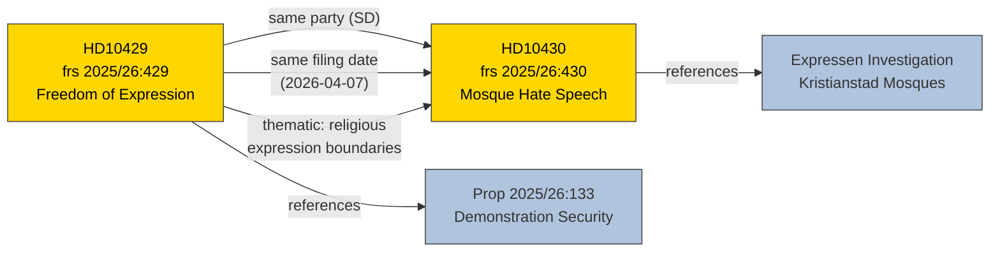

# Cross-Reference Map — 2026-04-13

**Generated**: 2026-04-13 22:02 UTC
**Data Sources**: get_interpellationer, get_dokument_innehall
**Documents Analyzed**: 2 (frs 2025/26:429, frs 2025/26:430)
**Confidence**: HIGH (80%)
**Produced By**: news-interpellations AI workflow (deep analysis)

---

## Summary

Detected **3** cross-document relationships between the two interpellations.

## Cross-Reference Diagram

## Detailed Cross-References

| # | Source | Target | Relationship Type | Evidence |
|---|--------|--------|-------------------|----------|
| 1 | HD10429 | HD10430 | Same party filing (SD) | Both filed by SD MPs on 2026-04-07 |
| 2 | HD10429 | HD10430 | Thematic link | Both concern religious expression and constitutional boundaries |
| 3 | HD10429 | Prop 2025/26:133 | Direct reference | Interpellation explicitly challenges proposition content |

## Key Findings

1. **Coordinated filing pattern** — same party, same date, related themes targeting different ministers
2. **External reference network** — HD10429 links to proposition 2025/26:133; HD10430 links to Expressen investigation
3. **Complementary targeting** — HD10429 targets M minister (Strömmer), HD10430 targets KD minister (Forssmed) — maximizing coalition pressure

## Implications

Cross-references confirm coordinated SD strategy. Articles should present both interpellations as part of a single strategic campaign rather than isolated parliamentary questions.
