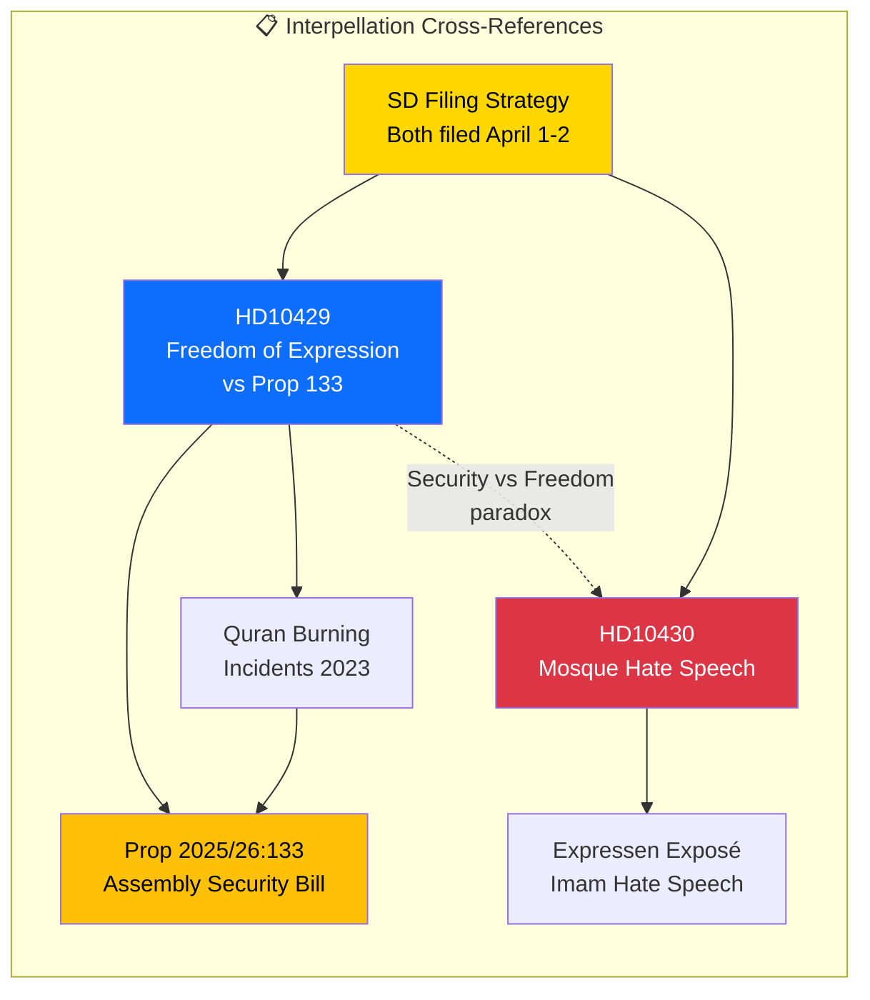

# Cross-Reference Map — Interpellations 2026-04-13

| Field | Value |
|-------|-------|
| **ID** | XREF-IP-2026-04-13-001 |
| **Date** | 2026-04-13 |
| **Riksmöte** | 2025/26 |
| **Documents Mapped** | 2 |
| **Generated** | 2026-04-13 07:20 UTC |

## Cross-Reference Diagram

## Reference Links

| Source dok_id | References | Relationship |
|--------------|-----------|--------------|
| HD10429 | Proposition 2025/26:133 | Directly challenges this government bill on assembly security |
| HD10429 | Quran burning incidents (2023) | Contextual trigger for Prop 133 |
| HD10429 | HD10430 | Thematic pair — security vs freedom tension |
| HD10430 | Expressen exposé on imam hate speech | Primary evidence cited in interpellation |
| HD10430 | BrB 16:8 (hate crime legislation) | Legal framework referenced |

## Shared Patterns

- **Filing coordination**: Both interpellations filed by SD members on April 1-2, 2026
- **Target strategy**: Each targets a different coalition minister (M and KD)
- **Policy paradox**: HD10430 identifies a security threat, HD10429 questions government response to that threat
- **Timeline alignment**: Both announced in Riksdag chamber on same date (April 13)
