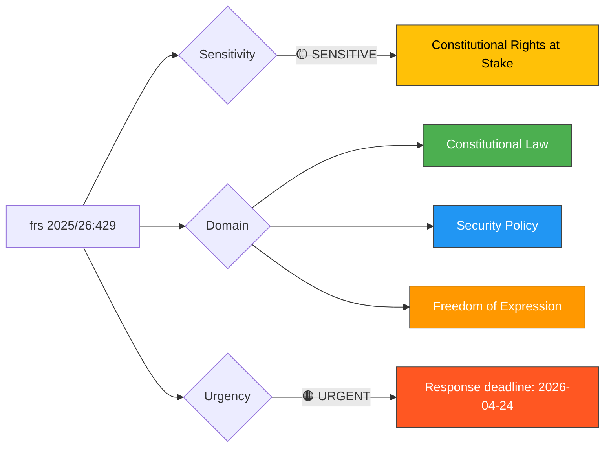

# Document Analysis: Protection of Freedom of Expression vs Proposition 2025/26:133

**Generated**: 2026-04-13 22:00 UTC
**dok_id**: HD10429
**Document Type**: interpellations
**Committee**: KU (Constitutional Affairs)
**Date**: 2026-04-07
**Author**: Rashid Farivar (SD)
**Target Minister**: Justitieminister Gunnar Strömmer (M)
**Party**: SD
**Riksmöte**: 2025/26
**Significance**: 🔴 High (8/10)
**Confidence**: HIGH (85%)
**Analyst**: news-interpellations workflow

---

## 🎯 Executive Summary

SD MP Rashid Farivar challenges Justice Minister Gunnar Strömmer on whether government proposition 2025/26:133 — which grants police new powers to relocate or cancel demonstrations for security reasons — will effectively enable a "hooligan's veto" (våldsverkarnas veto) over freedom of expression. The interpellation directly references the post-Quran-burning government response and poses three pointed questions about practical enforcement of fundamental constitutional rights. This is a high-significance interpellation touching Sweden's foundational democratic freedoms, filed by a government support party against a government minister — a rare and politically charged dynamic. **[HIGH confidence]**

---

## 📊 Political Classification

**Sensitivity**: 🟡 SENSITIVE — Constitutional rights implications
**Domains**: Constitutional law, security policy, freedom of expression
**Urgency**: 🟠 URGENT — Statutory 4-week response deadline April 24

---

## 🔍 SWOT Analysis

### Strengths (Government Coalition)

| # | Statement | Evidence | Confidence | Impact |
|---|-----------|----------|------------|--------|
| S1 | Government demonstrates proactive security stance through proposition 2025/26:133 | dok_id HD10429 references prop. 2025/26:133 | HIGH | Medium |
| S2 | Coalition maintains law-and-order credibility by addressing demonstration security gaps | Proposition creates explicit legal basis for police powers | MEDIUM | Medium |

### Weaknesses (Government Coalition)

| # | Statement | Evidence | Confidence | Impact |
|---|-----------|----------|------------|--------|
| W1 | Government faces criticism from its own support party (SD) on fundamental rights | frs 2025/26:429 — SD MP Farivar directly challenges coalition partner's minister | HIGH | High |
| W2 | Minister Strömmer's March 4 written response criticized as "not satisfactory" by interpellant | HD10429 full text: "Det svar jag fick den 4 mars var, tyvärr, inte tillfredsställande" | HIGH | Medium |
| W3 | Proposition risks creating "våldsverkarnas veto" perception — threats determining which demos proceed | HD10429: "att hot om våld blir ett effektivt verktyg för att stoppa vissa åsikter" | HIGH | High |

### Opportunities (Opposition)

| # | Statement | Evidence | Confidence | Impact |
|---|-----------|----------|------------|--------|
| O1 | SD can position itself as defender of Sweden's 1766 free speech tradition against own coalition | HD10429 opens with 1766 tryckfrihet reference, framing SD as constitutional guardian | HIGH | High |
| O2 | Opposition parties can exploit intra-coalition tensions between SD and M on fundamental rights | SD questioning M-led Justice Ministry is rare coalition fracture point | MEDIUM | High |

### Threats (Democratic Function)

| # | Statement | Evidence | Confidence | Impact |
|---|-----------|----------|------------|--------|
| T1 | Risk of legislative creep: "säkerheten för människors liv eller hälsa" is overly broad | HD10429: "mycket bred" formulation "saknar tydlig avgränsning" | HIGH | Critical |
| T2 | International pressure (authoritarian states) influencing Swedish fundamental rights policy | HD10429: "påtryckningar från auktoritära stater" drove investigation since summer 2023 | HIGH | High |

---

## 👥 Stakeholder Impact (8-Lens Analysis)

| Stakeholder Group | Impact | Assessment | Confidence |
|---|---|---|---|
| **Citizens** | HIGH | Fundamental right to demonstrate at meaningful locations potentially curtailed; risk of police discretion replacing judicial oversight | HIGH |
| **Government Coalition** | HIGH | Internal tension — support party SD publicly challenging coalition partner M on constitutional principle | HIGH |
| **Opposition Bloc** | MEDIUM | Opportunity to frame government as erosion of Swedish democratic tradition | MEDIUM |
| **Business/Industry** | LOW | Minimal direct impact unless security concerns affect business districts | LOW |
| **Civil Society** | HIGH | NGOs, media organizations, and human rights groups directly affected by demonstration restrictions | HIGH |
| **International/EU** | MEDIUM | EU freedom of assembly norms (ECHR Article 11) relevant; authoritarian state pressure noted | HIGH |
| **Judiciary/Constitutional** | HIGH | Police discretion vs. constitutional rights balance; Lagrådet oversight questions | HIGH |
| **Media/Public Opinion** | HIGH | Quran burning debate widely covered; public opinion divided on security vs. freedom | MEDIUM |

---

## ⚡ Risk Matrix

| Risk | Likelihood (1-5) | Impact (1-5) | L×I Score | Mitigation |
|---|---|---|---|---|
| Police use broad security grounds to relocate controversial demonstrations | 4 | 4 | **16** 🔴 | Judicial review requirement; clear guidelines |
| "Hooligan's veto" becomes normalized practice | 3 | 5 | **15** 🔴 | Explicit legislative safeguards against threat-based decisions |
| Coalition fracture between SD and M on constitutional principle | 2 | 4 | **8** 🟡 | Minister provides satisfactory response by April 24 |
| International reputational damage to Sweden's free speech tradition | 3 | 3 | **9** 🟡 | Constitutional council review; ECHR compliance check |

---

## 🔮 Forward Indicators

| Indicator | Trigger | Timeline | Watch Level |
|---|---|---|---|
| Minister Strömmer's formal response | Response deadline April 24 | 11 days | 🔴 HIGH |
| KU committee scheduling of interpellation debate | Parliamentary calendar update | 2-4 weeks | 🟡 MEDIUM |
| SD party group follow-up (additional interpellations or motions) | If response deemed inadequate | Post April 24 | 🟡 MEDIUM |
| Constitutional law expert commentary in media | Following debate publication | Days | 🟢 LOW |

---

## 🗳️ Election 2026 Implications

- **Electoral Impact**: 🟩HIGH — Freedom of expression is a galvanizing issue for voters across political spectrum
- **Coalition Scenarios**: 🟧MEDIUM — SD challenging M signals potential post-election realignment on constitutional values
- **Voter Salience**: 🟩HIGH — Post-Quran-burning debate remains highly salient among Swedish voters
- **Campaign Vulnerability**: 🟧MEDIUM — Government vulnerable to "erosion of Swedish values" framing
- **Policy Legacy**: 🟦VERY HIGH — Proposition 2025/26:133 creates lasting precedent for demonstration regulation

---

## Data Quality Notes

- **Analysis confidence**: HIGH (85%)
- **Full-text content**: Available — deep analysis based on complete interpellation text
- **Minister response**: Not yet available — filed April 7, response deadline April 24
- **Cross-reference**: Same-day filing as HD10430 (SD coordination pattern)
- **Data sources**: get_interpellationer, get_dokument_innehall
