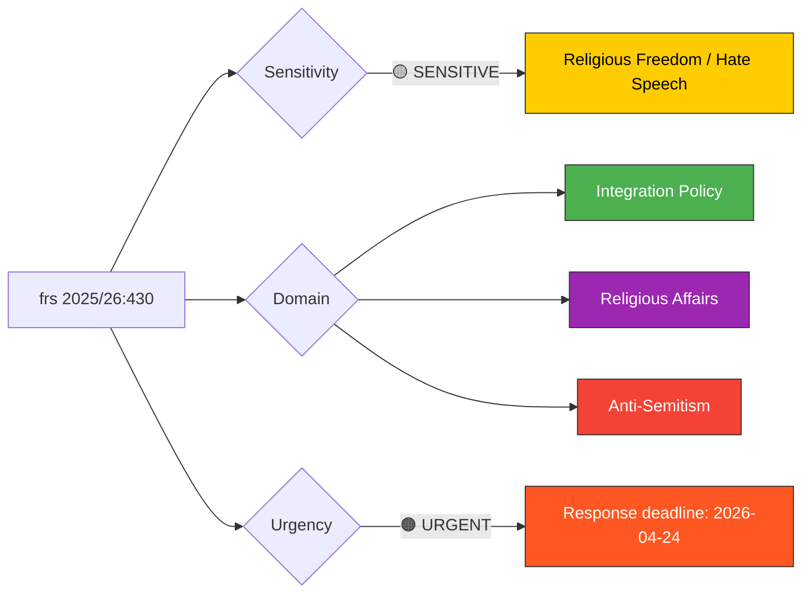

# Document Analysis: Mosques Spreading Hate and Threats

**Generated**: 2026-04-13 22:00 UTC
**dok_id**: HD10430
**Document Type**: interpellations
**Committee**: SoU (Social Affairs)
**Date**: 2026-04-07
**Author**: Richard Jomshof (SD)
**Target Minister**: Socialminister Jakob Forssmed (KD)
**Party**: SD
**Riksmöte**: 2025/26
**Significance**: 🟡 Medium-High (7/10)
**Confidence**: HIGH (80%)
**Analyst**: news-interpellations workflow

---

## 🎯 Executive Summary

SD committee chair Richard Jomshof targets Social Minister Jakob Forssmed (KD) over Expressen revelations that an imam in Kristianstad openly preached hatred against non-Muslims and Jews, including calls for revenge and encouraging children to harm Jewish people. This interpellation follows a pattern: the same city's other mosque was previously exposed for an imam defending a husband's "right" to strike his wife. Jomshof's single pointed question — whether the minister will "take general initiatives" — is strategically vague, pressuring Forssmed to either propose concrete action or appear passive on hate speech from religious institutions. Filed same day as HD10429, revealing coordinated SD strategy on religious freedom and expression themes. **[HIGH confidence]**

---

## 📊 Political Classification

**Sensitivity**: 🟡 SENSITIVE — Hate speech and religious community tensions
**Domains**: Integration policy, religious affairs, anti-Semitism
**Urgency**: 🟠 URGENT — Response deadline April 24; active media coverage

---

## 🔍 SWOT Analysis

### Strengths (Government Coalition)

| # | Statement | Evidence | Confidence | Impact |
|---|-----------|----------|------------|--------|
| S1 | Government can demonstrate commitment to combating hate speech and anti-Semitism | Clear documented evidence from Expressen investigation | HIGH | High |
| S2 | Cross-party consensus on opposing anti-Semitism strengthens government response | Anti-Semitism broadly condemned across all parties | HIGH | Medium |

### Weaknesses (Government Coalition)

| # | Statement | Evidence | Confidence | Impact |
|---|-----------|----------|------------|--------|
| W1 | Repeated incidents in same city (Kristianstad) suggest policy failure on religious institution oversight | HD10430: "Det hänt igen, fast i stadens andra sunnimuslimska moské" | HIGH | High |
| W2 | Social Minister Forssmed (KD) must navigate between religious freedom and hate speech enforcement | KD's religious community ties complicate response | MEDIUM | Medium |
| W3 | Interpellation addressed to Forssmed (KD) but answerability assigned to Strömmer (M) — jurisdictional ambiguity | HD10430 metadata: stalldtill=Forssmed, besvaradav=Strömmer | HIGH | Medium |

### Opportunities (Opposition)

| # | Statement | Evidence | Confidence | Impact |
|---|-----------|----------|------------|--------|
| O1 | SD strengthens profile on integration failures and anti-Semitism | Jomshof is SD committee chair, filing with institutional authority | HIGH | High |
| O2 | Issue provides SD with cross-spectrum appeal — defending Jewish community against religious extremism | HD10430 cites specific anti-Jewish hate speech: "blod, död och fördrivning" | HIGH | High |

### Threats (Democratic Function)

| # | Statement | Evidence | Confidence | Impact |
|---|-----------|----------|------------|--------|
| T1 | Risk of broad anti-Muslim policy response harming religious freedom for all | Interpellation frames "mosques" collectively, not specific individuals | MEDIUM | High |
| T2 | Escalation of community tensions between Muslim and Jewish communities | Specific anti-Jewish content cited risks inflaming inter-community relations | HIGH | High |

---

## 👥 Stakeholder Impact (8-Lens Analysis)

| Stakeholder Group | Impact | Assessment | Confidence |
|---|---|---|---|
| **Citizens** | HIGH | Jewish community directly threatened; Muslim community may face collective stigma | HIGH |
| **Government Coalition** | HIGH | KD minister must balance religious freedom heritage with anti-hate stance | HIGH |
| **Opposition Bloc** | MEDIUM | S, V may critique SD's framing while agreeing on anti-Semitism substance | MEDIUM |
| **Business/Industry** | LOW | Limited direct impact | LOW |
| **Civil Society** | HIGH | Jewish organizations, Muslim community groups, anti-racism organizations all affected | HIGH |
| **International/EU** | MEDIUM | Sweden's handling of religious extremism watched internationally; IHRA commitments relevant | MEDIUM |
| **Judiciary/Constitutional** | MEDIUM | Hate speech prosecution thresholds (BrB 16:8 hets mot folkgrupp) may be tested | HIGH |
| **Media/Public Opinion** | HIGH | Expressen investigation driving public awareness; high media salience | HIGH |

---

## ⚡ Risk Matrix

| Risk | Likelihood (1-5) | Impact (1-5) | L×I Score | Mitigation |
|---|---|---|---|---|
| Hate speech from religious institutions continues unchecked | 3 | 4 | **12** 🟡 | Strengthened oversight of religious community funding/activities |
| Anti-Muslim backlash from policy overreaction | 3 | 4 | **12** 🟡 | Targeted enforcement against specific actors, not communities |
| Inter-community violence escalation | 2 | 5 | **10** 🟡 | Community dialogue programs; police monitoring |
| Government appears passive on anti-Semitism | 3 | 3 | **9** 🟡 | Minister provides concrete action plan in response |

---

## 🔮 Forward Indicators

| Indicator | Trigger | Timeline | Watch Level |
|---|---|---|---|
| Minister Forssmed/Strömmer formal response | Response deadline April 24 | 11 days | 🔴 HIGH |
| Criminal investigation into cited hate speech | Prosecutor action on BrB 16:8 | Weeks | 🟡 MEDIUM |
| Expressen follow-up investigation | Additional revelations from same or other mosques | Days-weeks | 🟡 MEDIUM |
| Jewish community organization response | Official statements from Judiska Centralrådet | Days | 🟡 MEDIUM |

---

## 🗳️ Election 2026 Implications

- **Electoral Impact**: 🟩HIGH — Anti-Semitism and integration failures are top election issues
- **Coalition Scenarios**: 🟧MEDIUM — SD pressing KD minister creates coalition tension
- **Voter Salience**: 🟩HIGH — Hate speech from religious institutions highly visible in media
- **Campaign Vulnerability**: 🟩HIGH — Government vulnerable if perceived as passive on hate speech
- **Policy Legacy**: 🟧MEDIUM — Response sets precedent for religious institution oversight

---

## Data Quality Notes

- **Analysis confidence**: HIGH (80%)
- **Full-text content**: Available — based on complete interpellation text
- **Minister response**: Not yet available — response deadline April 24
- **Cross-reference**: Same-day filing as HD10429 (SD coordination pattern)
- **Data sources**: get_interpellationer, get_dokument_innehall
