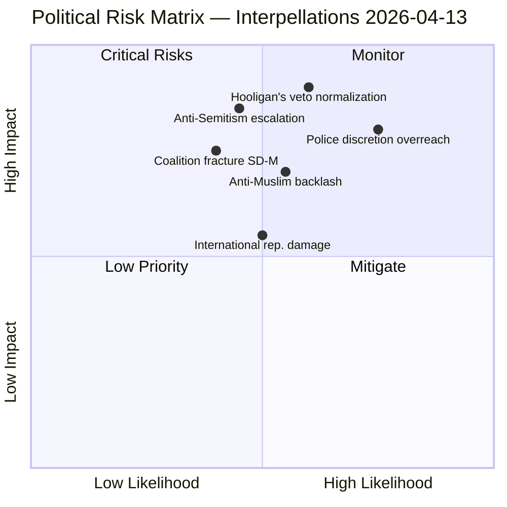

# Political Risk Assessment — 2026-04-13

**Generated**: 2026-04-13 22:02 UTC
**Data Sources**: get_interpellationer, get_dokument_innehall
**Documents Analyzed**: 2 (frs 2025/26:429, frs 2025/26:430)
**Confidence**: HIGH (80%)
**Produced By**: news-interpellations AI workflow (deep analysis)

---

## Summary

Risk assessment of two SD interpellations targeting government ministers on constitutional rights (demonstration freedom) and social cohesion (hate speech from religious institutions). Primary risks center on erosion of fundamental rights through overly broad legislation and policy failure on religious institution oversight.

## Risk Matrix Visualization

## Detailed Risk Analysis

### Risk 1: Legislative Creep on Demonstration Rights
- **Source**: frs 2025/26:429 (HD10429) — Proposition 2025/26:133
- **Description**: Broad "security" formulation enables police to relocate or cancel demonstrations without clear judicial oversight
- **Likelihood**: 4/5 — Police operational culture favors security over expression
- **Impact**: 4/5 — Fundamental constitutional right at stake
- **L×I Score**: **16** 🔴 CRITICAL
- **Indicators**: First police decision to relocate a controversial demonstration post-enactment
- **Mitigation**: Judicial review requirement; explicit legislative safeguards; KU oversight

### Risk 2: "Hooligan's Veto" Normalization
- **Source**: frs 2025/26:429 (HD10429) — "våldsverkarnas veto" concept
- **Description**: Threat of violence becomes effective tool for suppressing unpopular expression
- **Likelihood**: 3/5 — Already observed in Quran burning context
- **Impact**: 5/5 — Destroys democratic discourse foundation
- **L×I Score**: **15** 🔴 CRITICAL
- **Indicators**: Denied demonstration permits citing security post-legislation; international pressure leading to cancellations
- **Mitigation**: Minister's explicit commitment to not allowing threats to determine policy

### Risk 3: Hate Speech from Religious Institutions Continues
- **Source**: frs 2025/26:430 (HD10430) — Kristianstad mosque imams
- **Description**: Second mosque in same city exposed within months; pattern suggests systemic oversight failure
- **Likelihood**: 3/5 — Limited oversight mechanisms currently in place
- **Impact**: 4/5 — Social cohesion and community safety
- **L×I Score**: **12** 🟡 HIGH
- **Indicators**: Further Expressen or media exposés; escalation of anti-Jewish incidents
- **Mitigation**: Strengthened oversight of religious institution funding; training requirements for religious leaders

### Risk 4: Coalition Fracture Between SD and Government
- **Source**: Both interpellations — SD challenging M and KD ministers simultaneously
- **Description**: Coordinated SD challenge to coalition partners signals growing friction before Election 2026
- **Likelihood**: 2/5 — SD maintains strategic interest in coalition stability
- **Impact**: 4/5 — Government collapse would trigger early election dynamics
- **L×I Score**: **8** 🟡 MODERATE
- **Indicators**: SD filing additional interpellations on same themes; SD threatening to withdraw support on specific votes
- **Mitigation**: Ministers provide satisfactory responses by April 24 deadline

## Coalition Stability Assessment

**Coalition Risk Score**: 18/100 (LOW-MODERATE)
- Baseline stability: Strong (government majority intact)
- Interpellation pressure: Moderate (support party challenging but not threatening withdrawal)
- Election proximity: Elevating all political dynamics
- SD strategy: Calibrated criticism, not destabilization

## Key Findings

1. Two 🔴 CRITICAL risks identified: legislative creep on demonstration rights and hooligan's veto normalization
2. Two 🟡 HIGH/MODERATE risks: religious institution oversight failure and coalition friction
3. Coalition stability remains intact but under increased monitoring pressure
4. All risks have forward indicators that can be tracked through minister responses (deadline: April 24)

## Implications

The primary risk is not immediate coalition collapse but gradual erosion of fundamental democratic rights through well-intentioned but poorly constrained legislation. Minister responses due April 24 will be the key risk mitigation event.
