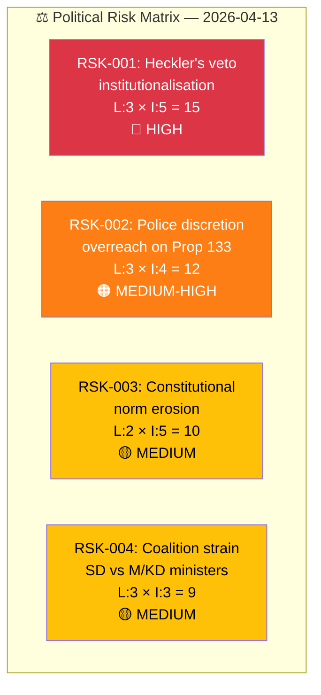

# Political Risk Assessment — Interpellations 2026-04-13

| Field | Value |
|-------|-------|
| **ID** | RISK-IP-2026-04-13-001 |
| **Date** | 2026-04-13 |
| **Riksmöte** | 2025/26 |
| **Documents Analyzed** | 2 |
| **Overall Risk Level** | MEDIUM |
| **Generated** | 2026-04-13 07:20 UTC |

## Risk Dashboard

## 5×5 Risk Matrix

| Risk ID | Description | Likelihood (1-5) | Impact (1-5) | L×I Score | Level | Evidence |
|---------|-------------|:-----------------:|:-------------:|:---------:|:-----:|----------|
| RSK-001 | Heckler's veto institutionalisation via Prop 133 | 3 | 5 | **15** | 🔴 HIGH | HD10429: "hot om våld blir ett effektivt verktyg för att stoppa vissa åsikter" |
| RSK-002 | Police discretion overreach on public assembly permits | 3 | 4 | **12** | 🟠 MEDIUM-HIGH | HD10429: broad language "säkerheten för människors liv eller hälsa" |
| RSK-003 | Constitutional norm erosion — gradual restriction of demonstration rights | 2 | 5 | **10** | 🟡 MEDIUM | HD10429: "förskjutningar som över tid riskerar att bli norm" |
| RSK-004 | Coalition strain — SD publicly challenges M and KD ministers | 3 | 3 | **9** | 🟡 MEDIUM | HD10429 targets Strömmer (M), HD10430 targets Forssmed (KD) |

## Risk Interconnections

RSK-001 and RSK-002 are causally linked: if police gain broad discretion to deny permits (RSK-002), the heckler's veto mechanism (RSK-001) becomes operationalised. RSK-003 represents the long-term systemic consequence. RSK-004 is the political trigger — SD's interpellations are the mechanism exposing these risks publicly.

## Mitigation Factors

| Factor | Risk Mitigated | Assessment |
|--------|---------------|------------|
| Minister Strömmer's response (due April 27) may provide constitutional guarantees | RSK-001, RSK-002, RSK-003 | Potential if response is substantive **[MEDIUM confidence]** |
| Existing constitutional safeguards (Regeringsformen 2:1) | RSK-001, RSK-003 | Strong institutional framework **[HIGH confidence]** |
| Media scrutiny of minister responses | RSK-004 | Transparency ensures accountability **[HIGH confidence]** |
