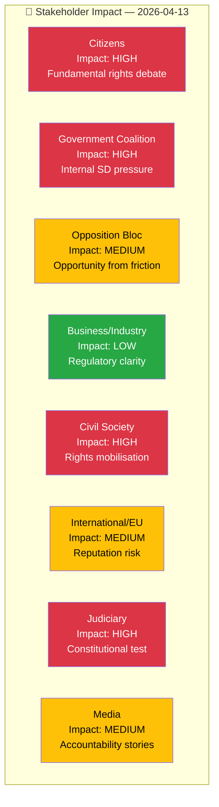

# Stakeholder Perspectives — Interpellations 2026-04-13

| Field | Value |
|-------|-------|
| **ID** | STKH-IP-2026-04-13-001 |
| **Date** | 2026-04-13 |
| **Riksmöte** | 2025/26 |
| **Documents Analyzed** | 2 |
| **Overall Confidence** | MEDIUM |
| **Generated** | 2026-04-13 07:20 UTC |

## Stakeholder Impact Matrix

## Detailed Stakeholder Analysis

### Citizens — Impact: HIGH
Both interpellations directly affect citizen rights. frs 2025/26:429 addresses whether demonstration rights may be curtailed under Prop 133, affecting every citizen's ability to participate in public protest. frs 2025/26:430 addresses hate speech affecting religious communities in Kristianstad. **[HIGH confidence]**

### Government Coalition — Impact: HIGH
Unusually, both interpellations come from SD, the government's informal support party, targeting M and KD ministers. This signals internal coalition tension and puts ministers Strömmer and Forssmed on the spot to defend government policy while maintaining SD cooperation. **[HIGH confidence]**

### Opposition Bloc — Impact: MEDIUM
Opposition parties (S, V, MP, C) can use SD-coalition friction to highlight government dysfunction. However, frs 2025/26:429's freedom of expression argument creates an awkward dynamic where opposition may align with SD on civil liberties. **[MEDIUM confidence]**

### Business/Industry — Impact: LOW
Limited direct impact. Regulatory clarity on public assemblies from Prop 133 may benefit event and security industries marginally. **[LOW confidence]**

### Civil Society — Impact: HIGH
Civil liberties organisations face critical moment: frs 2025/26:429 raises fundamental rights questions that could galvanise advocacy. Muslim community organisations face stigmatisation risk from HD10430's framing. **[HIGH confidence]**

### International/EU — Impact: MEDIUM
Sweden's international reputation as freedom of expression champion is at stake if Prop 133 is perceived as restricting demonstration rights. HD10429 explicitly references pressure from "authoritarian states" post-Quran-burnings. **[MEDIUM confidence]**

### Judiciary/Constitutional — Impact: HIGH
frs 2025/26:429 raises specific constitutional questions about Regeringsformen 2:1 and the breadth of Prop 133's language. Judicial interpretation challenges likely if law is enacted. **[HIGH confidence]**

### Media/Public Opinion — Impact: MEDIUM
Tangible accountability stories: minister responses to specific questions with deadlines (April 24, April 27) create follow-up coverage opportunities. Risk of oversimplification in coverage. **[MEDIUM confidence]**
