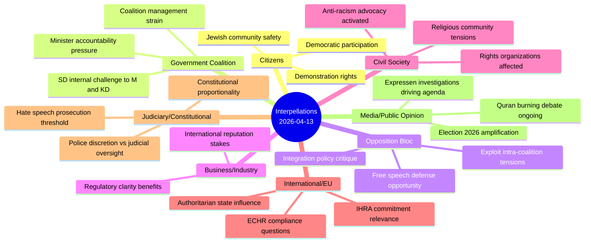

# Stakeholder Perspective Analysis — 2026-04-13

**Generated**: 2026-04-13 22:02 UTC
**Data Sources**: get_interpellationer, get_dokument_innehall
**Documents Analyzed**: 2 (frs 2025/26:429, frs 2025/26:430)
**Confidence**: HIGH (80%)
**Produced By**: news-interpellations AI workflow (deep analysis)

---

## Summary

Applied **8 stakeholder lenses** to 2 interpellations analyzing coordinated SD accountability campaign targeting government ministers on freedom of expression and hate speech.

## Stakeholder Impact Map

## Detailed Perspective Analysis

### 1. Citizens
- **Primary concern**: Right to peaceful demonstration at meaningful locations (frs 2025/26:429); safety from hate speech targeting (frs 2025/26:430)
- **Impact level**: HIGH — Constitutional rights directly affected
- **Key evidence**: HD10429 raises "våldsverkarnas veto" — citizens lose rights when threats override democratic participation

### 2. Government Coalition (M, KD, L + SD support)
- **Primary concern**: Managing internal SD criticism while maintaining coalition stability
- **Impact level**: HIGH — Two ministers personally targeted by support party
- **Key evidence**: Strömmer (M) and Forssmed (KD) both face April 24 response deadlines on sensitive constitutional/social issues

### 3. Opposition Bloc (S, V, MP, C)
- **Primary concern**: Leveraging visible coalition friction for electoral advantage
- **Impact level**: MEDIUM — Opportunity to appear as stronger defenders of fundamental rights
- **Key evidence**: SD challenging its own coalition opens space for opposition to differentiate

### 4. Business/Industry
- **Primary concern**: Regulatory predictability and Sweden's international reputation as open society
- **Impact level**: LOW — Indirect effects through investment climate perceptions
- **Key evidence**: Sweden's free speech tradition is an economic soft power asset

### 5. Civil Society
- **Primary concern**: Rights organizations face chilling effect from demonstration restrictions; religious communities face collective accountability
- **Impact level**: HIGH — NGOs, Jewish organizations, Muslim community groups all directly affected
- **Key evidence**: HD10430 documents specific hate speech targeting children's attitudes toward Jews

### 6. International/EU
- **Primary concern**: Sweden's compliance with ECHR Article 11 (assembly) and IHRA definition of anti-Semitism
- **Impact level**: MEDIUM — International monitoring of Swedish democratic standards
- **Key evidence**: HD10429 explicitly mentions "påtryckningar från auktoritära stater" influencing domestic policy

### 7. Judiciary/Constitutional
- **Primary concern**: Proportionality of police powers under proposition 2025/26:133; prosecution thresholds for hate speech
- **Impact level**: HIGH — Fundamental separation of powers questions
- **Key evidence**: HD10429 questions whether police discretion replaces judicial oversight on fundamental rights

### 8. Media/Public Opinion
- **Primary concern**: Continuing investigative accountability (Expressen); balanced reporting on polarizing issues
- **Impact level**: HIGH — Media driving agenda through investigations; election 2026 amplifies coverage
- **Key evidence**: HD10430 triggered entirely by Expressen investigation; public opinion divided on free speech boundaries

## Key Findings

1. **Citizens and judiciary most critically impacted** — both face direct constitutional rights implications
2. **Government coalition uniquely pressured** — SD challenging from within, rare accountability dynamic
3. **Civil society faces dual pressure** — rights restrictions AND hate speech exposures affect different community organizations
4. **Media plays driving role** — Expressen investigations are the primary trigger for HD10430

## Implications

All 8 stakeholder groups are meaningfully affected — these are not routine interpellations but touch fundamental democratic infrastructure. The coordinated SD strategy ensures maximum stakeholder attention ahead of Election 2026.
