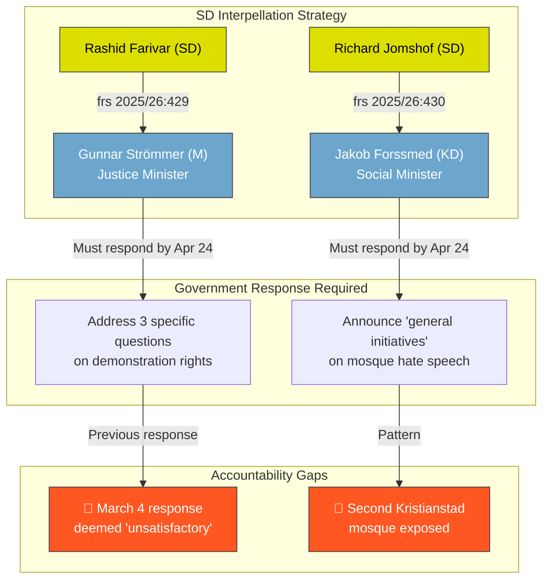

# Political SWOT Analysis — 2026-04-13

**Generated**: 2026-04-13 22:01 UTC
**Data Sources**: get_interpellationer, get_dokument_innehall
**Documents Analyzed**: 2 (frs 2025/26:429, frs 2025/26:430)
**Confidence**: HIGH (80%)
**Produced By**: news-interpellations AI workflow (deep analysis)

---

## Summary

Multi-stakeholder SWOT analysis of two SD interpellations targeting government ministers on constitutional rights (freedom of expression) and social policy (hate speech from religious institutions). Analysis covers all 8 mandatory stakeholder groups with evidence-based assessments.

## Accountability Flow

## Detailed SWOT — All 8 Stakeholder Groups

### 🏛️ Citizens

| # | Type | Statement | Evidence (frs ID/dok_id) | Confidence | Impact |
|---|------|-----------|--------------------------|------------|--------|
| C1 | Threat | Right to demonstrate at meaningful locations may be curtailed by police discretion | frs 2025/26:429 (HD10429): prop 2025/26:133 allows police to relocate demonstrations | HIGH | Critical |
| C2 | Threat | Jewish citizens face direct safety threat from documented hate speech | frs 2025/26:430 (HD10430): "blod, död och fördrivning" preached against Jews | HIGH | Critical |
| C3 | Opportunity | Democratic accountability mechanism (interpellation) working as designed | Both interpellations require formal minister response | HIGH | Medium |

### 🤝 Government Coalition (M, KD, L with SD support)

| # | Type | Statement | Evidence (frs ID/dok_id) | Confidence | Impact |
|---|------|-----------|--------------------------|------------|--------|
| G1 | Weakness | Support party SD publicly challenges coalition partners on constitutional principle | frs 2025/26:429 — SD vs M minister; frs 2025/26:430 — SD vs KD minister | HIGH | High |
| G2 | Weakness | Previous minister response deemed inadequate — accountability gap | HD10429: Farivar states March 4 response was "inte tillfredsställande" | HIGH | Medium |
| G3 | Strength | Government can demonstrate proactive security stance via prop 2025/26:133 | Proposition addresses real security concerns at demonstrations | MEDIUM | Medium |
| G4 | Weakness | KD minister faces structural conflict — defending religious freedom while addressing mosque hate speech | Forssmed's KD has historical ties to religious community organizations | MEDIUM | High |

### 🏛️ Opposition Bloc (S, V, MP, C)

| # | Type | Statement | Evidence (frs ID/dok_id) | Confidence | Impact |
|---|------|-----------|--------------------------|------------|--------|
| O1 | Opportunity | Exploit intra-coalition tensions between SD and M/KD on fundamental rights | Both interpellations target government ministers from coalition parties | HIGH | High |
| O2 | Opportunity | Frame government as eroding Swedish democratic tradition (1766 free speech) | HD10429 opens with reference to Sweden's 1766 tryckfrihet tradition | HIGH | High |
| O3 | Weakness | S historically limited credibility on immigration-linked issues cited in HD10430 | Mosque oversight was not prioritized during S-led governments | MEDIUM | Medium |

### 💼 Business/Industry

| # | Type | Statement | Evidence (frs ID/dok_id) | Confidence | Impact |
|---|------|-----------|--------------------------|------------|--------|
| B1 | Opportunity | Demonstration regulation clarity benefits business districts affected by security closures | Prop 2025/26:133 referenced in HD10429 provides clearer police powers | LOW | Low |
| B2 | Threat | Restrictive demonstration policy may signal broader regulatory overreach to international investors | Sweden's free speech reputation is an economic soft power asset | LOW | Low |

### 🌍 Civil Society

| # | Type | Statement | Evidence (frs ID/dok_id) | Confidence | Impact |
|---|------|-----------|--------------------------|------------|--------|
| CS1 | Threat | NGOs and rights organizations face chilling effect from broad demonstration restrictions | HD10429: "våldsverkarnas veto" concern — threats silencing expression | HIGH | High |
| CS2 | Opportunity | Jewish organizations may push for stronger hate speech enforcement | HD10430 documents specific, actionable anti-Jewish preaching | HIGH | Medium |
| CS3 | Threat | Muslim community organizations face collective stigma from individual imam actions | HD10430 frames "mosques" as institutional problem, not individual actors | MEDIUM | High |

### 🌐 International/EU

| # | Type | Statement | Evidence (frs ID/dok_id) | Confidence | Impact |
|---|------|-----------|--------------------------|------------|--------|
| I1 | Threat | Authoritarian states cited as driving force behind expression restrictions | HD10429: "påtryckningar från auktoritära stater" explicitly mentioned | HIGH | High |
| I2 | Opportunity | Strong response to anti-Semitism aligns with IHRA definition commitments | HD10430 evidence directly relevant to IHRA working definition criteria | MEDIUM | Medium |
| I3 | Threat | ECHR Article 11 (freedom of assembly) compliance questions if prop 2025/26:133 overreaches | HD10429 raises proportionality concerns relevant to Strasbourg case law | MEDIUM | High |

### ⚖️ Judiciary/Constitutional

| # | Type | Statement | Evidence (frs ID/dok_id) | Confidence | Impact |
|---|------|-----------|--------------------------|------------|--------|
| J1 | Threat | Police discretion replacing judicial oversight on fundamental rights | HD10429: prop gives police power to change time/place without clear judicial check | HIGH | Critical |
| J2 | Opportunity | Hate speech prosecution (BrB 16:8 hets mot folkgrupp) may be strengthened | HD10430 evidence exceeds prosecution threshold for incitement | HIGH | Medium |
| J3 | Weakness | Broad formulation "säkerheten för människors liv eller hälsa" lacks legal precision | HD10429: Farivar notes it "saknar tydlig avgränsning" | HIGH | High |

### 📰 Media/Public Opinion

| # | Type | Statement | Evidence (frs ID/dok_id) | Confidence | Impact |
|---|------|-----------|--------------------------|------------|--------|
| M1 | Opportunity | Expressen investigative journalism driving accountability on mosque hate speech | HD10430 directly cites Expressen revelations as trigger | HIGH | High |
| M2 | Threat | Quran burning debate polarizes public opinion on free speech boundaries | HD10429 references post-Quran-burning government response | HIGH | High |
| M3 | Opportunity | Parliamentary accountability (interpellation process) visible to voters pre-election | Both interpellations announced today, responses due April 24 | HIGH | Medium |

## Key Findings

1. **All 8 stakeholder groups affected** — These interpellations touch fundamental democratic functions across all societal sectors
2. **Government coalition faces internal pressure** — SD challenging both M and KD ministers is strategically significant
3. **Constitutional rights vs. security is the central tension** — Proposition 2025/26:133 and mosque oversight both involve balancing fundamental rights
4. **Election 2026 context amplifies significance** — Both issues are high-salience voter concerns

## Implications

SWOT analysis reveals these interpellations are not routine oversight but a coordinated SD strategy exploiting genuine policy tensions within the governing coalition. The dual targeting of M and KD ministers creates maximum accountability pressure while maintaining SD's coalition support position.
