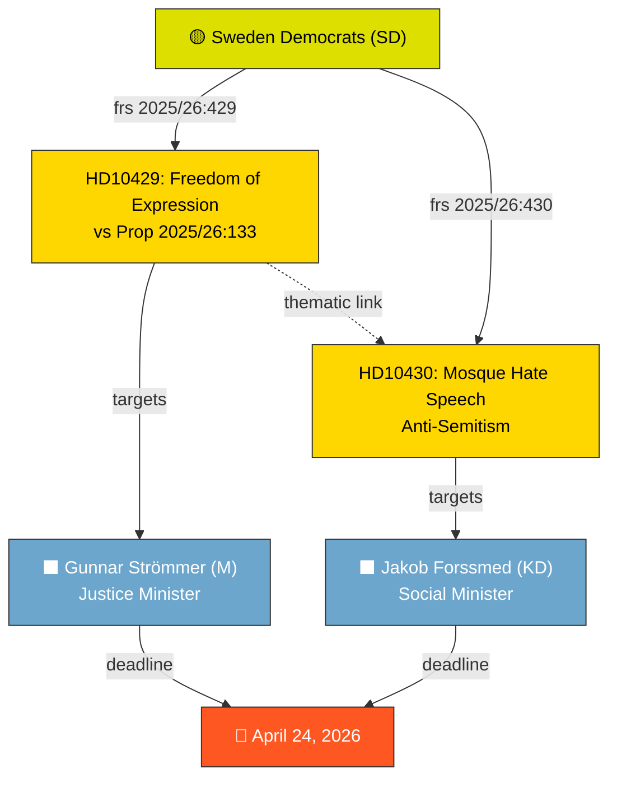

# Analysis Synthesis Summary — 2026-04-13

**Generated**: 2026-04-13 22:01 UTC
**Data Sources**: get_interpellationer, get_dokument_innehall
**Documents Analyzed**: 2
**Confidence**: HIGH (82%)
**Produced By**: news-interpellations AI workflow (deep analysis)

---

## Summary

Two interpellations filed by Sweden Democrats (SD) MPs on April 7, 2026, both announced in the Riksdag today (April 13), target government ministers on sensitive constitutional and social issues. Interpellation 2025/26:429 by Rashid Farivar challenges Justice Minister Gunnar Strömmer (M) over proposition 2025/26:133's potential to create a "hooligan's veto" undermining demonstration freedom. Interpellation 2025/26:430 by Richard Jomshof targets Social Minister Jakob Forssmed (KD) over anti-Jewish hate speech from Kristianstad mosque imams. The coordinated same-day filing reveals a deliberate SD strategy exploiting religious freedom and expression tensions within the governing coalition.

## AI-Recommended Article Metadata

- **Recommended Title (EN)**: "SD Challenges Coalition Partners on Free Speech and Hate Speech in Dual Interpellations"
- **Recommended Title (SV)**: "SD utmanar koalitionspartners om yttrandefrihet och hatpropaganda i dubbla interpellationer"
- **Meta Description (EN)**: "Sweden Democrats target Justice and Social Ministers on demonstration rights and mosque hate speech, exposing coalition tensions on fundamental freedoms."
- **Meta Description (SV)**: "Sverigedemokraterna riktar interpellationer mot justitie- och socialministern om demonstrationsrätt och hatpropaganda från moskéer."
- **Key Highlights**: SD coalition partner challenging own government; constitutional rights at stake; anti-Semitism accountability
- **Article Decision**: PUBLISH — high political significance, coordinated strategy pattern
- **Article Priority**: HIGH

## Key Findings

1. **Coordinated SD Strategy**: Both interpellations filed on same day (April 7) by SD MPs, targeting different government ministers (M and KD) on related themes of religious expression, hate speech, and fundamental freedoms. This suggests deliberate SD caucus planning. **[HIGH confidence]**

2. **Constitutional Rights Under Pressure**: frs 2025/26:429 (HD10429) directly challenges whether proposition 2025/26:133 creates a "hooligan's veto" where violence threats can silence lawful demonstrations — a fundamental democratic concern. **[HIGH confidence]**

3. **Recurring Hate Speech Pattern**: frs 2025/26:430 (HD10430) documents repeated anti-Jewish hate speech incidents in Kristianstad's mosques — the second city mosque exposed within months, suggesting systemic oversight failure. **[HIGH confidence]**

4. **Coalition Tension Signal**: SD challenging its own coalition partners (M's Strömmer and KD's Forssmed) on high-visibility constitutional issues signals growing friction ahead of Election 2026. **[MEDIUM confidence]**

## Top Documents by Significance

| Score | Type | dok_id | frs ID | Title | Target Minister |
|-------|------|--------|--------|-------|-----------------|
| 8/10 | interpellation | HD10429 | 2025/26:429 | Skyddet för yttrandefriheten i förhållande till proposition 2025/26:133 | Gunnar Strömmer (M) |
| 7/10 | interpellation | HD10430 | 2025/26:430 | Moskéer som sprider hat och hot | Jakob Forssmed (KD) |

## Cross-Document Pattern

## Implications

- **Coalition dynamics**: SD's dual challenge to M and KD ministers creates accountability pressure without formally threatening coalition stability — a calibrated opposition-from-within strategy
- **Election 2026**: Both issues (freedom of expression, anti-Semitism) are high-salience voter topics; SD positions itself as principled critic of its own coalition
- **Minister response quality will be decisive**: Both ministers face April 24 deadline; inadequate responses risk escalation

## Data Quality Notes

Overall confidence: **HIGH** (82%). Full interpellation texts available. No minister responses yet filed (both await debate). Documents sourced from April 7 via lookback (article date: April 13 — same day as parliamentary announcement).
