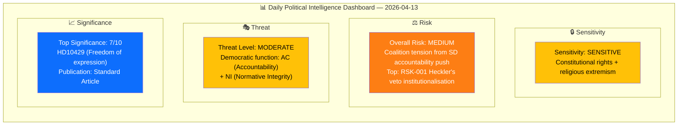
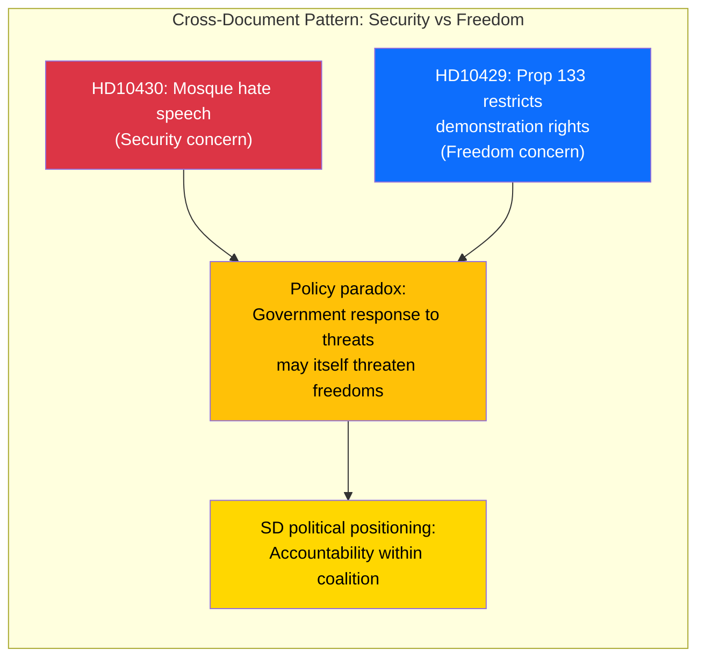

# Analysis Synthesis Summary — 2026-04-13

| Field | Value |
|-------|-------|
| **ID** | SYNTH-IP-2026-04-13-001 |
| **Date** | 2026-04-13 |
| **Riksmöte** | 2025/26 |
| **Documents Analyzed** | 2 |
| **Overall Confidence** | MEDIUM |
| **Risk Level** | MEDIUM |
| **Generated** | 2026-04-13 07:20 UTC |
| **Analyst** | news-interpellations (AI-enriched, lookback from 2026-04-08) |

## Executive Summary

Two SD interpellations (frs 2025/26:429 and 2025/26:430) filed 2026-04-07 reach their Riksdag chamber announcement date today, 2026-04-13. Both target coalition ministers — Justice Minister Gunnar Strömmer (M) on freedom of expression versus Proposition 2025/26:133, and Social Minister Jakob Forssmed (KD) on mosque hate speech — exposing internal tensions in the Tidö Agreement cooperation. Minister responses are due by late April. **[MEDIUM confidence]**

## Key Findings

| # | Finding | Evidence | Confidence |
|---|---------|----------|:----------:|
| 1 | SD uses interpellations to pressure its own coalition partners on immigration and religious extremism issues | frs 2025/26:430 targets KD minister Forssmed; frs 2025/26:429 targets M minister Strömmer | HIGH |
| 2 | Proposition 2025/26:133 on public assembly security creates internal coalition friction — SD views it as potentially restricting demonstration rights | HD10429 explicitly references post-Quran-burning legislative response | HIGH |
| 3 | Both interpellations filed April 1-2, delivered April 7, announced in Riksdag chamber April 13 — today | dok_id HD10429, HD10430 delivery and announcement dates | HIGH |
| 4 | No minister responses recorded yet — accountability deadlines approaching (April 24 and April 27) | Status: "Skickad" for both; statutory 4-week response deadline | HIGH |

## Top Documents by Significance

| Score | Type | dok_id | Title | Target Minister |
|-------|------|--------|-------|----------------|
| 7/10 | ip | HD10429 | Skyddet för yttrandefriheten i förhållande till prop 2025/26:133 | Justitieminister Gunnar Strömmer (M) |
| 6/10 | ip | HD10430 | Moskéer som sprider hat och hot | Socialminister Jakob Forssmed (KD) |

## Cross-Document Patterns

Both interpellations share a common thread: the tension between security measures and fundamental freedoms. HD10430 addresses the security threat from religious extremism in mosques, while HD10429 questions whether the government's response to such threats (via Prop 2025/26:133) might undermine constitutional rights. SD exploits this policy paradox to create visible distance from coalition policy.

## Election 2026 Implications

| Dimension | Assessment | Confidence |
|-----------|-----------|:----------:|
| **Electoral Impact** | SD demonstrates independence from coalition, strengthening "change agent" image with voters | 🟧MEDIUM |
| **Coalition Scenarios** | If minister responses are evasive, SD may use this as justification for post-election independence | 🟧MEDIUM |
| **Voter Salience** | Immigration, religious extremism, and freedom of expression are top-3 voter concerns in 2026 | 🟩HIGH |
| **Campaign Vulnerability** | KD and M face accusations of inaction on religious extremism from their own support party | 🟧MEDIUM |
| **Policy Legacy** | Prop 2025/26:133 may become a campaign liability if perceived as restricting demonstration rights | 🟥LOW |

## Forward Indicators

| Indicator | Trigger | Timeline | Confidence |
|-----------|---------|----------|:----------:|
| Minister Forssmed response to frs 2025/26:430 | Response due date | By 2026-04-24 | HIGH |
| Minister Strömmer response to frs 2025/26:429 | Response due date | By 2026-04-27 | HIGH |
| Riksdag chamber announcement | Both announced today | 2026-04-13 | HIGH |
| SD satisfaction with responses | Debate scheduling post-response | Late April 2026 | MEDIUM |
| Opposition party reactions | Committee scheduling | Week of 2026-04-20 | LOW |

## AI-Recommended Article Metadata

| Field | EN | SV |
|-------|----|----|
| **Recommended Title** | SD Challenges Coalition Partners Strömmer and Forssmed on Freedom and Extremism | SD utmanar koalitionspartnerna Strömmer och Forssmed om frihet och extremism |
| **Meta Description** | Sweden Democrats file interpellations targeting Justice Minister Strömmer on demonstration rights and Social Minister Forssmed on mosque hate speech, exposing Tidö coalition tensions | Sverigedemokraterna riktar interpellationer mot justitieminister Strömmer om demonstrationsrätt och socialminister Forssmed om moskéhatpredikningar |
| **Key Highlights** | Coalition accountability, constitutional rights debate, religious extremism response | Koalitionsansvar, grundlagsdebatt, religiös extremism |
| **Article Decision** | PUBLISH — Standard Article | |
| **Article Priority** | MEDIUM-HIGH (7/10 significance, chamber announcement today) | |

## Data Quality Notes

Overall confidence: **MEDIUM**. Analysis based on 2 interpellations filed 2026-04-07 via lookback from article date 2026-04-08, now at chamber announcement date 2026-04-13. Full text available for both documents. MCP server unavailable on 2026-04-13; data sourced from previous successful fetch. No minister responses yet recorded.
