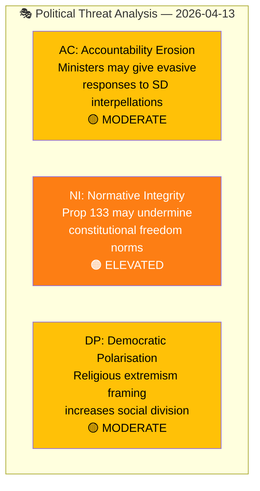
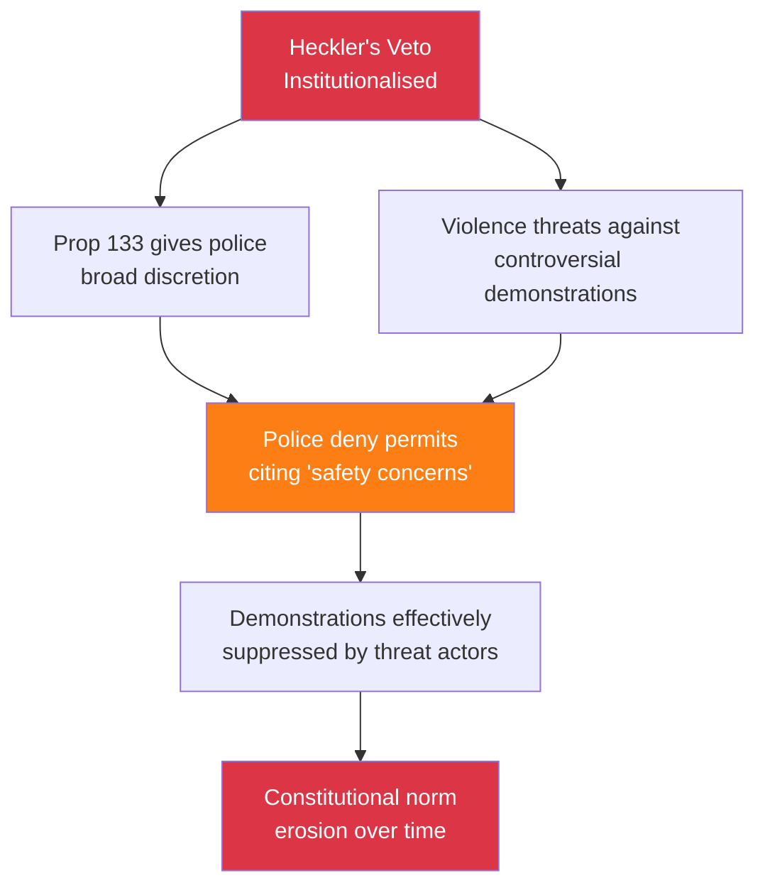

# Political Threat Analysis — Interpellations 2026-04-13

| Field | Value |
|-------|-------|
| **ID** | THREAT-IP-2026-04-13-001 |
| **Date** | 2026-04-13 |
| **Riksmöte** | 2025/26 |
| **Documents Analyzed** | 2 |
| **Overall Threat Level** | MODERATE |
| **Generated** | 2026-04-13 07:20 UTC |

## Threat Dashboard

## Threat Categories

| Category | Code | Level | Evidence | Confidence |
|----------|:----:|:-----:|----------|:----------:|
| **Accountability Erosion** | AC | 🟡 MODERATE | Ministers Strömmer and Forssmed face interpellation pressure from SD but may respond evasively to avoid coalition conflict | MEDIUM |
| **Normative Integrity** | NI | 🟠 ELEVATED | Prop 2025/26:133 broad language ("säkerheten för människors liv eller hälsa") creates potential for demonstration rights erosion | HIGH |
| **Democratic Polarisation** | DP | 🟡 MODERATE | HD10430 framing of mosque hate speech may increase social division in communities like Kristianstad | MEDIUM |

## Democratic Function Impact Assessment

| Democratic Function | Impact | Evidence (dok_id) | Confidence |
|-------------------|:------:|-------------------|:----------:|
| Freedom of Expression | 🟠 MEDIUM-HIGH | frs 2025/26:429: Prop 133 may restrict demonstration rights via "heckler's veto" mechanism | HIGH |
| Parliamentary Accountability | 🟢 POSITIVE | Both interpellations demonstrate functioning accountability — ministers must respond within statutory deadlines | HIGH |
| Rule of Law | 🟡 MEDIUM | frs 2025/26:429: Police discretion under Prop 133 may lead to inconsistent enforcement | MEDIUM |
| Social Cohesion | 🟡 MEDIUM | frs 2025/26:430: Mosque hate speech narrative may increase inter-community tensions | MEDIUM |

## Attack Tree: Heckler's Veto Institutionalisation

