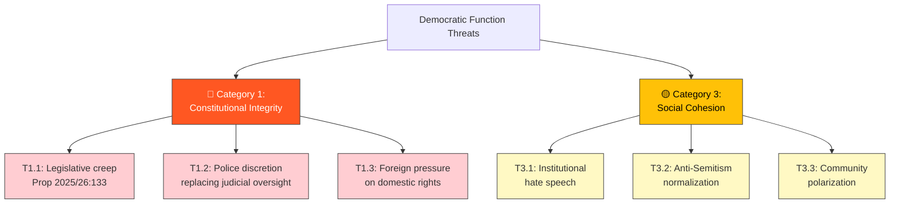

# Political Threat Analysis — 2026-04-13

**Generated**: 2026-04-13 22:02 UTC
**Data Sources**: get_interpellationer, get_dokument_innehall
**Documents Analyzed**: 2 (frs 2025/26:429, frs 2025/26:430)
**Confidence**: HIGH (78%)
**Produced By**: news-interpellations AI workflow (deep analysis)

---

## Summary

Threat analysis identifies two primary democratic function threat categories activated by these interpellations: erosion of fundamental rights through legislative overreach (Category 1: Constitutional Integrity) and failure to protect minority communities from institutional hate speech (Category 3: Social Cohesion).

## Threat Taxonomy

## Detailed Threat Assessment

### T1.1: Legislative Creep on Fundamental Rights
- **Source**: frs 2025/26:429 (HD10429)
- **Threat Actor**: Government (unintentional overreach)
- **Vector**: Proposition 2025/26:133 — broad "security" formulation
- **Severity**: 🔴 HIGH — Affects constitutional foundation
- **Evidence**: "formuleringen 'säkerheten för människors liv eller hälsa' mycket bred. Den saknar tydlig avgränsning" (HD10429)
- **Democratic Function Impact**: Demonstration freedom (RF 2:1) potentially constrained

### T1.2: Police Discretion Replacing Judicial Oversight
- **Source**: frs 2025/26:429 (HD10429)
- **Threat Actor**: Police operational culture
- **Vector**: New legal authority to relocate/cancel demonstrations without judicial check
- **Severity**: 🔴 HIGH — Separation of powers concern
- **Evidence**: "uttryckligt lagstöd för Polismyndigheten att ändra tid och plats" (HD10429)

### T3.1: Institutional Hate Speech
- **Source**: frs 2025/26:430 (HD10430)
- **Threat Actor**: Radical religious leaders (specific imams in Kristianstad)
- **Vector**: Sermons in established mosques preaching hatred
- **Severity**: 🟡 MEDIUM-HIGH — Targets specific minority (Jewish community)
- **Evidence**: "uppmanat muslimer att hata icke-muslimer", "blod, död och fördrivning" against Jews (HD10430)

### T3.2: Anti-Semitism Normalization
- **Source**: frs 2025/26:430 (HD10430)
- **Threat Actor**: Radical religious leaders, community networks
- **Vector**: Intergenerational hate transmission — "kommande generationer lär sig att 'skada' judar"
- **Severity**: 🔴 HIGH — Systematic radicalization targeting children
- **Evidence**: HD10430 cites imam teaching children "muslimerna 'kommer att hämnas'"

## Key Findings

1. **Constitutional integrity** faces dual threat: legislative overreach from government and foreign pressure from authoritarian states
2. **Social cohesion** threatened by institutional hate speech pattern in Kristianstad — two mosques exposed in rapid succession
3. **Intergenerational radicalization** is the most severe long-term threat (children taught hatred)
4. **Democratic accountability is functioning** — interpellation mechanism forces minister responses

## Implications

These interpellations reveal genuine threats to democratic function, not merely political posturing. The legislative creep risk (T1.1) is systemic and enduring; the anti-Semitism threat (T3.2) targets community safety. Minister responses will determine whether democratic self-correction mechanisms function effectively.
