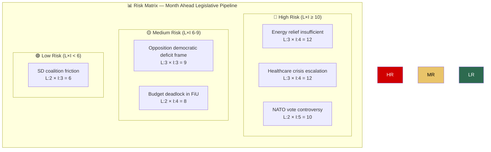

# 🔴 Risk Assessment — Month Ahead (April 14 – May 13, 2026)

| Field | Value |
|-------|-------|
| **ID** | RISK-MON-2026-04-13-001 |
| **Date** | 2026-04-13 |
| **Riksmöte** | 2025/26 |
| **Risk Level** | ELEVATED |
| **Confidence** | HIGH |

---

## Risk Matrix

## Detailed Risk Table

| # | Risk Description | Likelihood (1-5) | Impact (1-5) | L×I Score | Category | Trigger Date | Mitigation |
|---|-----------------|:-:|:-:|:-:|---|:---:|---|
| 1 | Energy relief (HD03236) perceived as insufficient by voters ahead of Election 2026 | 3 | 4 | **12** | Fiscal/Electoral | Apr 25-30 | Fast-track processing via FiU48; visible household savings by May |
| 2 | Healthcare access crisis dominates campaign after 348 motions rejected (SoU16/17) | 3 | 4 | **12** | Social/Electoral | May 1-15 | Government health minister media strategy; point to ongoing reforms |
| 3 | NATO Finland deployment vote exposes defence consensus cracks | 2 | 5 | **10** | Defence/Foreign | Apr 20-25 | Broad parliamentary support; UFöU3 committee already approved |
| 4 | Opposition weaponizes "404 rejected motions" as democratic accountability narrative | 3 | 3 | **9** | Political/Democratic | Apr 14-May 13 | Government counters with legislative output metrics |
| 5 | FiU processing bottleneck delays Spring Budget before May recess | 2 | 4 | **8** | Legislative/Process | May 1-10 | Extended committee sessions; parliamentary scheduling coordination |
| 6 | SD interpellations on free speech/mosques escalate coalition tensions | 2 | 3 | **6** | Coalition/Political | Apr 14-21 | Ministerial responses contain debate; SD satisfied with spotlight |

## Election 2026 Risk Overlay

The 30-day window represents the **final legislative sprint** before election campaign mode. Key electoral risks:
- **Government**: Must demonstrate tangible policy delivery (fuel cuts, energy support) visible to voters
- **Opposition**: Must transform "rejection narrative" into credible alternative government vision
- **SD**: Dual role as government support party AND provocateur on cultural issues creates unpredictability

## Data Quality Notes

Risk scores based on cross-referencing 61+ parliamentary documents, World Bank economic data (GDP growth 0.82%, inflation 2.8%, unemployment 8.4%), and 6 sibling analysis types.
