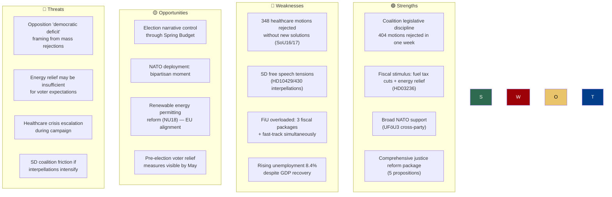

# 🔄 SWOT Analysis — Month Ahead (April 14 – May 13, 2026)

| Field | Value |
|-------|-------|
| **ID** | SWOT-MON-2026-04-13-001 |
| **Date** | 2026-04-13 |
| **Riksmöte** | 2025/26 |
| **Analysis Depth** | deep |
| **Stakeholder Groups** | 8/8 |
| **Confidence** | HIGH |
| **Methodology** | ai-driven-analysis-guide.md v5.0 |

---

## 📊 SWOT Overview

---

## Detailed 8-Group Stakeholder SWOT

### 1. Citizens

| # | Statement | Evidence (dok_id) | Confidence | Impact | Entry Date |
|---|-----------|-------------------|:---:|:---:|:---:|
| S1 | Fuel tax reduction and energy price support provide direct household relief | HD03236 (Extra ändringsbudget) | 🟩 HIGH | HIGH | 2026-04-13 |
| W1 | 348 healthcare motions rejected without alternative solutions; access crisis unaddressed | SoU16, SoU17 | 🟩 HIGH | HIGH | 2026-04-01 |
| O1 | Spring Budget may include expanded welfare measures visible before election | HD03100 (Vårpropositionen) | 🟧 MEDIUM | MEDIUM | 2026-04-13 |
| T1 | Unemployment at 8.4% while cost-of-living remains elevated | World Bank data; HD0399 | 🟩 HIGH | HIGH | 2026-04-13 |

### 2. Government Coalition (M, KD, L)

| # | Statement | Evidence (dok_id) | Confidence | Impact | Entry Date |
|---|-----------|-------------------|:---:|:---:|:---:|
| S2 | Strongest legislative week of the session — 10 propositions, 6 fiscal in one day | HD03100, HD0399, HD03236, HD0398, HD03101, HD03241 | 🟩 HIGH | CRITICAL | 2026-04-13 |
| W2 | Overreliance on SD parliamentary cooperation creates vulnerability | SfU31, SfU32, SfU36 (migration package requires SD) | 🟧 MEDIUM | HIGH | 2026-04-10 |
| O2 | Spring Budget creates pre-election economic narrative ownership | HD03100 (Vårpropositionen) | 🟩 HIGH | HIGH | 2026-04-13 |
| T2 | SD interpellations on free speech/mosque hate speech expose internal divisions | HD10429, HD10430 | 🟧 MEDIUM | MEDIUM | 2026-04-07 |

### 3. Opposition Bloc (S, V, MP, C)

| # | Statement | Evidence (dok_id) | Confidence | Impact | Entry Date |
|---|-----------|-------------------|:---:|:---:|:---:|
| S3 | MP leads opposition volume (42% of motions) — strategic breadth across 6 committees | HD024068, HD024074, HD024055, HD024054, HD024053 | 🟩 HIGH | MEDIUM | 2026-04-13 |
| W3 | 404 motions rejected — opposition unable to force committee reconsideration | Committee reports UU6, FöU8, SfU16, SoU16/17 | 🟩 HIGH | HIGH | 2026-04-09 |
| O3 | Cross-party coordination on Sida audit (C+V+MP) and education creates coalition building | HD024070, HD024071, HD024072 | 🟩 HIGH | MEDIUM | 2026-04-08 |
| T3 | Government's fiscal largesse may neutralize opposition economic critique | HD03236 (fuel tax cuts) | 🟧 MEDIUM | HIGH | 2026-04-13 |

### 4. Business/Industry

| # | Statement | Evidence (dok_id) | Confidence | Impact | Entry Date |
|---|-----------|-------------------|:---:|:---:|:---:|
| S4 | Renewable energy permitting reform (NU18) accelerates green investments | HD01NU18 | 🟩 HIGH | HIGH | 2026-04-08 |
| W4 | Arms export modernization (HD03228) increases compliance burden | HD03228, HD03114 | 🟧 MEDIUM | MEDIUM | 2026-04-01 |
| O4 | Consumer credit reform (HD03223) stabilizes lending market | HD03223 | 🟧 MEDIUM | MEDIUM | 2026-03-31 |
| T4 | Competition law changes (Prop. 203) expand antitrust powers — business opposition | HD024057 (MP motion challenging) | 🟧 MEDIUM | MEDIUM | 2026-04-01 |

### 5. Civil Society

| # | Statement | Evidence (dok_id) | Confidence | Impact | Entry Date |
|---|-----------|-------------------|:---:|:---:|:---:|
| S5 | Species protection compensation (HD03230) balances conservation and landowner rights | HD03230 | 🟧 MEDIUM | MEDIUM | 2026-04-08 |
| W5 | Social dumping unaddressed despite interpellation (HD10423) | HD10423 | 🟧 MEDIUM | MEDIUM | 2026-03-30 |
| O5 | Disability rights review (Funktionsrätt granskning HD10416) raises visibility | HD10416 | 🟧 MEDIUM | MEDIUM | 2026-03-26 |
| T5 | New bosättningslag (HD03215) imposes residence restrictions on immigrants | HD03215 | 🟩 HIGH | HIGH | 2026-03-31 |

### 6. International/EU

| # | Statement | Evidence (dok_id) | Confidence | Impact | Entry Date |
|---|-----------|-------------------|:---:|:---:|:---:|
| S6 | NATO forward presence in Finland demonstrates alliance commitment | HD03220, HD01UFöU3 | 🟩 HIGH | CRITICAL | 2026-04-09 |
| W6 | Israel death penalty interpellation (HD10426) may strain diplomatic relations | HD10426 | 🟧 MEDIUM | MEDIUM | 2026-04-01 |
| O6 | EU renewable energy directive implementation positions Sweden as leader | HD01NU18 | 🟩 HIGH | HIGH | 2026-04-08 |
| T6 | Strategic export control review may affect defence industry partnerships | HD03114 | 🟧 MEDIUM | MEDIUM | 2026-04-07 |

### 7. Judiciary/Constitutional

| # | Statement | Evidence (dok_id) | Confidence | Impact | Entry Date |
|---|-----------|-------------------|:---:|:---:|:---:|
| S7 | Expanded civil servant liability (HD03217) strengthens public accountability | HD03217 | 🟩 HIGH | HIGH | 2026-04-09 |
| W7 | Double gang penalties (HD03218) raise proportionality concerns | HD03218 | 🟧 MEDIUM | HIGH | 2026-04-09 |
| O7 | Cybersecurity center legislation (HD03214) modernizes digital governance | HD03214 | 🟩 HIGH | MEDIUM | 2026-04-01 |
| T7 | "Hooligan's veto" risk from Prop. 133 (raised in HD10429) | HD10429 | 🟧 MEDIUM | HIGH | 2026-04-07 |

### 8. Media/Public Opinion

| # | Statement | Evidence (dok_id) | Confidence | Impact | Entry Date |
|---|-----------|-------------------|:---:|:---:|:---:|
| S8 | Fiscal transparency through annual review (HD03101) and tax expenditure report (HD0398) | HD03101, HD0398 | 🟩 HIGH | MEDIUM | 2026-04-13 |
| W8 | 404 motion rejections in one week may appear anti-democratic to media | Committee reports (per committeeReports analysis) | 🟧 MEDIUM | HIGH | 2026-04-09 |
| O8 | Spring Budget creates extensive data-driven reporting opportunities | HD03100, HD0399 | 🟩 HIGH | MEDIUM | 2026-04-13 |
| T8 | SD mosque hate speech interpellation (HD10430) could dominate news cycle | HD10430 | 🟧 MEDIUM | MEDIUM | 2026-04-07 |

## Data Quality Notes

All 8 mandatory stakeholder groups analyzed. Evidence tables cite specific dok_ids. Confidence labels applied per ai-driven-analysis-guide.md v5.0 five-level scale.
