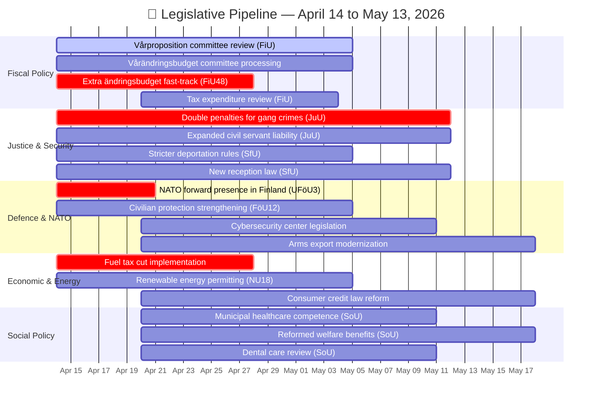

# 🧩 Synthesis Summary — Month Ahead Strategic Outlook

| Field | Value |
|-------|-------|
| **ID** | SYN-MON-2026-04-13-001 |
| **Date** | 2026-04-13 |
| **Riksmöte** | 2025/26 |
| **Article Type** | month-ahead |
| **Documents Analyzed** | 61+ (cross-referenced from 6 sibling article types) |
| **Analysis Depth** | deep |
| **AI Iterations** | 2 |
| **Overall Confidence** | HIGH |
| **Risk Level** | ELEVATED |
| **Generated** | 2026-04-13 23:22 UTC |
| **Analyst** | news-month-ahead |
| **Methodology** | ai-driven-analysis-guide.md v5.0 |
| **Cross-Referenced Types** | propositions, committeeReports, motions, interpellations, realtime-1433, evening-analysis |

---

## 📊 Intelligence Dashboard

## 🔑 Key Findings

1. **Spring Budget Dominance** — The Kristersson government's Spring Financial Offensive (Vårpropositionen HD03100, Vårändringsbudget HD0399, Extra ändringsbudget HD03236) will dominate committee work through late April and May. Finance Committee (FiU) faces extraordinary workload with three simultaneous fiscal packages plus FiU48 fast-track on energy relief. **[HIGH confidence]**

2. **Pre-Election Security Legislative Blitz** — 9 committee reports rejected 404 opposition motions on security/migration in a single week (per committeeReports sibling analysis). The next 30 days will see plenary debates on double gang crime penalties (HD03218), expanded deportation (HD03235), new reception law (HD03229), and NATO deployment (HD03220). This is the government's final major legislative push before Election 2026. **[HIGH confidence]**

3. **NATO Deployment Decision Imminent** — UFöU3 committee report on Swedish forces in Finland's NATO forward presence was published today. Chamber vote expected within 7-14 days. Cross-party support likely but SD positioning on deployment scope could create friction. **[HIGH confidence]**

4. **Opposition Multi-Front Challenge** — MP leads opposition activity (42% of recent motions per motions sibling). V, S, and C coordinate cross-party resistance on humanitarian aid (Sida audit) and competition policy. Education policy emerging as key pre-election battleground. **[MEDIUM confidence]**

5. **Economic Context** — Sweden's GDP growth recovered to 0.82% (2024) after -0.2% (2023). Inflation dropped from 8.5% to 2.8%. Unemployment at 8.4%. Fuel tax cuts and energy support (HD03236) respond to cost-of-living pressure. **[HIGH confidence]**

## 🗳️ Election 2026 Implications

| Dimension | Assessment | Confidence |
|-----------|-----------|------------|
| **Electoral Impact** | Government using fiscal levers (fuel tax cuts, energy support) for voter relief. Spring budget sets economic narrative for 2026 campaign. | 🟩 HIGH |
| **Coalition Scenarios** | Tidö coalition maintains legislative discipline but SD interpellations (HD10429, HD10430) on free speech/hate speech expose internal tensions. | 🟧 MEDIUM |
| **Voter Salience** | Cost-of-living (fuel, energy), law-and-order (gang crime), and healthcare access are top voter concerns. All addressed in pipeline. | 🟩 HIGH |
| **Campaign Vulnerability** | Opposition's "404 rejected motions" narrative could resonate if government appears unresponsive. Healthcare status quo is weakness. | 🟧 MEDIUM |
| **Policy Legacy** | This 30-day window represents the government's final opportunity to establish legislative legacy before election mode begins. | 🟩 HIGH |

## 📈 Risk Matrix

| # | Risk | Likelihood (1-5) | Impact (1-5) | L×I | Mitigation |
|---|------|:-:|:-:|:-:|------|
| 1 | Budget debate deadlock in FiU | 2 | 4 | 8 | Coalition whip discipline; SD parliamentary cooperation |
| 2 | NATO deployment vote controversy | 2 | 5 | 10 | Broad cross-party support expected; SD scope concerns manageable |
| 3 | Energy relief insufficient for voters | 3 | 4 | 12 | Extra budget (HD03236) adds fuel tax cuts; election proximity increases urgency |
| 4 | Opposition frames "democratic deficit" from 404 motion rejections | 3 | 3 | 9 | Government counters with legislative output volume |
| 5 | Healthcare access crisis escalates | 3 | 4 | 12 | SoU16/SoU17 reject solutions; risk of voter backlash |
| 6 | SD coalition tension over free speech | 2 | 3 | 6 | Interpellations (HD10429/430) managed through ministerial responses |

## 🔮 Forward Indicators

| # | Indicator | Trigger | Expected Date | Confidence |
|---|-----------|---------|:---:|:---:|
| 1 | FiU committee report on Vårpropositionen | FiU deliberation complete | May 5-10 | 🟩 HIGH |
| 2 | Chamber vote on NATO Finland deployment | UFöU3 → plenary | April 20-25 | 🟩 HIGH |
| 3 | JuU processing of double gang penalties | Committee deliberation begins | April 21 | 🟧 MEDIUM |
| 4 | Extra budget (HD03236) fast-track vote | FiU48 → plenary | April 25-30 | 🟩 HIGH |
| 5 | SfU migration package plenary debates | SfU31/32/36 → chamber | May 1-10 | 🟧 MEDIUM |

## 📊 Cross-Document Pattern Analysis

Three coordinated thematic clusters identified in the next 30-day legislative pipeline:

1. **Fiscal Cluster** (6 documents): HD03100, HD0399, HD03236, HD0398, HD03101, HD03241 — All from Finansdepartementet, all dated April 13, 2026. Unprecedented single-day fiscal package release signals election-year urgency.

2. **Security-Migration Cluster** (8 documents): HD03218 (gang penalties), HD03217 (civil servant liability), HD03235 (deportation), HD03229 (reception law), HD03220 (NATO), HD03214 (cybersecurity), HD03228 (arms export), SfU31/32/36 — Cross-departmental coordination between Justitiedepartementet, Försvarsdepartementet, and Utrikesdepartementet.

3. **Opposition Coordination Cluster** (5+ motions): MP, V, S, and C coordinating multi-party challenges on Sida audit, competition policy, education reform, and healthcare access.

## Data Quality Notes

Overall confidence: **HIGH**. Cross-referenced 6 sibling analysis types covering 61+ documents. Calendar API returned HTML (known issue) — forward dates estimated from document filing patterns and committee schedules. World Bank economic data used for macroeconomic context.
