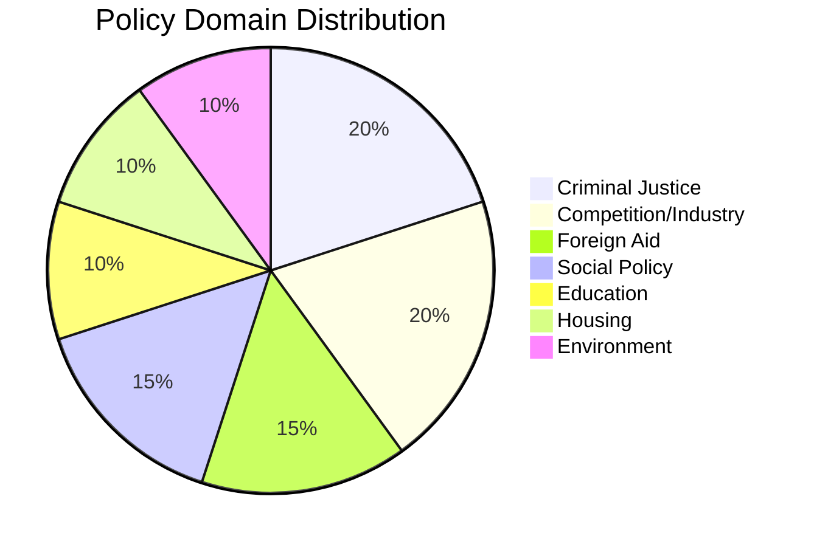

# 🏷️ Classification Results — Opposition Motions (2026-04-13)

**Generated**: 2026-04-13 07:42 UTC | **Riksmöte**: 2025/26 | **Documents**: 19 motions
**Confidence**: HIGH

---

## Document Classification Matrix

| dok_id | Motion # | Party | Committee | Domain | Sensitivity | Urgency | Significance |
|--------|----------|-------|-----------|--------|-------------|---------|-------------|
| HD024063 | 4063 | MP | JuU | Criminal Justice / Human Rights | 🟡 SENSITIVE | 🔴 CRITICAL | 8/10 |
| HD024015 | 4015 | S | NU | Competition Policy / Public Sector | 🟡 SENSITIVE | 🔵 ELEVATED | 7/10 |
| HD024057 | 4057 | MP | NU | Competition Policy / Public Sector | 🟡 SENSITIVE | 🔵 ELEVATED | 7/10 |
| HD024021 | 4021 | S | UbU | Education / Vocational Training | 🟡 SENSITIVE | 🔵 ELEVATED | 7/10 |
| HD024073 | 4073 | V | JuU | Criminal Justice / Youth | 🟡 SENSITIVE | 🔵 ELEVATED | 7/10 |
| HD024074 | 4074 | MP | JuU | Criminal Justice / Youth | 🟡 SENSITIVE | 🔵 ELEVATED | 7/10 |
| HD024070 | 4070 | C | UU | Foreign Aid / Development | 🟢 PUBLIC | 🔵 ELEVATED | 6/10 |
| HD024071 | 4071 | V | UU | Foreign Aid / Development | 🟡 SENSITIVE | 🔵 ELEVATED | 6/10 |
| HD024072 | 4072 | MP | UU | Foreign Aid / Development | 🟢 PUBLIC | 🔵 ELEVATED | 6/10 |
| HD024075 | 4075 | S | SoU | Social Policy / Alcohol | 🟡 SENSITIVE | 🔵 ELEVATED | 6/10 |
| HD024056 | 4056 | MP | UbU | Education / Privacy | 🟡 SENSITIVE | 🔵 ELEVATED | 6/10 |
| HD024067 | 4067 | MP | CU | Housing Policy | 🟢 PUBLIC | 🔵 ELEVATED | 6/10 |
| HD024012 | 4012 | S | CU | Housing Policy | 🟡 SENSITIVE | 🔵 ELEVATED | 6/10 |
| HD024068 | 4068 | MP | MJU | Environment / Hunting | 🟢 PUBLIC | ⚪ ROUTINE | 5/10 |
| HD024069 | 4069 | MP | MJU | Defense / Food Supply | 🟡 SENSITIVE | ⚪ ROUTINE | 5/10 |
| HD024032 | 4032 | C | SoU | Social Policy / Welfare | 🟢 PUBLIC | ⚪ ROUTINE | 5/10 |
| HD024045 | 4045 | C | SoU | Health / Suicide Prevention | 🟡 SENSITIVE | ⚪ ROUTINE | 5/10 |
| HD024007 | 4007 | SD | NU | Copyright / Digital Policy | 🟢 PUBLIC | ⚪ ROUTINE | 5/10 |
| HD024037 | 4037 | C | NU | Copyright / Digital Policy | 🟢 PUBLIC | ⚪ ROUTINE | 5/10 |

## Domain Distribution

