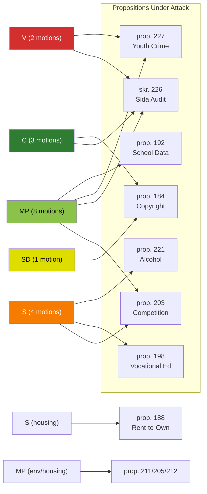

# 🔗 Cross-Reference Map — Opposition Motions (2026-04-13)

**Generated**: 2026-04-13 07:43 UTC | **Riksmöte**: 2025/26 | **Documents**: 19 motions

---

## Cross-Party Motion Clusters

### Cluster 1: Competition Policy (S+MP vs prop. 203)
- **mot. 2025/26:4015** (S, Fredrik Olovsson) — Rejects law on "offentlig säljverksamhet"
- **mot. 2025/26:4057** (MP, Katarina Luhr) — Rejects chapter 6 on public-sector commercial rules
- **Target**: prop. 2025/26:203 (Nya verktyg för stärkt konkurrens)
- **Significance**: Coordinated left-green opposition to municipal commerce restrictions

### Cluster 2: Sida Humanitarian Aid (C+V+MP vs skr. 226)
- **mot. 2025/26:4070** (C, Anna Lasses & Kerstin Lundgren) — Demands government action on audit findings
- **mot. 2025/26:4071** (V, Lotta Johnsson Fornarve) — Rejects migration-conditioned aid
- **mot. 2025/26:4072** (MP, Janine Alm Ericson) — Demands Sida efficiency reforms
- **Target**: skr. 2025/26:226 (Riksrevisionens rapport om Sida)
- **Significance**: Cross-bloc opposition (center + left-green) united on aid reform

### Cluster 3: Youth Crime Investigation (V+MP vs prop. 227)
- **mot. 2025/26:4073** (V, Gudrun Nordborg) — Demands safeguards for youth suspects
- **mot. 2025/26:4074** (MP, Ulrika Westerlund) — Rejects youth investigation expansion
- **Target**: prop. 2025/26:227 (Bättre möjligheter att utreda brott av unga)
- **Significance**: Left-green rights-based opposition to crime expansion

### Cluster 4: Copyright/Private Copying Levy (SD+C vs prop. 184)
- **mot. 2025/26:4007** (SD, Tobias Andersson) — Rejects private copying levy
- **mot. 2025/26:4037** (C, Anders Ådahl) — Demands complete abolition of system
- **Target**: prop. 2025/26:184 (Privatkopieringsersättning)
- **Significance**: Unusual SD-C alignment against government digital policy

### Cluster 5: Education Policy (S+MP, different props)
- **mot. 2025/26:4021** (S, Anders Ygeman) — Regulate vocational education outsourcing (vs prop. 198)
- **mot. 2025/26:4056** (MP, Camilla Hansén) — Voluntary school data sharing (vs prop. 192)
- **Same committee**: UbU
- **Significance**: Parallel opposition education agenda in same committee

