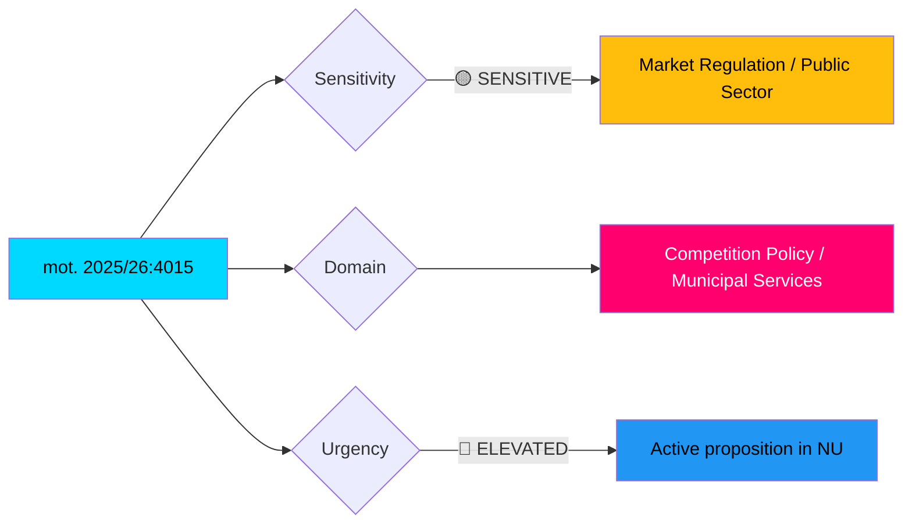

# 🔍 Per-File Political Intelligence Analysis

## 📋 Document Identity

| Field | Value |
|-------|-------|
| **Document ID** | HD024015 (mot. 2025/26:4015) |
| **Document Type** | motions |
| **Title** | med anledning av prop. 2025/26:203 Nya verktyg för stärkt konkurrens |
| **Date** | 2026-04-01 |
| **Riksmöte** | 2025/26 |
| **Committee** | NU (Näringsutskottet) |
| **Party** | S (Socialdemokraterna) |
| **Author** | Fredrik Olovsson m.fl. |
| **Source MCP Tool** | get_motioner |
| **Analysis Timestamp** | 2026-04-13 07:32 UTC |
| **Analyst** | news-motions |

## 🎯 Executive Summary

The Social Democrats demand rejection of the government's proposed law on public-sector commercial activities (offentlig säljverksamhet) within prop. 2025/26:203. This is a high-significance motion targeting a core ideological battleground — the role of municipalities in commercial markets. S and MP (mot. 2025/26:4057) form a cross-party bloc against this specific provision, signaling coordinated left-green opposition to privatization-friendly regulation. **[HIGH confidence]**

## 📊 Political Classification

| Metric | Score | Rationale |
|--------|-------|-----------|
| **Significance** | 7/10 | Targets core ideological issue; cross-party opposition (S+MP) |
| **Urgency** | ELEVATED | Active proposition in NU pipeline |
| **Sensitivity** | SENSITIVE | Touches municipal autonomy and public service delivery |

## 🔄 SWOT Analysis

### Strengths
| # | Statement | Evidence | Confidence | Impact |
|---|-----------|----------|------------|--------|
| 1 | Cross-party opposition bloc: S (mot. 4015) + MP (mot. 4057) both reject public-sector sales rules | Two separate motions targeting same proposition chapter | HIGH | Strengthens opposition negotiating position |
| 2 | S defends municipal service delivery — popular with local government associations (SKR) | Rejection of law on "offentlig säljverksamhet" | HIGH | Aligns with SKR position, broadens support base |

### Weaknesses
| # | Statement | Evidence | Confidence | Impact |
|---|-----------|----------|------------|--------|
| 1 | Opposition may not defeat entire prop. 2025/26:203 — government has coalition majority | S+MP insufficient without V, C support | MEDIUM | May only secure reservations, not rejection |

### Opportunities
| # | Statement | Evidence | Confidence | Impact |
|---|-----------|----------|------------|--------|
| 1 | Can link to broader "government weakens public sector" narrative for 2026 campaign | Part of systematic deregulation agenda | HIGH | Campaign ammunition |
| 2 | Municipal election cycle 2026 — local politicians motivated to oppose restrictions on municipal commercial activity | Municipal autonomy resonates with local representatives across parties | MEDIUM | Cross-party local support |

### Threats
| # | Statement | Evidence | Confidence | Impact |
|---|-----------|----------|------------|--------|
| 1 | Government frames as pro-competition, anti-monopoly — difficult to oppose openly | Competition law modernization framing | MEDIUM | S risks appearing anti-competitive |

## 📉 Risk Assessment

| Risk | L (1-5) | I (1-5) | L×I | Mitigation |
|------|---------|---------|-----|------------|
| Municipal service erosion if passed | 3 | 4 | 12 | Legal challenges by municipalities |
| Cross-party opposition bloc fractures | 2 | 3 | 6 | S-MP coordination |
| Government uses competition framing effectively | 3 | 3 | 9 | S counters with public service narrative |

## 🗳️ Election 2026 Implications

| Dimension | Assessment | Confidence |
|-----------|------------|------------|
| **Electoral Impact** | Moderate — municipal services matter to voters; deregulation concern for public sector unions | 🟩HIGH |
| **Coalition Scenarios** | S+MP bloc on this issue — potential V alignment creates left opposition wall | 🟩HIGH |
| **Voter Salience** | Medium — competition policy is technical, but "privatization of public services" resonates | 🟧MEDIUM |
| **Campaign Vulnerability** | Government risks losing municipal officials' support | 🟧MEDIUM |
| **Policy Legacy** | Structural shift in municipal commercial activity regulation if passed | 🟩HIGH |

## 🔮 Forward Indicators

- **Watch**: NU committee deliberation on prop. 2025/26:203 (chapter 6 specifically)
- **Trigger**: If C joins S+MP opposition to chapter 6, government may face defeat on that section
- **Timeline**: Expected NU report and riksdag vote May-June 2026
- **Cross-reference**: Compare with mot. 2025/26:4057 (MP, same proposition)
