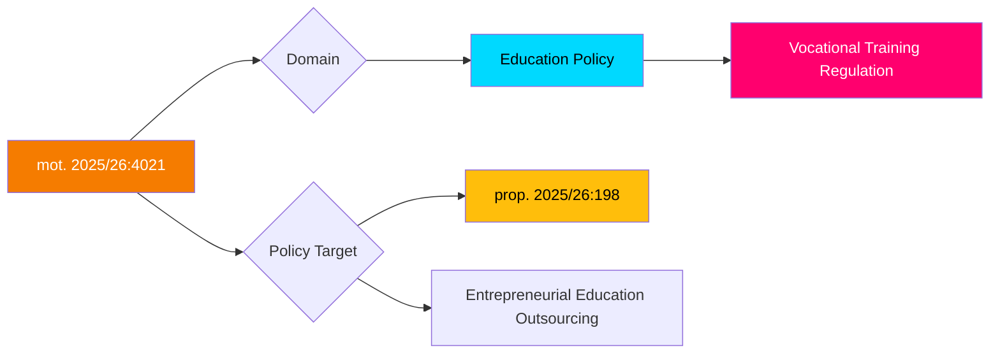

# 🔍 Per-File Political Intelligence Analysis

## 📋 Document Identity

| Field | Value |
|-------|-------|
| **Document ID** | HD024021 (mot. 2025/26:4021) |
| **Document Type** | motions |
| **Title** | med anledning av prop. 2025/26:198 Bättre förutsättningar för yrkesutbildning |
| **Date** | 2026-04-01 |
| **Riksmöte** | 2025/26 |
| **Committee** | UbU (Utbildningsutskottet) |
| **Party** | S (Socialdemokraterna) |
| **Author** | Anders Ygeman m.fl. |
| **Source MCP Tool** | get_motioner |
| **Analysis Timestamp** | 2026-04-13 07:34 UTC |
| **Analyst** | news-motions |

## 🎯 Executive Summary

The Social Democrats demand stricter regulation of outsourcing (entreprenad) in vocational education, directly challenging the government's proposition to expand flexibility in vocational training (prop. 2025/26:198). Anders Ygeman m.fl. argue that private providers in vocational education must face tighter controls and limitations to protect educational quality. This targets the government's liberalization of education markets, a persistent left-right fault line in Swedish politics. **[HIGH confidence]**

## 📊 Political Classification

| Metric | Score | Rationale |
|--------|-------|-----------|
| **Significance** | 7/10 | Education quality is high-salience voter issue; targets government market-friendly reform |
| **Urgency** | ELEVATED | Active proposition in UbU |
| **Sensitivity** | SENSITIVE | Touches education quality and private provider accountability |

## 🔄 SWOT Analysis

### Strengths
| # | Statement | Evidence | Confidence | Impact |
|---|-----------|----------|------------|--------|
| 1 | Education quality resonates strongly with voters — S positions as quality defender | mot. 2025/26:4021 demands regulation of "entreprenad" in vocational education | HIGH | Strong campaign position |
| 2 | S has credible track record on education regulation | Historical S education policy | HIGH | Established brand advantage |

### Weaknesses
| # | Statement | Evidence | Confidence | Impact |
|---|-----------|----------|------------|--------|
| 1 | Risk of appearing anti-business, anti-flexibility in skills training | Opposing expanded vocational training options | MEDIUM | May alienate business community |

### Opportunities
| # | Statement | Evidence | Confidence | Impact |
|---|-----------|----------|------------|--------|
| 1 | Can link to broader "for-profit schools" debate — highly salient in Swedish politics | Profit in welfare sector (vinster i välfärden) remains campaign issue | HIGH | Major 2026 campaign ammunition |
| 2 | Compare with MP's motion on school data sharing (mot. 4056) — opposition education bloc | Cross-party education policy coordination | MEDIUM | Strengthens opposition narrative |

### Threats
| # | Statement | Evidence | Confidence | Impact |
|---|-----------|----------|------------|--------|
| 1 | Government counters with skills shortage narrative — Sweden needs more vocational graduates | Labour market demand for skilled workers | HIGH | Government has strong economic argument |

## 📉 Risk Assessment

| Risk | L (1-5) | I (1-5) | L×I | Mitigation |
|------|---------|---------|-----|------------|
| Education quality erosion through unregulated outsourcing | 3 | 4 | 12 | S oversight demands |
| Government frames as anti-skills-development | 3 | 3 | 9 | S reframes as quality-first |
| Private provider lobbying overrides quality concerns | 3 | 3 | 9 | Public opinion pressure |

## 🗳️ Election 2026 Implications

| Dimension | Assessment | Confidence |
|-----------|------------|------------|
| **Electoral Impact** | High — education is top-3 voter issue; profit-in-welfare debate intensifying | 🟩HIGH |
| **Coalition Scenarios** | S+V+MP likely aligned on education regulation | 🟩HIGH |
| **Voter Salience** | High — parents, teachers, unions care deeply about education quality | 🟩HIGH |
| **Campaign Vulnerability** | Government exposed if education quality scandals emerge before election | 🟩HIGH |
| **Policy Legacy** | Sets regulatory framework for vocational education for years | 🟩HIGH |

## 🔮 Forward Indicators

- **Watch**: UbU committee vote on prop. 2025/26:198
- **Trigger**: Teacher union (Lärarförbundet) public stance on proposition
- **Timeline**: UbU report expected May 2026
- **Cross-reference**: mot. 2025/26:4056 (MP, education — school data sharing)
