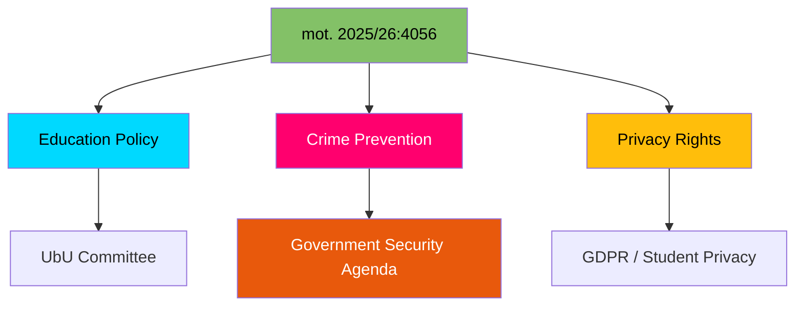

# 🔍 Per-File Political Intelligence Analysis

## 📋 Document Identity

| Field | Value |
|-------|-------|
| **Document ID** | HD024056 (mot. 2025/26:4056) |
| **Document Type** | motions |
| **Title** | med anledning av prop. 2025/26:192 Överlämnande av uppgifter mellan skolor i brottsförebyggande syfte |
| **Date** | 2026-04-01 |
| **Riksmöte** | 2025/26 |
| **Committee** | UbU (Utbildningsutskottet) |
| **Party** | MP (Miljöpartiet) |
| **Author** | Camilla Hansén m.fl. |
| **Source MCP Tool** | get_motioner |
| **Analysis Timestamp** | 2026-04-13 07:35 UTC |
| **Analyst** | news-motions |

## 🎯 Executive Summary

Miljöpartiet demands amendments to prop. 2025/26:192 on sharing student data between schools for crime prevention. MP supports data sharing in principle but pushes for it to be voluntary ("möjlighet") rather than mandatory, protecting student privacy while enabling schools to act on safety concerns. This motion sits at the intersection of the government's crime prevention agenda and civil liberties — a classic green-libertarian position against overreach of the security state. **[HIGH confidence]**

## 📊 Political Classification

| Metric | Score | Rationale |
|--------|-------|-----------|
| **Significance** | 6/10 | Touches crime prevention vs privacy — culturally charged in Sweden |
| **Urgency** | ELEVATED | Active proposition in UbU |
| **Sensitivity** | SENSITIVE | Student data, privacy, crime prevention |

## 🔄 SWOT Analysis

### Strengths
| # | Statement | Evidence | Confidence | Impact |
|---|-----------|----------|------------|--------|
| 1 | MP positions as privacy guardian — resonates with civil liberties constituency | mot. 2025/26:4056 demands voluntary rather than mandatory data sharing | HIGH | Differentiates MP from both government and S on crime |
| 2 | Nuanced position: supports data sharing capability but opposes compulsion | "skolor ska ha möjlighet" (schools should have the ability) | HIGH | Harder to dismiss as "soft on crime" |

### Weaknesses
| # | Statement | Evidence | Confidence | Impact |
|---|-----------|----------|------------|--------|
| 1 | Risk of "soft on crime" framing by government/SD | Government's crime prevention narrative dominant | MEDIUM | Could alienate security-focused voters |

### Opportunities
| # | Statement | Evidence | Confidence | Impact |
|---|-----------|----------|------------|--------|
| 1 | Teachers' unions may support voluntary approach — reduces administrative burden | Mandatory reporting creates workload | MEDIUM | Professional support for MP position |
| 2 | GDPR compliance argument strengthens legal basis | EU data protection framework supports proportionality | MEDIUM | Legal/constitutional backing |

### Threats
| # | Statement | Evidence | Confidence | Impact |
|---|-----------|----------|------------|--------|
| 1 | If school violence incident occurs, government uses it to push mandatory sharing | Crime events drive public opinion | HIGH | Could make MP position politically untenable |

## 📉 Risk Assessment

| Risk | L (1-5) | I (1-5) | L×I | Mitigation |
|------|---------|---------|-----|------------|
| Student privacy erosion through mandatory data sharing | 3 | 3 | 9 | MP demands voluntary framework |
| MP labeled "soft on crime" | 4 | 3 | 12 | MP reframes as "smart crime prevention" |
| Incident-driven legislative acceleration | 3 | 4 | 12 | Constitutional review process |

## 🗳️ Election 2026 Implications

| Dimension | Assessment | Confidence |
|-----------|------------|------------|
| **Electoral Impact** | Moderate — positions MP on civil liberties for core voters but risky in broader electorate | 🟧MEDIUM |
| **Coalition Scenarios** | Potential V alignment on privacy; S may support government on crime measures | 🟧MEDIUM |
| **Voter Salience** | Limited unless school safety incident makes headlines | 🟥LOW |
| **Campaign Vulnerability** | Government can attack MP as prioritizing privacy over child safety | 🟩HIGH |
| **Policy Legacy** | Sets precedent for student data sharing — surveillance vs privacy in schools | 🟩HIGH |

## 🔮 Forward Indicators

- **Watch**: UbU committee position on mandatory vs voluntary data sharing
- **Trigger**: Any school safety incident amplifying debate
- **Timeline**: UbU report expected spring 2026
- **Cross-reference**: mot. 2025/26:4021 (S, vocational education — same committee)
