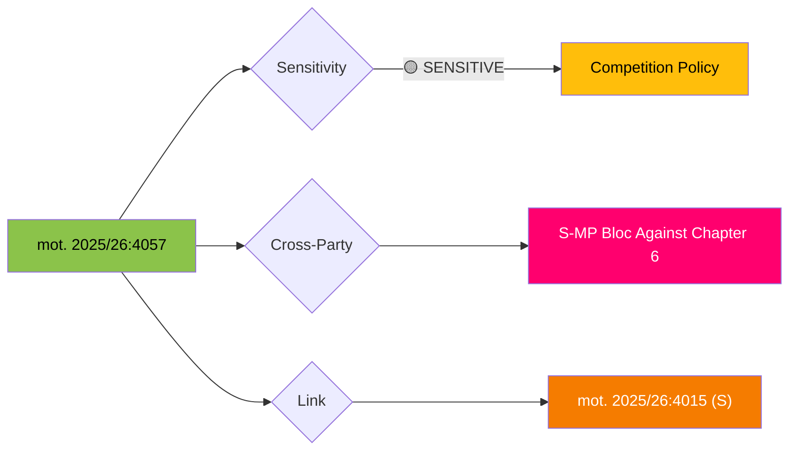

# 🔍 Per-File Political Intelligence Analysis

## 📋 Document Identity

| Field | Value |
|-------|-------|
| **Document ID** | HD024057 (mot. 2025/26:4057) |
| **Document Type** | motions |
| **Title** | med anledning av prop. 2025/26:203 Nya verktyg för stärkt konkurrens |
| **Date** | 2026-04-01 |
| **Riksmöte** | 2025/26 |
| **Committee** | NU (Näringsutskottet) |
| **Party** | MP (Miljöpartiet) |
| **Author** | Katarina Luhr m.fl. |
| **Source MCP Tool** | get_motioner |
| **Analysis Timestamp** | 2026-04-13 07:33 UTC |
| **Analyst** | news-motions |

## 🎯 Executive Summary

Miljöpartiet (MP) demands rejection of the government's proposed rules on public-sector commercial activities in prop. 2025/26:203, specifically chapter 6. This motion aligns with S (mot. 2025/26:4015) to form a coordinated left-green opposition front against government-imposed restrictions on municipal commercial operations. MP frames this as protecting municipal autonomy and green public services. **[HIGH confidence]**

## 📊 Political Classification

| Metric | Score | Rationale |
|--------|-------|-----------|
| **Significance** | 7/10 | Cross-party coordination with S; targets specific proposition chapter |
| **Urgency** | ELEVATED | Active proposition in NU |
| **Sensitivity** | SENSITIVE | Municipal autonomy and public sector reform |

## 🔄 SWOT Analysis

### Strengths
| # | Statement | Evidence | Confidence | Impact |
|---|-----------|----------|------------|--------|
| 1 | Coordinated with S motion (mot. 4015) — cross-party united front | Both target prop. 2025/26:203 chapter 6 | HIGH | Demonstrates opposition unity |
| 2 | MP focuses narrowly on chapter 6 (public sales) while accepting other competition reforms | Surgical opposition — not blanket rejection | HIGH | Harder for government to dismiss |

### Weaknesses
| # | Statement | Evidence | Confidence | Impact |
|---|-----------|----------|------------|--------|
| 1 | MP's 18 seats insufficient alone; dependent on broader opposition coalition | Parliamentary arithmetic | HIGH | Must rely on S, V coordination |

### Opportunities
| # | Statement | Evidence | Confidence | Impact |
|---|-----------|----------|------------|--------|
| 1 | Can frame as defending local green initiatives (municipal energy companies, recycling) | Municipal commercial activities include green services | MEDIUM | Strengthens environmental angle |

### Threats
| # | Statement | Evidence | Confidence | Impact |
|---|-----------|----------|------------|--------|
| 1 | Government separates vote on chapter 6 from rest of proposition | Tactical legislative management | MEDIUM | Opposition wins on chapter 6 but government saves rest |

## 📉 Risk Assessment

| Risk | L (1-5) | I (1-5) | L×I | Mitigation |
|------|---------|---------|-----|------------|
| Municipal green services restricted | 3 | 4 | 12 | Legal challenges |
| Opposition coalition holds on chapter 6 | 3 | 3 | 9 | S-MP-V coordination |

## 🗳️ Election 2026 Implications

| Dimension | Assessment | Confidence |
|-----------|------------|------------|
| **Electoral Impact** | Low for MP directly, but strengthens left-green alliance credibility | 🟧MEDIUM |
| **Coalition Scenarios** | Demonstrates S-MP pre-election coordination capacity | 🟩HIGH |
| **Policy Legacy** | If chapter 6 fails, signals limit to government deregulation | 🟩HIGH |

## 🔮 Forward Indicators

- **Watch**: NU committee vote on chapter 6 of prop. 2025/26:203
- **Cross-reference**: mot. 2025/26:4015 (S, same target)
- **Trigger**: V formal support for S-MP position would guarantee committee minority report
