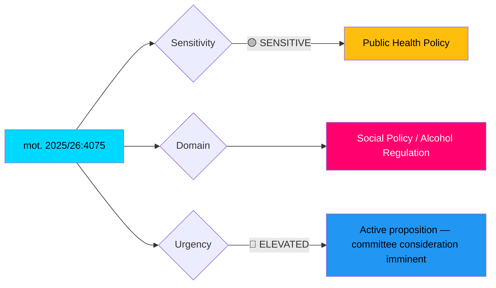

# 🔍 Per-File Political Intelligence Analysis

## 📋 Document Identity

| Field | Value |
|-------|-------|
| **Document ID** | HD024075 (mot. 2025/26:4075) |
| **Document Type** | motions |
| **Title** | med anledning av prop. 2025/26:221 Slopat matkrav för serveringstillstånd |
| **Date** | 2026-04-10 |
| **Riksmöte** | 2025/26 |
| **Committee** | SoU (Socialutskottet) |
| **Party** | S (Socialdemokraterna) |
| **Author** | Fredrik Lundh Sammeli m.fl. |
| **Source MCP Tool** | get_motioner |
| **Analysis Timestamp** | 2026-04-13 07:30 UTC |
| **Analyst** | news-motions |

## 🎯 Executive Summary

The Social Democrats (S) demand rejection of the government's proposal to abolish the food requirement for alcohol serving licenses in catering operations (prop. 2025/26:221). This motion targets a key deregulation initiative by the Tidö government, framing it as reckless weakening of Sweden's restrictive alcohol policy. The motion exploits a politically sensitive wedge issue — alcohol deregulation divides the government coalition, with KD historically supportive of restrictive alcohol policy. **[HIGH confidence]**

## 📊 Political Classification

| Metric | Score | Rationale |
|--------|-------|-----------|
| **Significance** | 6/10 | Targets government deregulation agenda; wedge potential within coalition |
| **Urgency** | ELEVATED | Active proposition in SoU pipeline |
| **Sensitivity** | SENSITIVE | Alcohol policy touches public health and cultural norms |

## 🔄 SWOT Analysis

### Strengths (for S opposition strategy)
| # | Statement | Evidence | Confidence | Impact |
|---|-----------|----------|------------|--------|
| 1 | S defends Sweden's restrictive alcohol model — popular with public health advocates | mot. 2025/26:4075 demands rejection of prop. 2025/26:221 | HIGH | Reinforces S brand as welfare state defender |
| 2 | Cross-party support potential — KD historically aligned with restrictive alcohol policy | Coalition tension point on alcohol deregulation | MEDIUM | Could split government coalition on committee vote |

### Weaknesses
| # | Statement | Evidence | Confidence | Impact |
|---|-----------|----------|------------|--------|
| 1 | S alone unlikely to block — needs V, MP, and potentially C or KD defectors | S has 107 seats vs coalition's 176 | HIGH | Requires broad opposition coalition |
| 2 | Catering-specific deregulation is narrow — limited public mobilization potential | Targets only alkohollagen 8 kap. 4 on catering kitchens | MEDIUM | Difficult to build public campaign around technical change |

### Opportunities
| # | Statement | Evidence | Confidence | Impact |
|---|-----------|----------|------------|--------|
| 1 | Can frame as "thin end of the wedge" for broader alcohol deregulation | Government's deregulation agenda includes multiple sectors | MEDIUM | Amplifies political significance beyond narrow scope |

### Threats
| # | Statement | Evidence | Confidence | Impact |
|---|-----------|----------|------------|--------|
| 1 | Government may negotiate compromise, neutralizing opposition stance | Coalition can adjust proposal to retain some requirements | MEDIUM | S loses campaign issue if government accommodates |

## 📉 Risk Assessment

| Risk | L (1-5) | I (1-5) | L×I | Mitigation |
|------|---------|---------|-----|------------|
| Coalition split on alcohol policy | 2 | 3 | 6 | Government whip management |
| Public health backlash against deregulation | 3 | 3 | 9 | Government communication strategy |
| S gains campaign issue for 2026 election | 4 | 2 | 8 | Government frames as modernization |

## 🗳️ Election 2026 Implications

| Dimension | Assessment | Confidence |
|-----------|------------|------------|
| **Electoral Impact** | Low-moderate — alcohol policy not top voter concern but resonates with health-conscious demographics | 🟧MEDIUM |
| **Coalition Scenarios** | Could test KD loyalty — KD's temperance tradition vs coalition discipline | 🟩HIGH |
| **Voter Salience** | Limited direct impact; amplified if linked to broader "government dismantling welfare state" narrative | 🟧MEDIUM |
| **Campaign Vulnerability** | S can use in debates: "government weakens alcohol policy while youth drinking concerns persist" | 🟩HIGH |
| **Policy Legacy** | If passed, becomes permanent deregulation — hard to reverse | 🟩HIGH |

## 🔮 Forward Indicators

- **Watch**: SoU committee vote on prop. 2025/26:221 (expected April-May 2026)
- **Trigger**: If KD members signal reservations, indicates coalition stress
- **Timeline**: Riksdag chamber vote likely before summer recess (June 2026)
