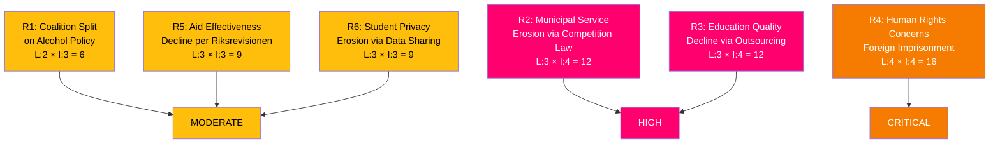

# 📉 Risk Assessment — Opposition Motions (2026-04-13)

**Generated**: 2026-04-13 07:38 UTC | **Riksmöte**: 2025/26 | **Documents**: 19 motions
**Confidence**: HIGH | **Methodology**: political-risk-methodology.md (5×5 L×I matrix)

---

## Risk Matrix Summary

## Detailed Risk Register

| ID | Risk | L (1-5) | I (1-5) | L×I | Category | Source Motion(s) | Mitigation |
|----|------|---------|---------|-----|----------|-----------------|------------|
| R1 | Coalition split on alcohol deregulation — KD temperance vs M/L liberalization | 2 | 3 | 6 | MODERATE | mot. 4075 (S) vs prop. 221 | Government whip management; KD leader alignment |
| R2 | Municipal commercial services restricted — loss of local public enterprises | 3 | 4 | 12 | HIGH | mot. 4015 (S), mot. 4057 (MP) vs prop. 203 ch.6 | S-MP-V committee minority report; legal challenges |
| R3 | Vocational education quality erosion via unregulated private outsourcing | 3 | 4 | 12 | HIGH | mot. 4021 (S) vs prop. 198 | Teacher union pressure; regulatory review |
| R4 | Human rights liability from foreign imprisonment policy | 4 | 4 | 16 | CRITICAL | mot. 4063 (MP) vs prop. 185 | Constitutional review; European Court scrutiny |
| R5 | Swedish humanitarian aid effectiveness decline per Riksrevisionen findings | 3 | 3 | 9 | MODERATE | mot. 4070 (C), 4071 (V), 4072 (MP) vs skr. 226 | Cross-party pressure for Sida reform implementation |
| R6 | Student data privacy erosion through mandatory school-to-school sharing | 3 | 3 | 9 | MODERATE | mot. 4056 (MP) vs prop. 192 | MP voluntary framework proposal |
| R7 | Youth criminal investigation powers expand without adequate safeguards | 3 | 3 | 9 | MODERATE | mot. 4073 (V), 4074 (MP) vs prop. 227 | V-MP joint reservation demanding safeguards |
| R8 | Food supply preparedness gaps if not addressed comprehensively | 2 | 4 | 8 | MODERATE | mot. 4069 (MP) vs prop. 205 | MP demands broader preparedness planning |

## Aggregate Risk Profile

| Category | Count | Average L×I | Dominant Party |
|----------|-------|-------------|----------------|
| CRITICAL | 1 | 16 | MP (justice/human rights) |
| HIGH | 2 | 12 | S+MP (competition, education) |
| MODERATE | 5 | 8.2 | Mixed (all parties) |
| LOW | 0 | — | — |

**Overall Risk Level**: **ELEVATED** — Multiple high-impact policy risks across justice, education, and competition domains. Opposition's coordinated response increases likelihood of committee dissent and public debate.
