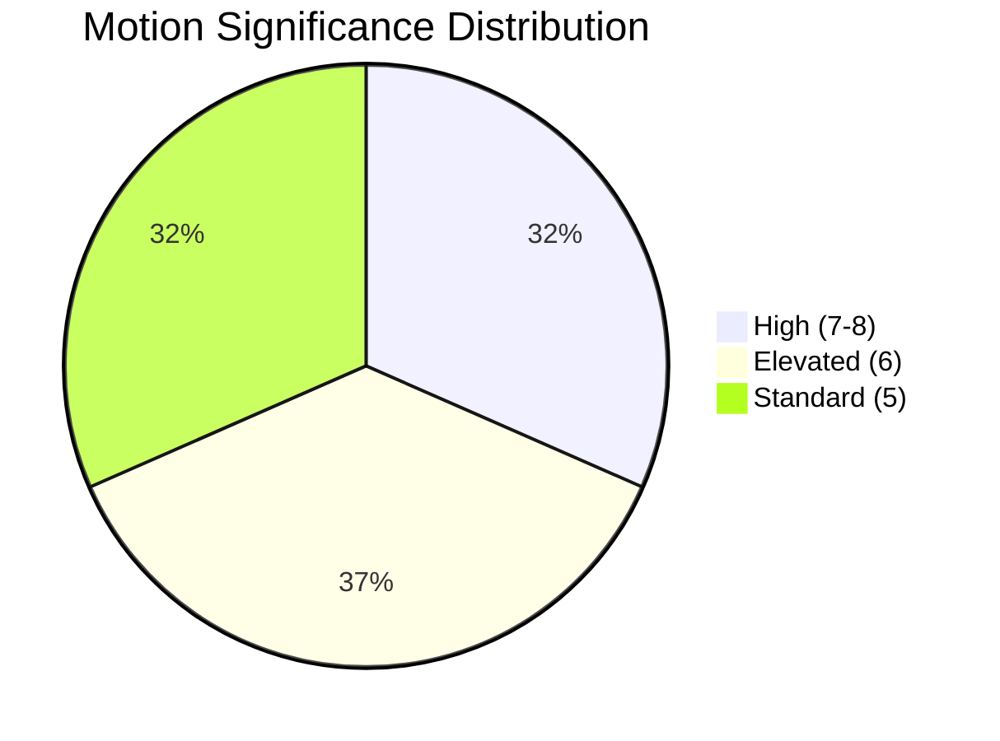

# 📈 Significance Scoring — Opposition Motions (2026-04-13)

**Generated**: 2026-04-13 07:39 UTC | **Riksmöte**: 2025/26 | **Documents**: 19 motions
**Methodology**: significance-scoring framework | **Confidence**: HIGH

---

## Significance Rankings

| Rank | dok_id | Motion # | Party | Committee | Significance (0-10) | Key Factor |
|------|--------|----------|-------|-----------|---------------------|------------|
| 1 | HD024063 | mot. 4063 | MP | JuU | 8 | Foreign imprisonment — constitutional/human rights |
| 2 | HD024015 | mot. 4015 | S | NU | 7 | S-MP bloc vs public sector commercial restrictions |
| 3 | HD024057 | mot. 4057 | MP | NU | 7 | Cross-party coordination with S on competition |
| 4 | HD024021 | mot. 4021 | S | UbU | 7 | Education quality — high voter salience |
| 5 | HD024073 | mot. 4073 | V | JuU | 7 | Youth crime investigation safeguards |
| 6 | HD024074 | mot. 4074 | MP | JuU | 7 | MP rejects youth investigation expansion |
| 7 | HD024070 | mot. 4070 | C | UU | 6 | Cross-party Sida audit cluster (C+V+MP) |
| 8 | HD024071 | mot. 4071 | V | UU | 6 | V demands end to migration-conditioned aid |
| 9 | HD024072 | mot. 4072 | MP | UU | 6 | MP demands Sida efficiency reforms |
| 10 | HD024075 | mot. 4075 | S | SoU | 6 | Alcohol deregulation wedge — KD sensitivity |
| 11 | HD024056 | mot. 4056 | MP | UbU | 6 | Student privacy vs crime prevention |
| 12 | HD024067 | mot. 4067 | MP | CU | 6 | Housing guarantee tenant protections |
| 13 | HD024012 | mot. 4012 | S | CU | 6 | S rejects rent-to-own (hyrköp) legislation |
| 14 | HD024068 | mot. 4068 | MP | MJU | 5 | Hunting law reforms — seal/water restrictions |
| 15 | HD024069 | mot. 4069 | MP | MJU | 5 | Food supply preparedness demands |
| 16 | HD024032 | mot. 4032 | C | SoU | 5 | Welfare activation monitoring demands |
| 17 | HD024045 | mot. 4045 | C | SoU | 5 | Suicide prevention expansion |
| 18 | HD024007 | mot. 4007 | SD | NU | 5 | SD rejects copyright levy — cross-aisle with C |
| 19 | HD024037 | mot. 4037 | C | NU | 5 | C rejects copyright levy — cross-aisle with SD |

## Significance Distribution

## Urgency Classification

| Urgency Level | Count | Motion IDs |
|--------------|-------|------------|
| CRITICAL | 1 | mot. 4063 (foreign imprisonment) |
| ELEVATED | 12 | mot. 4015, 4057, 4021, 4073, 4074, 4070-4072, 4075, 4056, 4067, 4012 |
| ROUTINE | 6 | mot. 4068, 4069, 4032, 4045, 4007, 4037 |
