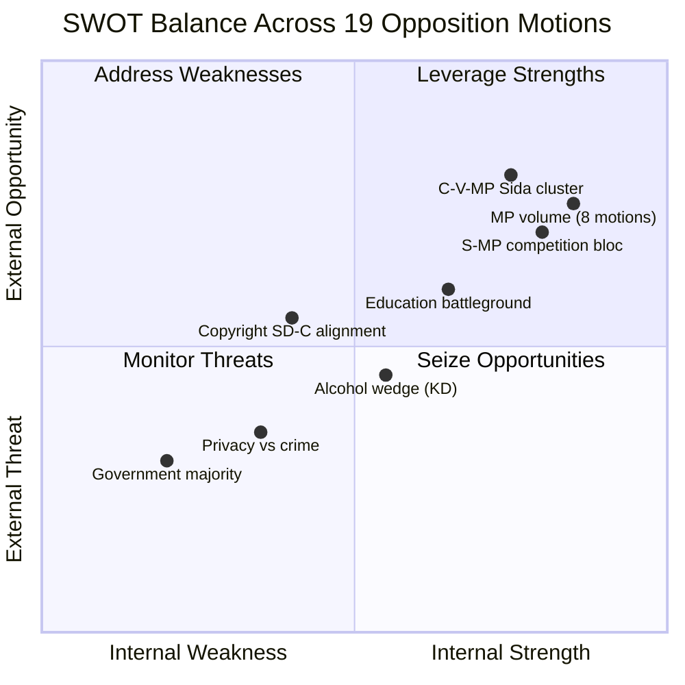

# 📊 SWOT Analysis — Opposition Motions (2026-04-13)

**Generated**: 2026-04-13 07:37 UTC | **Riksmöte**: 2025/26 | **Documents**: 19 motions
**Confidence**: HIGH | **Methodology**: political-swot-framework.md

---

## All 8 Stakeholder Groups Analysis

### 1. 👥 Citizens
| Factor | Assessment | Evidence | Confidence |
|--------|------------|----------|------------|
| **S** | S motions on education quality (mot. 4021) and housing (mot. 4012) directly address citizen welfare | Vocational education regulation, rent-to-own rejection | HIGH |
| **W** | Technical opposition motions hard for citizens to follow | Competition policy (mot. 4015/4057) is abstract | MEDIUM |
| **O** | Education and public health motions resonate in election year | mot. 4021, mot. 4075 on alcohol policy | HIGH |
| **T** | Government deregulation could erode service quality before citizens notice | Municipal services, education outsourcing | MEDIUM |

### 2. 🏛️ Government Coalition (M, KD, L + SD support)
| Factor | Assessment | Evidence | Confidence |
|--------|------------|----------|------------|
| **S** | Coalition maintains parliamentary majority (176 seats) to pass propositions | All motions likely to be voted down | HIGH |
| **W** | Alcohol policy (prop. 221) may split KD from coalition — temperance tradition | mot. 4075 (S) targets this wedge | MEDIUM |
| **O** | Can frame opposition as anti-reform, anti-modernization | Competition and deregulation narrative | MEDIUM |
| **T** | Multi-front opposition challenges stretch legislative management resources | 7 different propositions targeted simultaneously | HIGH |

### 3. ⚔️ Opposition Bloc (S, V, MP, C partially)
| Factor | Assessment | Evidence | Confidence |
|--------|------------|----------|------------|
| **S** | Cross-party coordination visible in 4 clusters: competition (S+MP), Sida (C+V+MP), youth crime (V+MP), copyright (SD+C) | Multiple motions targeting same propositions | HIGH |
| **W** | C selective engagement — participates in Sida and copyright clusters but not left-bloc issues | C absent from competition, education motions | MEDIUM |
| **O** | MP's 8-motion volume demonstrates legislative ambition despite 18 seats | 42% of all motions from smallest opposition party | HIGH |
| **T** | SD-C alignment on copyright (mot. 4007/4037) creates awkward optics for C | Centrist-populist cooperation | MEDIUM |

### 4. 🏢 Business/Industry
| Factor | Assessment | Evidence | Confidence |
|--------|------------|----------|------------|
| **S** | Competition policy reform (prop. 203) generally welcomed by private sector | Opposition to municipal commercial restrictions | MEDIUM |
| **W** | Vocational education reform opposition (mot. 4021) may concern employers needing skilled workers | S demands tighter regulation of education outsourcing | MEDIUM |
| **O** | Copyright debate (mot. 4007/4037) — tech industry supports abolishing private copying levy | SD+C cross-party opposition to prop. 184 | HIGH |
| **T** | Municipal service restrictions could affect local business ecosystems | Chapter 6 of prop. 203 restricts "offentlig säljverksamhet" | MEDIUM |

### 5. 🌍 Civil Society
| Factor | Assessment | Evidence | Confidence |
|--------|------------|----------|------------|
| **S** | Sida audit cluster (3 motions) empowers aid sector to demand government reforms | C+V+MP united on humanitarian aid effectiveness | HIGH |
| **W** | Alcohol policy debate is narrow — limited civil society mobilization | mot. 4075 targets catering-specific rule | LOW |
| **O** | Privacy advocates can rally behind MP's school data motion (mot. 4056) | Voluntary vs mandatory data sharing | MEDIUM |
| **T** | Government crime prevention narrative may override privacy concerns | Prop. 192 on school data sharing | MEDIUM |

### 6. 🌐 International/EU
| Factor | Assessment | Evidence | Confidence |
|--------|------------|----------|------------|
| **S** | Sida motions (mot. 4070/4071/4072) engage with international development policy | Riksrevisionen report on humanitarian aid | HIGH |
| **W** | V motion (4071) specifically opposes migration-conditioned aid — may concern EU partners | "Sweden ska inte ställa migrationspolitiska villkor" | MEDIUM |
| **O** | Swedish development policy debate contributes to Nordic aid policy discourse | Sweden as traditionally leading aid donor | MEDIUM |
| **T** | Government aid cuts already under international scrutiny | Sida efficiency debate in context of reduced ODA | MEDIUM |

### 7. ⚖️ Judiciary/Constitutional
| Factor | Assessment | Evidence | Confidence |
|--------|------------|----------|------------|
| **S** | JuU motions (mot. 4063/4073/4074) challenge government criminal justice expansion | Foreign imprisonment, youth crime investigation | HIGH |
| **W** | Constitutional concerns about foreign imprisonment (prop. 185) may be overlooked | Emergency crime legislation narrative | MEDIUM |
| **O** | MP rejection of foreign imprisonment (mot. 4063) raises human rights bar | "Riksdagen avslår proposition 2025/26:185" | HIGH |
| **T** | Trend toward securitization may override constitutional safeguards | Government crime prevention agenda dominant | HIGH |

### 8. 📰 Media/Public Opinion
| Factor | Assessment | Evidence | Confidence |
|--------|------------|----------|------------|
| **S** | Human interest angles: alcohol rules (mot. 4075), school safety (mot. 4056), aid reform | Multiple newsworthy topics across motions | HIGH |
| **W** | Competition policy and copyright are complex — low media appeal | mot. 4015/4057 on municipal commercial activities | MEDIUM |
| **O** | Cross-party clusters create "strange bedfellows" stories (SD+C on copyright) | mot. 4007 (SD) + mot. 4037 (C) | HIGH |
| **T** | Crime-focused news cycle may drown out nuanced opposition positions | Media prefers crime/security framing | HIGH |

## 📈 SWOT Heatmap

