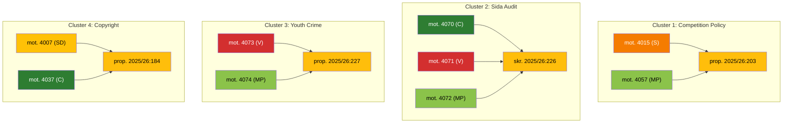

# 🧩 Synthesis Summary — Opposition Motions Analysis

**Generated**: 2026-04-13 07:36 UTC | **Riksmöte**: 2025/26 | **Confidence**: HIGH
**Documents Analyzed**: 19 | **New Since Last Run**: 5 | **Doc Type**: motions
**Analyst**: news-motions | **Methodology**: ai-driven-analysis-guide.md v5.0

---

## 📊 Key Intelligence Findings

### 1. MP Dominates Opposition Activity (8/19 motions)
Miljöpartiet filed 8 of 19 motions (42%), covering justice (JuU), environment (MJU), housing (CU), foreign affairs (UU), education (UbU), and competition (NU). This breadth signals MP's strategic positioning as the most active opposition voice, compensating for their 18 seats with legislative volume.

### 2. S-MP Cross-Party Coordination on Competition Policy
Socialdemokraterna (mot. 4015) and Miljöpartiet (mot. 4057) both target chapter 6 of prop. 2025/26:203 on public-sector commercial activities. This coordinated rejection of government deregulation of municipal commercial operations signals pre-election left-green alliance building. **[HIGH confidence]**

### 3. Three-Party Bloc on Sida Humanitarian Aid Audit
C (mot. 4070), V (mot. 4071), and MP (mot. 4072) all respond to the Riksrevisionen report on Sida's humanitarian aid management (skr. 2025/26:226). This tripartite opposition crosses the left-right divide, indicating broad parliamentary concern about aid effectiveness. **[HIGH confidence]**

### 4. Education Policy Becomes Battleground
Two UbU motions target different government propositions: S challenges vocational training deregulation (mot. 4021 vs prop. 198), while MP pushes voluntary student data sharing over mandatory requirements (mot. 4056 vs prop. 192). Opposition education agenda shaping. **[MEDIUM confidence]**

### 5. Newest Motion: S Rejects Alcohol Deregulation
The most recent motion (HD024075, 2026-04-10) sees S demanding rejection of removing food requirements for catering alcohol licenses (prop. 221). Politically sensitive — KD's temperance tradition could create coalition tension. **[MEDIUM confidence]**

## 🎯 AI-Recommended Article Metadata

| Field | EN | SV |
|-------|----|----|
| **Recommended Title** | Opposition Mounts Multi-Front Challenge as MP Files Record Motions Against Government Agenda | Oppositionen utmanar regeringen på bred front — MP leder med rekordmånga motioner |
| **Meta Description** | Miljöpartiet leads opposition with 8 of 19 motions, forming cross-party blocs with S on competition policy and with C and V on Sida audit reform in riksmöte 2025/26 | Miljöpartiet leder oppositionen med 8 av 19 motioner och bildar tvärpolitiska block med S om konkurrenspolitik och med C och V om Sida-granskning |
| **Key Highlights** | MP files 42% of motions; S-MP competition policy bloc; C-V-MP Sida audit bloc; education policy battleground | MP står för 42% av motionerna; S-MP konkurrensblock; C-V-MP Sida-block; utbildningspolitisk stridsfråga |
| **Article Decision** | PUBLISH — high political significance, cross-party dynamics, 5 new motions | PUBLICERA — hög politisk relevans, tvärpolitisk dynamik, 5 nya motioner |
| **Article Priority** | HIGH | HÖG |

## 📈 Party Activity Breakdown

| Party | Motions | % | Key Policy Areas |
|-------|---------|---|-----------------|
| MP | 8 | 42% | Justice, Environment, Housing, Foreign Aid, Education, Competition |
| S | 4 | 21% | Competition, Education, Housing, Alcohol Policy |
| C | 3 | 16% | Social Policy, Copyright, Foreign Aid |
| V | 2 | 11% | Justice, Foreign Aid |
| SD | 1 | 5% | Copyright |

## 📋 Committee Distribution

| Committee | Count | Key Issues |
|-----------|-------|------------|
| NU (Industry) | 4 | Copyright (2), Competition policy (2) |
| SoU (Social) | 3 | Welfare activation, Suicide prevention, Alcohol |
| JuU (Justice) | 3 | Youth crime, Foreign imprisonment, Youth investigations |
| UU (Foreign Affairs) | 3 | Sida humanitarian aid audit |
| CU (Housing) | 2 | Rent-to-own, Housing guarantees |
| UbU (Education) | 2 | Vocational training, School data sharing |
| MJU (Environment) | 2 | Hunting regulation, Food supply preparedness |

## 🔗 Cross-Party Motion Clusters

## 🗳️ Election 2026 Implications

| Dimension | Assessment | Confidence |
|-----------|------------|------------|
| **Electoral Impact** | MP's volume signals election readiness; S focuses on high-impact policy areas | 🟩HIGH |
| **Coalition Scenarios** | S-MP coordination visible; left bloc cohesion building pre-election | 🟩HIGH |
| **Voter Salience** | Education, crime, public services — high-salience areas for 2026 | 🟩HIGH |
| **Campaign Vulnerability** | Government deregulation agenda faces multi-front opposition challenge | ��MEDIUM |
| **Policy Legacy** | Multiple propositions at risk of opposition amendments | 🟧MEDIUM |
