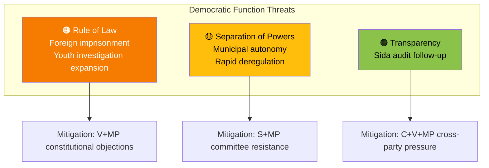

# 🔴 Threat Analysis — Opposition Motions (2026-04-13)

**Generated**: 2026-04-13 07:40 UTC | **Riksmöte**: 2025/26 | **Documents**: 19 motions
**Confidence**: HIGH | **Methodology**: political-threat-framework.md

---

## Democratic Function Threat Assessment

### 1. Rule of Law & Constitutional Integrity
**Threat Level**: 🟠 ELEVATED

| Threat | Evidence | Severity | Trend |
|--------|----------|----------|-------|
| Foreign imprisonment raises due process concerns | mot. 4063 (MP) — full rejection of prop. 185 | HIGH | ↑ Increasing |
| Youth investigation powers expansion without safeguards | mot. 4073 (V), 4074 (MP) vs prop. 227 | MEDIUM | ↑ Increasing |
| Mandatory student data sharing — privacy erosion | mot. 4056 (MP) demands voluntary framework | MEDIUM | → Stable |

### 2. Separation of Powers
**Threat Level**: 🟡 MODERATE

| Threat | Evidence | Severity | Trend |
|--------|----------|----------|-------|
| Government deregulation may bypass parliamentary scrutiny | Multiple rapid propositions (7 targeted simultaneously) | MEDIUM | → Stable |
| Municipal autonomy restricted by competition law | mot. 4015 (S), 4057 (MP) vs prop. 203 ch.6 | MEDIUM | ↑ Increasing |

### 3. Transparency & Accountability
**Threat Level**: 🟢 LOW-MODERATE

| Threat | Evidence | Severity | Trend |
|--------|----------|----------|-------|
| Sida audit reveals systematic aid management failures | Three-party response: C (mot. 4070), V (4071), MP (4072) | MEDIUM | → Stable |
| Riksrevisionen findings may not lead to concrete reforms | Government response (skr. 226) may be insufficient | LOW | → Stable |

## Overall Threat Assessment

The opposition motions collectively reveal **elevated threat levels in criminal justice expansion** (foreign imprisonment, youth investigation) offset by active parliamentary resistance from V and MP. Competition policy changes threaten municipal autonomy but face coordinated S-MP opposition. The most significant democratic health indicator is the breadth of opposition engagement: 5 parties filing motions across 7 committees shows healthy parliamentary scrutiny of government proposals.
