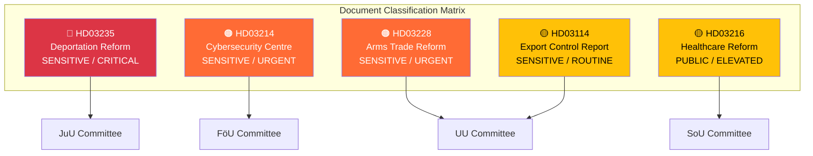

# Political Classification Results — 2026-04-13

**Generated**: 2026-04-13 06:19 UTC
**Data Sources**: riksdag-regering-mcp (lookback from 2026-04-10)
**Documents Analyzed**: 5
**Confidence**: MEDIUM (60%)
**Produced By**: AI-driven deep analysis

## Summary

Classified **5** parliamentary documents by sensitivity, impact, urgency, and domain.

## Classification Table

| dok_id | Title | Sensitivity | Domain | Urgency | Significance |
|--------|-------|-------------|--------|---------|-------------|
| HD03235 | Skärpta regler om utvisning på grund av brott | 🟡 SENSITIVE | Migration/Criminal Justice | 🔴 CRITICAL | 9/10 |
| HD03214 | Lagändringar för ett stärkt nationellt cybersäkerhetscenter | 🟡 SENSITIVE | Defence/Cybersecurity | 🟠 URGENT | 8/10 |
| HD03228 | Ett modernt och anpassat regelverk för krigsmateriel | 🟡 SENSITIVE | Defence/Foreign Trade | 🟠 URGENT | 8/10 |
| HD03216 | Stärkt medicinsk kompetens i kommunal hälso- och sjukvård | 🟢 PUBLIC | Health/Welfare | 🔵 ELEVATED | 6/10 |
| HD03114 | Strategisk exportkontroll 2025 | 🟡 SENSITIVE | Defence/Foreign Trade | 🔵 ROUTINE | 6/10 |

## Key Findings

1. **2 CRITICAL/URGENT documents** (HD03235, HD03214) requiring deep-inspection treatment
2. **3 documents in Defence/Security domain** forming coordinated policy cluster
3. **4 departments represented**: Justice, Defence, Foreign Affairs, Social Affairs
4. **Cross-party consensus varies**: Cybersecurity (high), Healthcare (moderate), Deportation (low), Arms trade (moderate)

## Implications

Classification drives article prioritisation. HD03235 (deportation reform) should receive the most analytical depth as a high-significance, politically divisive proposition. The defence-security cluster (HD03214, HD03228, HD03114) should be presented as a coordinated package.

## Data Quality Notes

Classification confidence: MEDIUM (60%). Based on metadata, committee assignment, and political domain expertise. Full-text analysis would refine sensitivity and urgency classifications.
