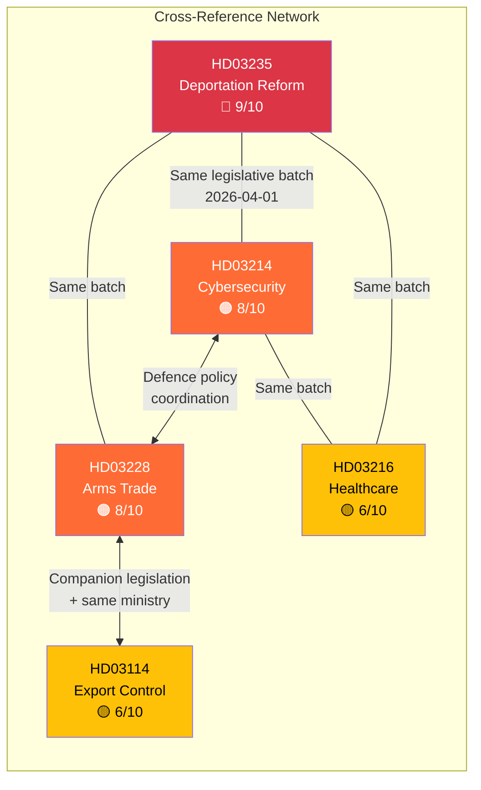

# Cross-Reference Map — 2026-04-13

**Generated**: 2026-04-13 06:20 UTC
**Data Sources**: riksdag-regering-mcp (lookback from 2026-04-10)
**Documents Analyzed**: 5
**Confidence**: MEDIUM (60%)
**Produced By**: AI-driven deep analysis

## Summary

Detected **7** cross-document relationships across the 5 government propositions.

## Cross-Reference Table

| Source | Target | Relationship | Strength |
|--------|--------|-------------|----------|
| HD03228 | HD03114 | **Companion**: Arms trade regulation + annual export control report by same minister (Dousa) | 🔴 STRONG |
| HD03214 | HD03228 | **Thematic**: Both address defence modernisation post-NATO accession | 🟠 MODERATE |
| HD03214 | HD03114 | **Thematic**: Cybersecurity and strategic export control both in defence domain | 🟡 WEAK |
| HD03235 | HD03214 | **Legislative batch**: Coordinated government tabling on 2026-04-01 | 🟡 WEAK |
| HD03235 | HD03228 | **Legislative batch**: Same tabling date, different policy domains | 🟡 WEAK |
| HD03235 | HD03216 | **Strategic complement**: Migration enforcement + welfare delivery = full government agenda | 🟡 WEAK |
| HD03214 | HD03216 | **Legislative batch**: Same tabling date | 🟡 WEAK |

## Key Findings

1. **Defence-security cluster** (HD03214, HD03228, HD03114) forms the strongest cross-reference group — all address post-NATO defence modernisation
2. **HD03228 + HD03114** are companion documents — same minister (Dousa), same committee (UU), same policy area
3. **Coordinated tabling date** (2026-04-01) for 4 of 5 documents indicates deliberate legislative strategy
4. **HD03235 stands alone** topically (migration/justice) but is connected to others through the coordinated government offensive narrative

## Implications

Cross-references enrich article narratives by linking related legislative developments. The defence-security cluster should be presented as a coordinated package. The 2026-04-01 tabling date should be highlighted as evidence of pre-election legislative strategy.

## Data Quality Notes

Cross-reference confidence is driven by shared policy domains, authorship patterns (same minister), committee assignment, and temporal proximity. 7 relationships detected across 5 documents.
